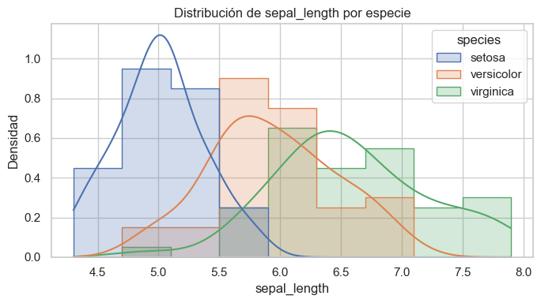
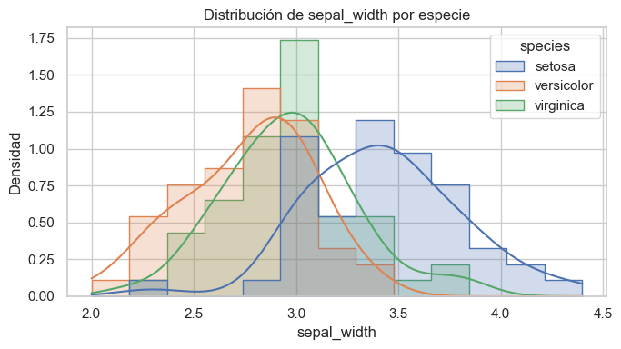
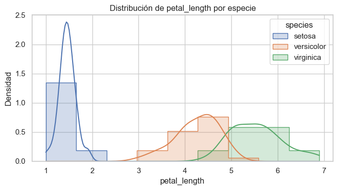
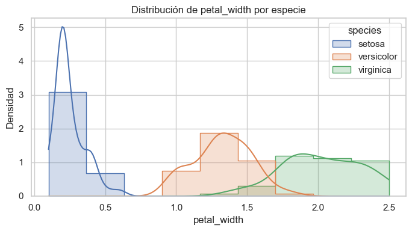
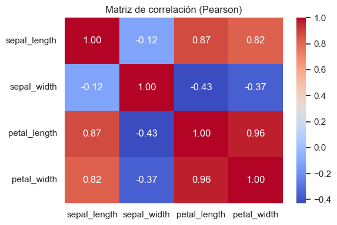
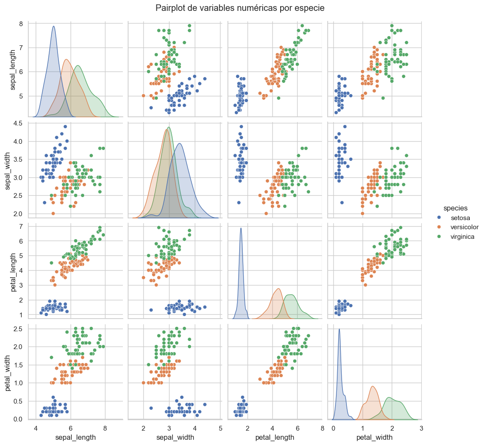
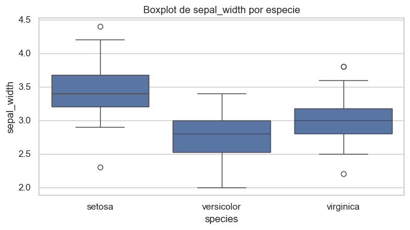

# UT1 - Actividad 1: Carga y EDA del dataset Iris

## Contexto

En esta actividad se trabajó con el clásico **dataset de Iris**, utilizando distintas formas de carga: librerías (`seaborn`, `scikit-learn`), CSV desde URL. El objetivo fue practicar diferentes estrategias de acceso a datos, realizar un análisis exploratorio (EDA) completo y documentar los principales hallazgos mediante estadísticas descriptivas, visualizaciones y perfiles automatizados.

## Objetivos

- Cargar datos desde **múltiples fuentes** (seaborn, sklearn, URL pública).
- Aplicar chequeos básicos: `describe`, tipos de datos, valores faltantes.
- Construir un **diccionario de datos** completo.
- Validar rangos y plausibilidad de las variables.
- Explorar correlaciones, asimetría, curtosis y generar visualizaciones clave.
- Analizar distribución de clases e imbalance categórico.
- Generar perfiles automatizados con ydata-profiling.

## Actividades (con tiempos estimados)

| Actividad                | Tiempo | Resultado esperado                              |
|---------------------------|:------:|------------------------------------------------|
| Carga multi-origen        |  30m   | Datasets cargados en DataFrames                |
| Chequeos básicos          |  20m   | Shape, dtypes, valores faltantes, `describe`   |
| Plausibilidad y rangos    |  20m   | Validación min/max y % missing                 |
| Análisis estadístico      |  30m   | Correlaciones, skew/kurtosis, covarianzas      |
| Duplicados e imbalance    |  15m   | Conteo de duplicados y distribución de especies|
| Visualizaciones           |  30m   | Histogramas, boxplots, heatmap, pairplot       |
| Perfiles automatizados    |  15m   | Reporte HTML con ydata-profiling               |
| Documentación             |  20m   | Data dictionary e insights                     |

## Desarrollo

### 1. Carga de Datos

Se utilizaron 3 métodos principales para cargar el dataset Iris:

- **Seaborn**: `sns.load_dataset('iris')` - Método más directo para datasets de ejemplo.
- **Scikit-learn**: `load_iris(as_frame=True)` - Útil para integración con pipelines de ML.
- **URL pública**: Carga desde GitHub raw - Útil para datasets externos y versionado.

Se verificó la equivalencia entre las fuentes, confirmando que seaborn y la URL pública proporcionan datos idénticos, mientras que sklearn requiere mapeo de targets a nombres de especies.

### 2. Chequeos Básicos

Se realizaron validaciones fundamentales:

- **Estructura**: 150 observaciones, 5 columnas (4 numéricas + 1 categórica).
- **Tipos de datos**: Variables numéricas como `float64`, especie como `category`.
- **Valores faltantes**: 0% missing en todas las variables.
- **Estadísticas descriptivas**: Medidas de tendencia central, dispersión y percentiles para cada variable numérica.

### 3. Plausibilidad y Rangos

Se construyó un sistema de validación de rangos esperados para cada variable:

- **Rangos definidos manualmente** basados en conocimiento del dominio:
  - `sepal_length`: 4.0-8.0 cm
  - `sepal_width`: 2.0-4.5 cm
  - `petal_length`: 1.0-7.0 cm
  - `petal_width`: 0.1-2.5 cm

- **Validación**: Todas las observaciones están dentro de rangos esperados (flag=True para todas las variables).
- **Exportación**: Resultados guardados para trazabilidad.

### 4. Análisis Estadístico

Se realizó un análisis estadístico completo:

**Correlaciones:**
- **Pearson**: Mide relaciones lineales. Destaca correlación alta entre `petal_length` y `petal_width` (0.96).
- **Spearman**: Mide relaciones monótonas. Valores similares pero ligeramente más altos.

**Forma de la distribución:**
- **Asimetría (skew)**: Valores entre -0.27 y 0.32, indicando distribuciones relativamente simétricas.
- **Curtosis**: Valores negativos en `petal_length` y `petal_width` sugieren distribuciones más planas que la normal, consistente con la mezcla de especies.

**Covarianzas:**
- Matriz de covarianza calculada y exportada para análisis multivariado posterior.

**Exportaciones:**
- `skew_kurt.csv`: Asimetría y curtosis por variable.
- `cov.csv`: Matriz de covarianza completa.

### 5. Duplicados e Imbalance Categórico

**Duplicados:**
- Se detectó 1 fila duplicada (no se limpió en esta etapa, solo se documentó).

**Distribución de especies:**
- **Balance perfecto**: 33.3% para cada especie (50 observaciones por clase).
- **Clasificación**: Todas las categorías marcadas como "normal" (ninguna <5%).
- **Exportación**: `species_dist.csv` con proporciones y clasificación.

Este balance perfecto es ideal para modelos de clasificación, evitando sesgos por desbalance de clases.

### 6. Visualizaciones

Se generaron visualizaciones clave para explorar relaciones y distribuciones:

**Histogramas con KDE por especie:**
- Distribuciones de densidad para cada variable numérica, separadas por especie.
- Permite identificar solapamientos y separabilidad entre clases.

**Matriz de correlaciones:**
- Heatmap con valores de correlación de Pearson.
- Identifica relaciones lineales fuertes entre variables.

**Pairplot:**
- Visualización multivariada completa mostrando todas las relaciones entre variables.
- Distribuciones en diagonal y scatter plots fuera de la diagonal.
- Coloreado por especie para identificar patrones de separación.

**Boxplots por variable y especie:**
- Comparación de distribuciones entre especies.
- Identificación de outliers y rangos intercuartílicos.

**Barplot de missing:**
- Visualización de valores faltantes (confirmando 0% en este dataset).

Todas las visualizaciones fueron guardadas en `results/visualizaciones/` con alta resolución (dpi=200).

### 7. Perfiles Automatizados

Se generó un reporte HTML automatizado usando `ydata-profiling`:

- **Configuración minimal**: Enfoque en estadísticas esenciales.
- **Correlaciones**: Solo Pearson activado para evitar redundancia.
- **Exportación**: `results/reportes/profile_iris.html`

Este reporte complementa el análisis manual y proporciona una visión general automatizada del dataset.

**📄 Ver reporte HTML generado:**

- [Abrir reporte profile_iris.html](Notebooks/results/reportes/profile_iris.html) (click para abrir en navegador)

**💻 Alternativa: Abrir desde PowerShell/CMD:**

Si el link no funciona, puedes abrir el reporte ejecutando este comando en PowerShell desde la carpeta del proyecto:

```powershell
# Navegar a la carpeta del reporte
cd "docs\portfolio\UT1\Notebooks\results\reportes"

# Abrir el HTML en el navegador predeterminado
Start-Process "profile_iris.html"
```

O desde cualquier ubicación usando la ruta completa:

```powershell
Start-Process "docs\portfolio\UT1\Notebooks\results\reportes\profile_iris.html"
```

### 8. Diccionario de Datos

Se construyó un diccionario de datos completo con las siguientes columnas:

- **nombre**: Nombre de la variable
- **tipo**: Tipo de dato (float, categorical)
- **unidad**: Unidad de medida (cm, -)
- **descripción**: Descripción semántica
- **notas**: Información adicional (valores posibles para categóricas)

Exportado a `results/reportes/data_dictionary.md` en formato markdown.

## Evidencias

- Notebook de análisis:

  [Abrir en Colab](https://colab.research.google.com/github/MatiasJorda/INGENIERIA-DATOS/blob/main/docs/portfolio/UT1/Notebooks/Practica_1.ipynb) ·

  [Ver en GitHub](https://github.com/MatiasJorda/INGENIERIA-DATOS/blob/main/docs/portfolio/UT1/Notebooks/Practica_1.ipynb) ·

  [Nbviewer (mirror)](https://nbviewer.org/github/MatiasJorda/INGENIERIA-DATOS/blob/main/docs/portfolio/UT1/Notebooks/Practica_1.ipynb) ·

---

### Visualización: Distribuciones por Especie



**Metodología utilizada:**
- Histogramas con curvas de densidad (KDE) para cada variable numérica.
- Separación por especie usando colores distintos.
- Normalización independiente por especie para comparación justa.

**Interpretación:**
- **Setosa** muestra distribuciones claramente separadas, especialmente en variables de pétalo.
- **Versicolor** y **Virginica** presentan solapamiento parcial, especialmente en `sepal_length` y `sepal_width`.
- Las variables de pétalo (`petal_length`, `petal_width`) son más discriminativas que las de sépalo.

---

### Visualización: Matriz de Correlaciones



**Metodología utilizada:**
- Heatmap con valores de correlación de Pearson entre todas las variables numéricas.
- Escala de colores para identificar correlaciones fuertes (positivas y negativas).

**Interpretación:**
- Correlación muy alta (0.96) entre `petal_length` y `petal_width`, sugiriendo redundancia informativa.
- Correlación moderada-alta (0.87) entre `sepal_length` y `petal_length`.
- Correlación negativa débil (-0.12) entre `sepal_length` y `sepal_width`.

---

### Visualización: Pairplot Multivariado



**Metodología utilizada:**
- Matriz de scatter plots mostrando todas las combinaciones de variables.
- Distribuciones univariadas en la diagonal con KDE.
- Coloreado por especie para identificar patrones de separación.

**Interpretación:**
- **Setosa** es claramente separable en el espacio 2D de variables de pétalo.
- **Versicolor** y **Virginica** muestran solapamiento, especialmente en dimensiones de sépalo.
- Las combinaciones de variables de pétalo muestran mejor separación entre todas las especies.

---

### Visualización: Boxplots por Variable






**Metodología utilizada:**
- Boxplots comparativos para cada variable numérica.
- Separación por especie para identificar diferencias en medianas, rangos intercuartílicos y outliers.

**Interpretación:**
- **Setosa** tiene valores de pétalo significativamente menores que las otras especies (sin solapamiento).
- **Versicolor** y **Virginica** muestran solapamiento en todas las variables, especialmente en sépalos.
- Presencia de algunos outliers en `petal_width` para setosa, pero no afectan significativamente la interpretación.

---

### Visualización: Análisis de Valores Faltantes



**Metodología utilizada:**
- Barplot mostrando el porcentaje de valores faltantes por columna.
- Verificación sistemática de completitud del dataset.

**Interpretación:**
- **0% de valores faltantes** en todas las variables.
- Dataset completamente limpio y listo para modelado sin necesidad de imputación.

---

## Hallazgos Principales

### 1. Separación Clara entre Especies

El análisis revela una **separación muy marcada** entre las especies, especialmente:

- **Setosa** se distingue con claridad en todas las variables, particularmente en `petal_length` y `petal_width`, donde no se solapa con las otras especies. Esto sugiere que estas dos variables son **altamente predictivas** para identificar esta especie.
- **Versicolor** y **Virginica** presentan una **superposición parcial** en `sepal_length` y `sepal_width`, lo cual indica que estas variables por sí solas no son suficientes para diferenciarlas de manera tajante.

### 2. Variables Más Informativas

De las cuatro variables analizadas, se puede concluir que:

- Las **más discriminantes** son `petal_length` y `petal_width`, dado que sus distribuciones muestran menor solapamiento entre especies y correlación muy alta (0.96) entre ellas.
- Por otro lado, `sepal_length` y `sepal_width`, aunque aportan información, tienen distribuciones más similares entre las especies, especialmente entre versicolor y virginica.

### 3. Balance Perfecto de Clases

- Las tres especies están **perfectamente balanceadas** (33.3% cada una, 50 observaciones por especie).
- Esto es ideal para modelos de clasificación, ya que no hay desbalance que pueda sesgar el entrenamiento.
- No se requieren técnicas de balanceo (SMOTE, undersampling, etc.).

### 4. Calidad del Dataset

- **0 valores faltantes** en todas las variables.
- **1 duplicado** detectado (no limpiado en esta etapa).
- Todas las variables dentro de **rangos esperados** según validación de plausibilidad.
- **Distribuciones relativamente simétricas** (skew entre -0.27 y 0.32).

### 5. Correlaciones y Redundancia

- **Alta correlación** (0.96) entre `petal_length` y `petal_width` sugiere redundancia informativa.
- Esto podría indicar que una de estas variables podría ser suficiente para el modelado, aunque ambas pueden aportar valor en conjunto.
- Las técnicas de reducción de dimensionalidad (PCA) podrían ser útiles para visualizar o simplificar el espacio de características.

### 6. Distribuciones y Normalidad

- Las medidas de asimetría indican distribuciones **relativamente simétricas**.
- La curtosis negativa en variables de pétalo sugiere distribuciones más planas que la normal, lo cual es consistente con la presencia de múltiples especies en el dataset.
- No todas las variables siguen distribuciones normales, lo cual puede ser relevante para la selección de algoritmos de modelado.

## Implicancias para Modelos Predictivos

Este análisis sugiere que:

1. **Modelos de clasificación supervisada** (KNN, árboles de decisión, regresión logística, SVM) pueden obtener **muy buen rendimiento** en este dataset, especialmente si se prioriza el uso de las variables de pétalos.

2. **Técnicas de reducción de dimensionalidad** como PCA podrían ser útiles para:
   - Visualizar el espacio de clases en 2D/3D.
   - Reducir redundancia entre variables correlacionadas.
   - Mejorar el rendimiento si se usa un modelo más complejo.

3. **Estandarización** es recomendable si se emplean métodos basados en distancias (KNN, SVM), ya que las escalas de las variables difieren.

4. **Evaluación con matriz de confusión** es crítica, con especial atención a la confusión entre versicolor y virginica, donde se espera la mayor tasa de error.

5. **Feature engineering** podría incluir:
   - Ratios entre variables (ej: `petal_length / petal_width`).
   - Transformaciones logarítmicas si se busca normalizar distribuciones.
   - Interacciones entre variables de sépalo y pétalo.

## Reflexión

El dataset Iris permitió ejercitar el **flujo completo de un EDA**: desde la carga multi-fuentes hasta el análisis estadístico avanzado y visual. Se comprobó que las variables de **pétalo** son las más discriminativas entre especies, lo cual explica su uso frecuente en clasificación y su alta correlación.

Además, se reforzó la importancia de:
- **Validar rangos y valores faltantes**, incluso en datasets "limpios".
- **Documentación clara** (diccionario de datos y reportes) que agrega trazabilidad y valor al análisis.
- **Visualizaciones múltiples** que permiten identificar patrones desde diferentes perspectivas.
- **Análisis estadístico completo** (correlaciones, asimetría, curtosis) que informa decisiones de modelado.

El ejercicio mostró cómo un EDA riguroso **informa directamente** las decisiones de preprocesamiento, selección de características y elección de algoritmos, estableciendo una base sólida para el modelado predictivo.

### Lecciones Clave

- Las **variables de pétalo** son más informativas que las de sépalo para este problema de clasificación.
- El **balance perfecto de clases** simplifica el modelado y la evaluación.
- La **alta correlación** entre variables puede indicar redundancia, pero también relaciones biológicas relevantes.
- La **separabilidad de setosa** explica por qué los modelos típicamente logran 100% de precisión para esta clase.
- El **solapamiento versicolor-virginica** justifica el uso de técnicas más sofisticadas y evaluación cuidadosa de la matriz de confusión.

---
