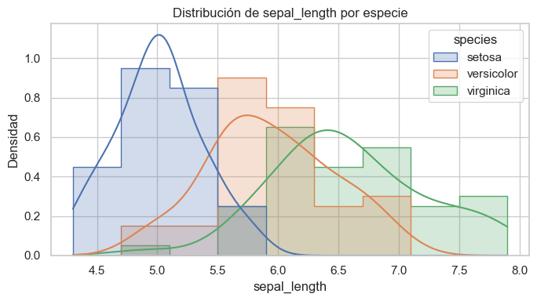
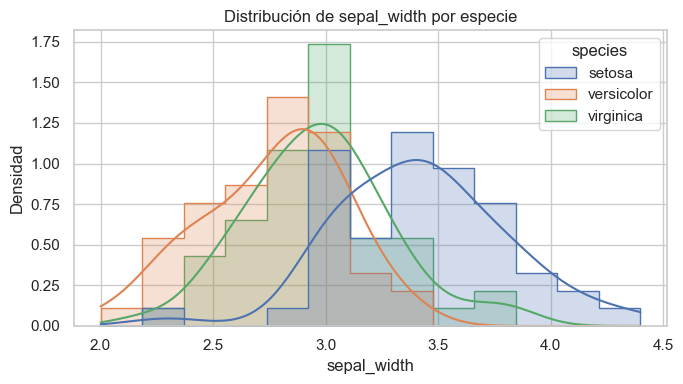
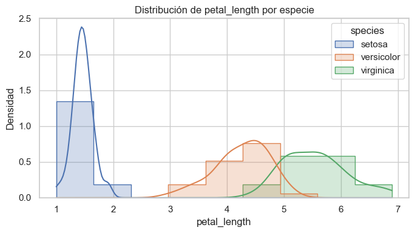
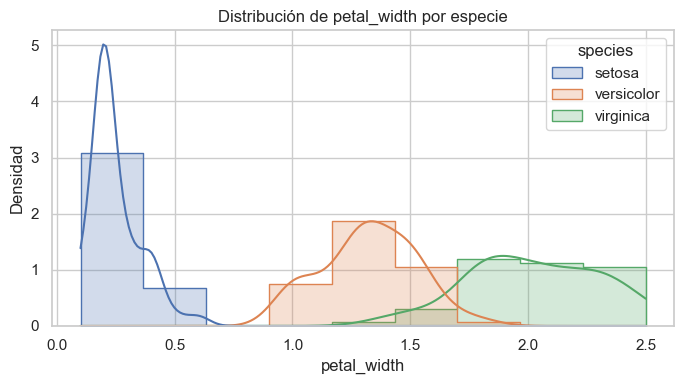
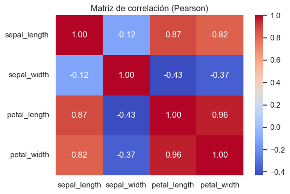
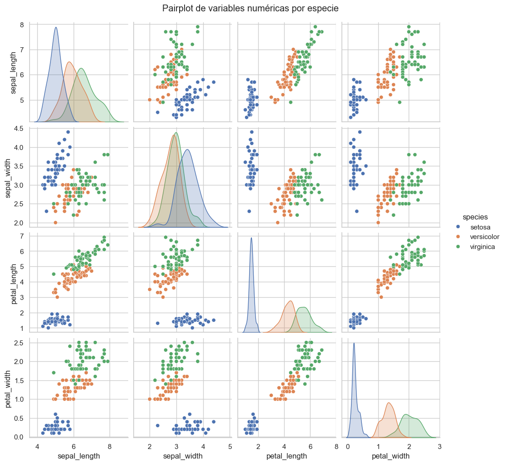
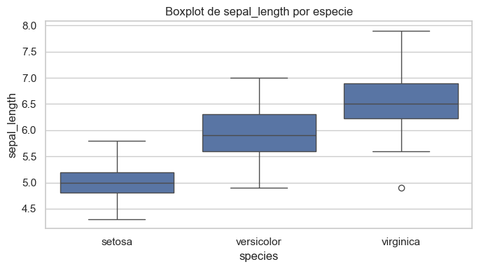
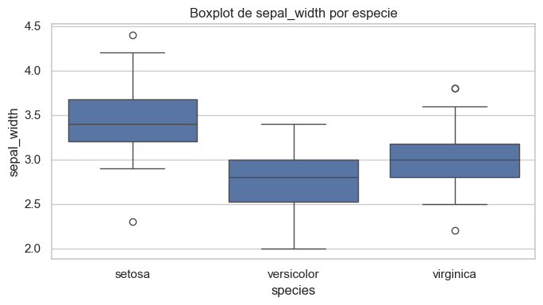
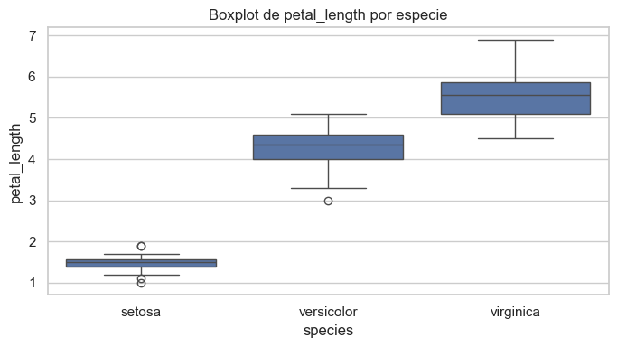
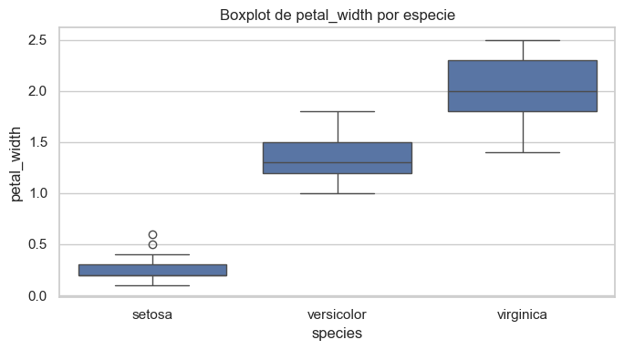

# UT1 - Actividad 1: Carga y EDA del dataset Iris

## Contexto
En esta actividad se trabajó con el clásico **dataset de Iris**, utilizando distintas formas de carga: librerías (`seaborn`, `scikit-learn`), Kaggle API, CSV manual y desde URL.  
El objetivo fue practicar diferentes estrategias de acceso a datos, realizar un análisis exploratorio (EDA) básico y documentar los principales hallazgos.

## Objetivos
- Cargar datos desde **múltiples fuentes** (seaborn, sklearn, Kaggle, Colab manual y URL).  
- Aplicar chequeos básicos: `describe`, tipos de datos, valores faltantes.  
- Construir un **diccionario de datos**.  
- Validar rangos y plausibilidad de las variables.  
- Explorar correlaciones y generar visualizaciones clave.  

## Actividades (con tiempos estimados)
| Actividad                | Tiempo | Resultado esperado                              |
|---------------------------|:------:|------------------------------------------------|
| Carga multi-origen        |  30m   | Datasets cargados en DataFrames                |
| Chequeos básicos          |  20m   | Shape, dtypes, valores faltantes, `describe`   |
| Plausibilidad y rangos    |  20m   | Validación min/max y % missing                 |
| Análisis estadístico      |  20m   | Correlaciones, skew/kurtosis                   |
| Visualizaciones           |  30m   | Histogramas, boxplots, heatmap, pairplot       |
| Documentación             |  20m   | Data dictionary e insights                     |

## Desarrollo
1. **Carga de datos**  
   - Se usaron 5 métodos: `seaborn.load_dataset`, `sklearn.datasets.load_iris`, Kaggle API, carga manual de CSV en Colab y URL pública.  
2. **Chequeos básicos**  
   - `df.describe()` y `df.dtypes` para entender la estructura.  
   - Exportación de missingness.  
3. **Plausibilidad**  
   - Se construyó un `range_check.csv` con rangos esperados de variables.  
   - Validación de min/max, %missing y banderas de calidad.  
4. **Análisis estadístico**  
   - Correlaciones.  
   - Skewness y curtosis .  
   - Distribución de especies .  
5. **Visualizaciones**  
   - Histogramas por especie.  
   - Matriz de correlación (`heatmap`).  
   - Pairplot por especie.  
   - Boxplots de variables por especie.  
   - Barplot de missingness.

## Evidencias
- Notebook de análisis: [Open Notebook](https://nbviewer.org/github/MatiasJorda/INGENIERIA-DATOS/blob/main/docs/portfolio/UT1/Notebooks/Practica_1.ipynb)

### Resultados:

El análisis exploratorio realizado sobre el dataset de Iris, acompañado por visualizaciones específicas para cada variable, permite obtener una comprensión clara de cómo se distribuyen las características de las flores según su especie.

**1. Separación clara entre especies:**

Tanto los gráficos de distribución como el boxplot de `petal_width` revelan una segmentación muy marcada entre las especies. Por ejemplo:

- **Setosa** se distingue con claridad en todas las variables, especialmente en `petal_length` y `petal_width`, donde no se solapa con las otras especies. Esto sugiere que estas dos variables son altamente predictivas para identificar esta especie.
- **Versicolor** y **Virginica**, en cambio, presentan una superposición parcial en `sepal_length` y `sepal_width`, lo cual indica que estas variables por sí solas no son suficientes para diferenciarlas de manera tajante.

**2. Variables más informativas:**

De las cuatro variables analizadas, se puede concluir que:

- Las más discriminantes son `petal_length` y `petal_width`, dado que sus distribuciones muestran menor solapamiento entre especies.
- Por otro lado, `sepal_length` y `sepal_width`, aunque aportan información, tienen distribuciones más similares entre las especies, especialmente entre versicolor y virginica.

**3. Distribuciones asimétricas y presencia de outliers:**

- El boxplot muestra la presencia de **valores atípicos en `petal_width` de setosa**, aunque estos no afectan significativamente la interpretación general del conjunto.
- Las curvas de densidad indican que no todas las variables siguen distribuciones normales. En algunos casos, como `petal_length` en setosa, se observan picos agudos que marcan concentraciones muy altas en un rango estrecho.

**4. Implicancias para modelos predictivos:**

Este análisis sugiere que un modelo de clasificación supervisado (como KNN, árboles de decisión o regresión logística) puede obtener muy buen rendimiento en este dataset, especialmente si se prioriza el uso de las variables de pétalos.

Además, dado que la separación entre clases es clara en al menos dos dimensiones, **técnicas de reducción de dimensionalidad como PCA** podrían ser útiles para visualizar el espacio de clases o incluso mejorar el rendimiento si se usara un modelo más complejo.

## Reflexión
El dataset Iris permitió ejercitar el **flujo completo de un EDA**: desde la carga multi-fuentes hasta el análisis estadístico y visual.  
Se comprobó que las variables de **pétalo** son las más discriminativas entre especies, lo cual explica su uso frecuente en clasificación.  
Además, se reforzó la importancia de validar rangos y valores faltantes, incluso en datasets “limpios”.  
El ejercicio mostró cómo la **documentación clara** (diccionario de datos y reportes) agrega trazabilidad y valor al análisis.  
