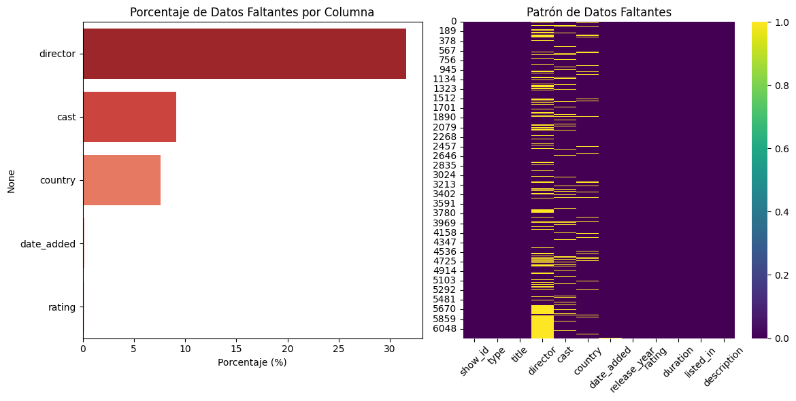
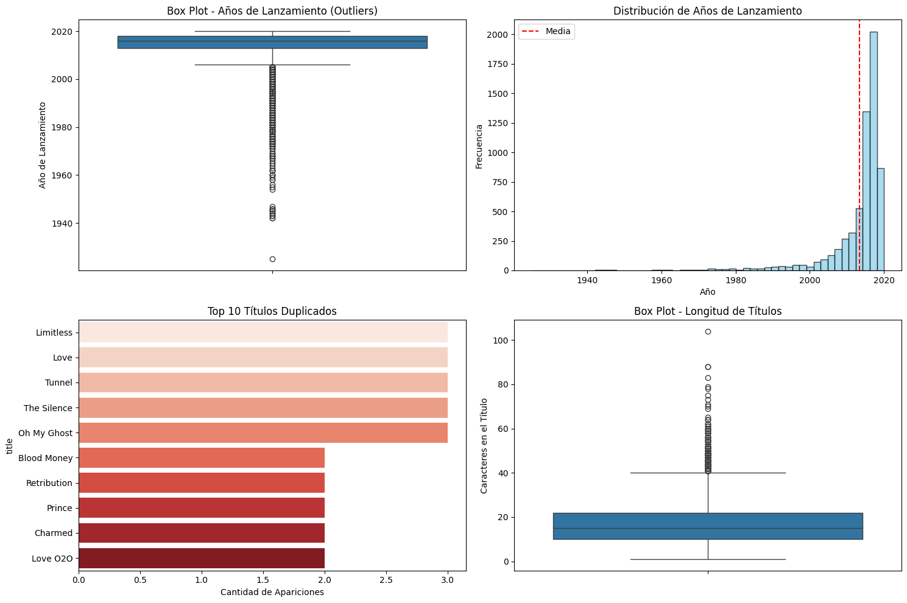
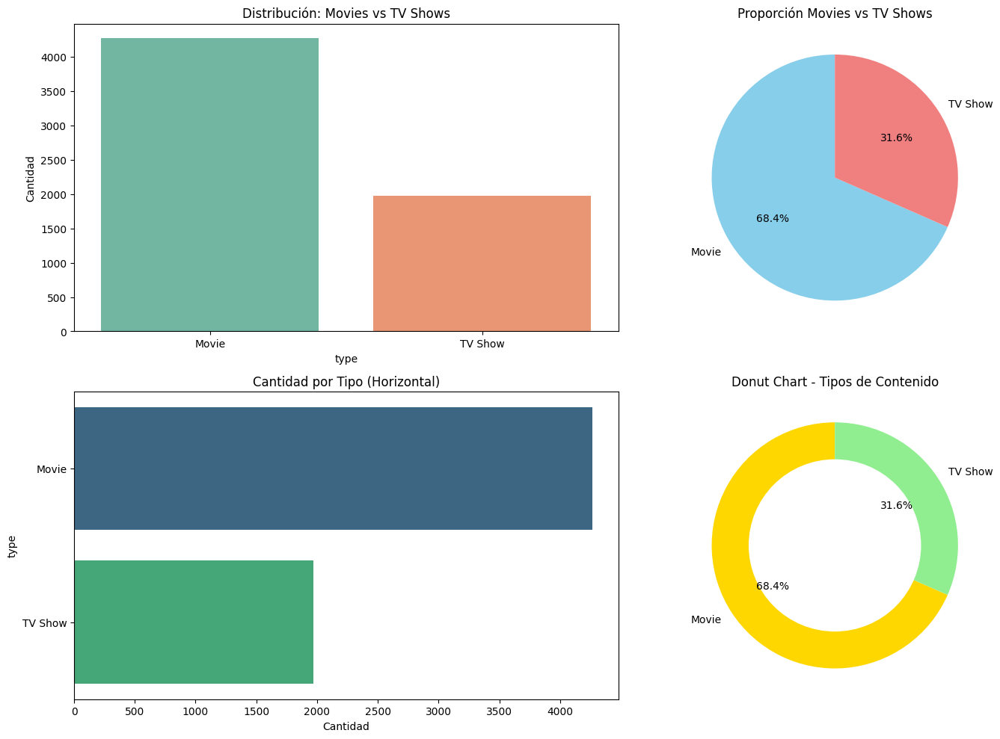
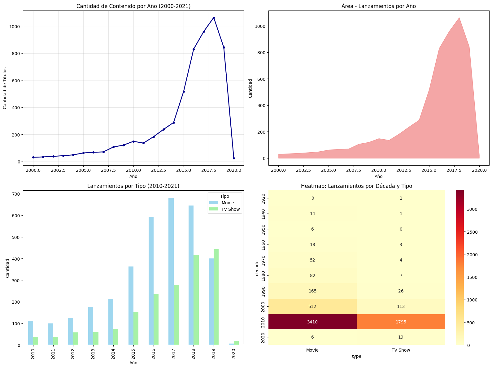
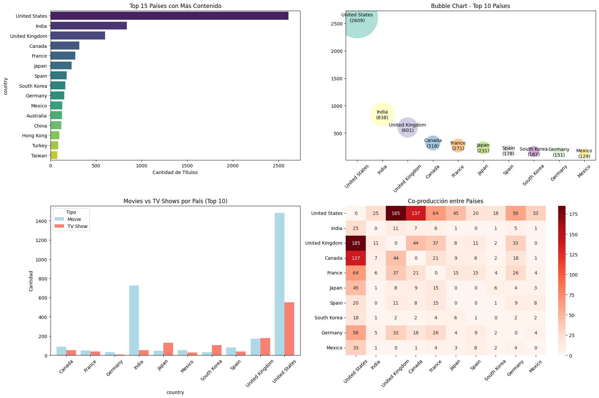
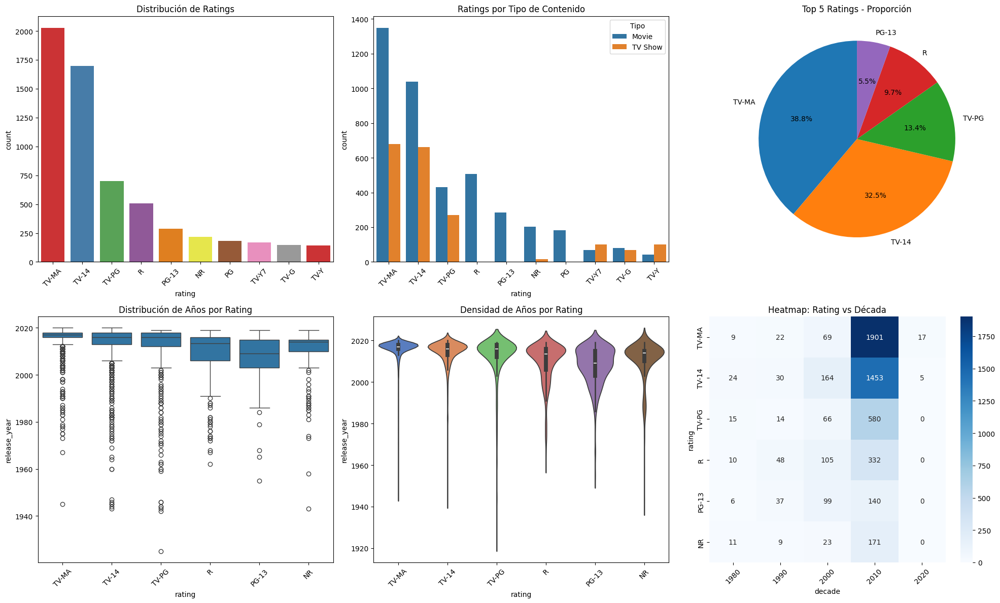
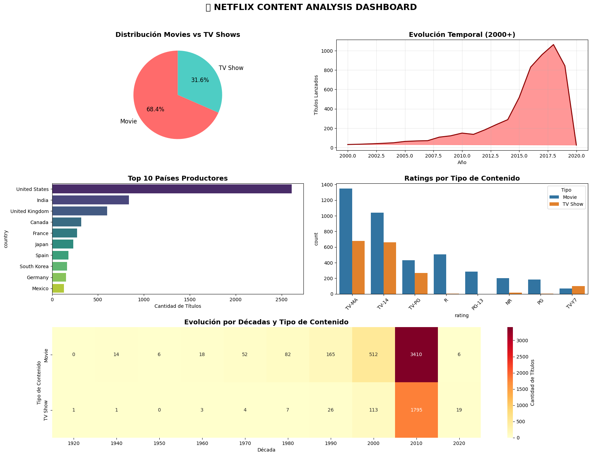
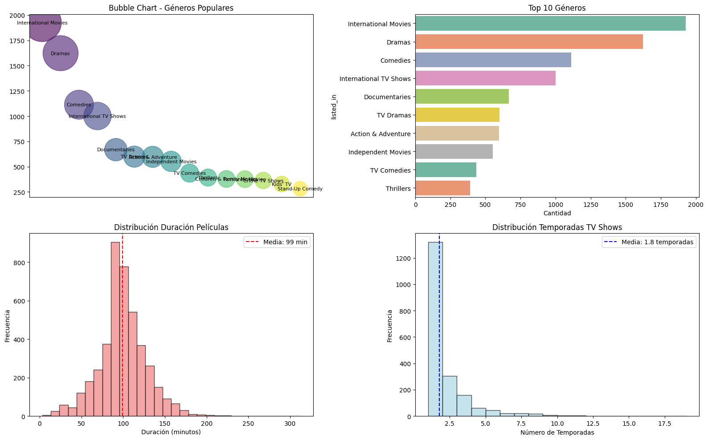

# UT1 - Actividad 3: Análisis Netflix Dataset

## Contexto
En esta actividad se trabajó con un dataset de Netflix, realizando limpieza, visualización y análisis exploratorio para extraer insights de negocio y patrones de contenido.

## Objetivos
- Aplicar técnicas de **data cleaning** y **EDA**.
- Generar visualizaciones para encontrar patrones.
- Plantear recomendaciones de negocio para Netflix.

## Actividades (con tiempos estimados)
| Actividad           | Tiempo | Resultado esperado               |
|---------------------|:------:|----------------------------------|
| Limpieza de datos |  1h  | Preparación de datos  |
| Análisis y visualizaciones      |  45m   | Generar análisis para conclusiones  |
| Documentación          |  30m   | Realizar reflexiones   |

## Desarrollo
Se analizaron las columnas de películas y series de Netflix, explorando:
- Distribución por tipo (películas vs series).
- Evolución en el tiempo del contenido.
- Países productores más frecuentes.
- Duración típica de películas y temporadas.

## Evidencias
- Notebook de análisis:

  [Abrir en Colab](https://colab.research.google.com/github/MatiasJorda/INGENIERIA-DATOS/blob/main/docs/portfolio/UT1/Notebooks/Netflix-analysis.ipynb) ·

  [Ver en GitHub](https://github.com/MatiasJorda/INGENIERIA-DATOS/blob/main/docs/portfolio/UT1/Notebooks/Netflix-analysis.ipynb) ·

  [Nbviewer (mirror)](https://nbviewer.org/github/MatiasJorda/INGENIERIA-DATOS/blob/main/docs/portfolio/UT1/Notebooks/Netflix-analysis.ipynb) ·

### Detención y visualización de valores faltantes

**Metodología utilizada:**

Se comenzó identificando los valores nulos por columna utilizando el método `isnull()`, tanto en cantidades absolutas como en porcentaje. Con esa información se crearon dos gráficos:

- Un gráfico de barras horizontales (via Seaborn) que muestra el porcentaje de datos faltantes en cada variable.
- Un heatmap que permite visualizar la distribución de valores nulos en el conjunto de datos, representando cada fila como un registro y cada columna como una variable.

**Interpretación:**

Del gráfico de barras se desprende que la columna con mayor cantidad de datos faltantes es `director`, con cerca del 32% de registros incompletos. Le siguen `cast` (9%) y `country` (8%). Por el contrario, columnas como `date_added` y `rating` presentan valores nulos casi insignificantes.

El heatmap refuerza este hallazgo, mostrando patrones claros de ausencia en las columnas mencionadas. Esto indica que cualquier acción de limpieza o imputación deberá enfocarse principalmente en `director`.

---

### Identificación de outliers y anomalías

**Metodología utilizada:**

Se recurrió a distintas visualizaciones para detectar valores atípicos o inconsistencias dentro del dataset:

- Un boxplot de los años de lanzamiento para ubicar títulos con fechas inusuales (muy antiguas).
- Un histograma de distribución de años, con una línea roja marcando la media.
- Un gráfico de barras con los títulos más duplicados.
- Un boxplot sobre la longitud de los títulos, para identificar extremos (muy cortos o muy extensos).

**Interpretación:**

El boxplot revela que existen títulos con años de lanzamiento anteriores a 1950, aunque no se detectan fechas futuras. El histograma confirma que la mayoría de las producciones fueron estrenadas entre 2010 y 2020.

El análisis de duplicados muestra que hay al menos 57 títulos repetidos, destacándose casos como "Love" o "Limitless". Por otro lado, el boxplot de longitudes muestra que la mayoría de los títulos tienen entre 10 y 20 caracteres, pero también hay excepciones notables como "PK", "ATM" o "Jim & Andy: The Great Beyond...".

---

### Análisis de tipos de contenido

**Metodología utilizada:**

Se usó `value_counts()` para calcular la proporción de cada tipo de contenido (`Movie` y `TV Show`). Posteriormente, se generaron varias visualizaciones para mostrar esta distribución:

- Un gráfico de barras vertical.
- Un gráfico circular (pie chart).
- Un gráfico de barras horizontales.
- Un gráfico tipo donut (versión del pie chart con centro vacío).

**Interpretación:**

Todas las representaciones coinciden en el mismo resultado: aproximadamente el 68% del contenido disponible es de tipo "película", mientras que el 32% corresponde a series. Esto refleja un catálogo más inclinado hacia el formato cinematográfico.

---

### Análisis de tendencias temporales

**Metodología utilizada:**

Se procesaron los años de lanzamiento convirtiéndolos a valores numéricos y agrupándolos por frecuencia. Se generaron diferentes visualizaciones:

- Una línea de tiempo con el número de lanzamientos por año desde el 2000.
- Un gráfico de área que resalta la tendencia de crecimiento.
- Un gráfico de barras segmentado por tipo (película o serie) entre 2010 y 2021.
- Un heatmap por década y tipo de contenido.

**Interpretación:**

Las visualizaciones evidencian un crecimiento constante de lanzamientos desde el año 2000, con un pico en 2017–2018 (más de 1000 lanzamientos). En 2020 se observa una disminución, posiblemente relacionada con la pandemia.

Las películas siguen siendo mayoría, aunque las series muestran un crecimiento acelerado desde 2015. El heatmap indica que la década 2010–2020 fue la de mayor producción, tanto en películas (más de 3400) como en series (casi 1800).

---

### Análisis por país de producción

**Metodología utilizada:**

Se limpiaron los datos de la columna `country`, separando múltiples países en una misma fila. Luego se generaron visualizaciones como:

- Gráfico de barras horizontal con los 15 países más representados.
- Bubble chart para los 10 principales países.
- Barras agrupadas por tipo de contenido (película o serie).
- Heatmap de co-producciones entre países.

**Interpretación:**

Estados Unidos lidera claramente el catálogo con más de 2500 títulos, seguido por India (838) y Reino Unido (601). Otros países como Canadá, Francia o Japón también tienen presencia, pero en menor medida.

Las películas predominan en la mayoría de países, aunque en algunos casos como Corea del Sur y Japón, las series también tienen peso. El heatmap de co-producciones muestra que EE.UU. colabora frecuentemente con Reino Unido y Canadá, reflejando su rol central en la industria global.

---

### Análisis de ratings y géneros

**Metodología utilizada:**

Se identificaron los 10 ratings más frecuentes usando `value_counts()`. Se utilizaron diferentes tipos de visualizaciones:

- Barras simples con los ratings más comunes.
- Barras segmentadas por tipo de contenido.
- Pie chart con los 5 ratings principales.
- Boxplot y violin plot del año de lanzamiento por rating.
- Heatmap que cruza ratings con décadas.

**Interpretación:**

TV-MA y TV-14 son los ratings más frecuentes, concentrando más del 70% del contenido. TV-MA es más común en películas, mientras que TV-14 se asocia más con series.

Los boxplots muestran que la mayoría de estos contenidos fueron lanzados después de 2010. El heatmap confirma que estos dos ratings dominaron en la década de 2010, desplazando clasificaciones como PG o R.

---

### Dashboard interactivo

**Metodología utilizada:**

Se calcularon métricas generales como el total de títulos, proporciones por tipo de contenido y rango de años. Luego, se construyó un dashboard utilizando `GridSpec` con 3 filas y 4 columnas, integrando los siguientes paneles:

- Pie chart: proporción entre películas y series.
- Área y línea temporal: lanzamientos por año desde 2000.
- Barras horizontales: 10 países más representados.
- Barras por rating y tipo.
- Heatmap por década y tipo.

**Interpretación:**

- El 68% del catálogo son películas y el 32% son series.
- Desde 2010 se observa un aumento sostenido en lanzamientos, con un máximo en 2017–2018.
- EE.UU. lidera en cantidad de títulos, seguido por India y Reino Unido.
- TV-MA y TV-14 son los ratings predominantes; cada uno se asocia a un tipo de contenido distinto.
- La década de 2010 fue clave para el crecimiento de Netflix, con una producción dominante de películas, aunque las series ganaron protagonismo.

---

### Análisis avanzado de géneros

**Metodología utilizada:**

Se descompuso la columna `listed_in` para separar los géneros múltiples por título. Luego se calcularon las frecuencias y se graficaron:

- Un bubble chart con los géneros más populares.
- Gráfico de barras horizontal con el Top 10 géneros.
- Histograma de duración de películas (con la media).
- Histograma de temporadas para series (también con la media).

**Interpretación:**

Los géneros más frecuentes son *International Movies*, *Dramas* y *Comedies*, junto con *International TV Shows* y *Documentaries*. 

La duración media de las películas es de 99 minutos, con extremos desde 3 hasta más de 300 minutos. En cuanto a las series, el promedio es de 1.8 temporadas, predominando formatos breves (1 a 2 temporadas), aunque hay excepciones de hasta 15 temporadas. Esto refleja un enfoque hacia el contenido consumible en sesiones cortas.

---

### Preguntas y respuestas

**¿Qué tipo de visualización es más efectiva para mostrar distribuciones temporales?**  
El gráfico de área destaca como el más claro para mostrar cambios a lo largo del tiempo, seguido del gráfico de línea. El gráfico de barras, en este contexto, resulta menos intuitivo.

**¿Por qué usar distintos tipos de gráficos?**  
Cada visualización se adapta mejor a ciertos datos y objetivos. Por ejemplo, los heatmaps son útiles para detectar patrones globales, y su interpretación puede verse afectada por la escala cromática.

**¿Qué insights pueden aprovecharse a nivel estratégico?**

- Seguir invirtiendo en series, que han mostrado un crecimiento sostenido.
- Diversificar el catálogo en países emergentes para reducir la dependencia de EE.UU. e India.
- Apostar por géneros universales (dramas, comedias), pero también explorar nichos menos saturados (anime, documentales).

**¿Cuál fue la visualización más reveladora?**  
El gráfico de lanzamientos por tipo de contenido a lo largo del tiempo. Mostró con claridad el cambio de estrategia hacia las

## Reflexión

El análisis del dataset de Netflix mostró cómo los datos reflejan decisiones estratégicas clave: desde 2017 las series se convirtieron en el motor principal de crecimiento, marcando un cambio en la identidad de la plataforma.  

También se evidenció la dependencia de mercados como EE.UU. e India, lo que abre la oportunidad de diversificar producciones en regiones emergentes. En cuanto a géneros, dramas y comedias dominan, aunque existen nichos poco explotados (documentales, realities, anime) con gran potencial.  

Este ejercicio permitió no solo practicar técnicas de análisis de datos, sino también comprender cómo la información puede guiar estrategias de contenido y expansión de una compañía global como Netflix.  

