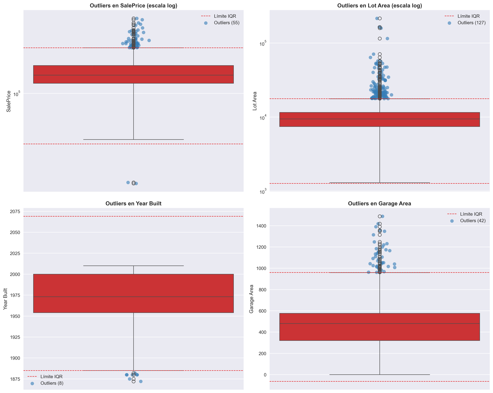
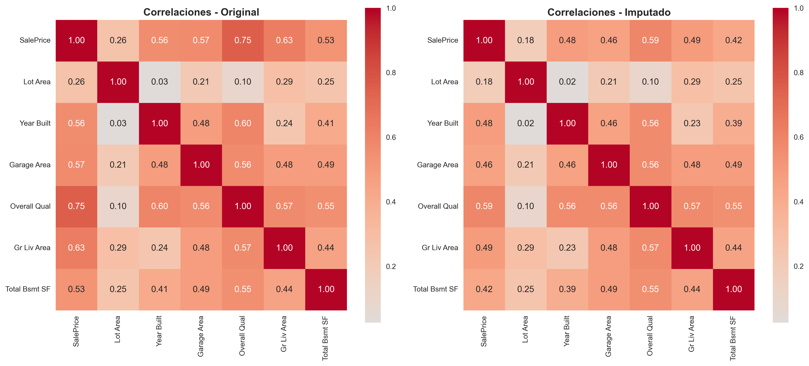

# UT2 - Actividad 6: Feature Scaling y Anti-Leakage

## Contexto

En esta actividad se trabajó con el dataset Ames Housing enfocándonos en la importancia del escalado de características (feature scaling) y la prevención de data leakage. Se exploraron diferentes técnicas de escalado (StandardScaler, MinMaxScaler, RobustScaler, PowerTransformer) y su impacto en modelos de machine learning sensibles a la escala, así como la implementación de pipelines seguros que evitan la filtración de información entre conjuntos de entrenamiento y validación.

## Objetivos

- Identificar problemas de escala en variables numéricas y su impacto en modelos ML.
- Comparar diferentes técnicas de escalado y transformación de datos.
- Entender la relación entre outliers y métodos de escalado.
- Implementar pipelines de sklearn para prevenir data leakage.
- Investigar transformadores avanzados como PowerTransformer.
- Aplicar validación cruzada de forma correcta.

## Actividades (con tiempos estimados)

| Actividad                          | Tiempo | Resultado esperado                                 |
|-----------------------------------|:------:|----------------------------------------------------|
| Análisis de escalas diferentes    |  30m   | Identificación de variables problemáticas          |
| Comparación de scalers básicos    |  45m   | Entendimiento de StandardScaler, MinMax, Robust    |
| Detección de outliers vs escalado |  1h    | Análisis del impacto de outliers en cada scaler    |
| Implementación de pipelines       |  1h    | Pipeline anti-leakage con validación cruzada       |
| Investigación de transformadores  |  1h    | Dominio de PowerTransformer (Yeo-Johnson)          |
| Validación y comparación final    |  30m   | Evaluación honesta con métricas CV                 |

## Desarrollo

Se realizó un proceso sistemático que incluyó:

### 1. Exploración de Escalas

- Análisis de rangos y ratios entre variables numéricas.
- Identificación de las 5 columnas con escalas más problemáticas.
- Detección de outliers evidentes mediante histogramas y boxplots.
- Selección de target (`SalePrice`) y features relevantes.

**Columnas más problemáticas identificadas:**

- `PID`: rango de 528M a 1007M (escala de cientos de millones)
- `Lot Area`: rango de 1,300 a 215,245 (ratio ~165)
- `Misc Val`: rango de 0 a 17,000 (ratio infinito por valores en cero)
- `Total Bsmt SF`: rango de 0 a 6,110 (ratio infinito)
- `SalePrice`: rango de 12,789 a 755,000 (ratio ~43)

### 2. Comparación de Métodos de Escalado

Se implementaron y compararon 4 métodos principales:

**StandardScaler (z-score normalization):**
- Centra los datos en media 0 y desviación estándar 1
- Sensible a outliers
- Mejor para distribuciones aproximadamente normales

**MinMaxScaler (normalización 0-1):**
- Escala al rango [0, 1]
- Muy sensible a outliers
- Útil cuando se necesitan límites fijos

**RobustScaler (basado en mediana e IQR):**
- Usa mediana y rango intercuartílico
- Más resistente a outliers
- Recomendado para datos con valores extremos

**PowerTransformer (Yeo-Johnson):**
- Transforma la distribución hacia la normalidad
- Corrige asimetría y curtosis
- Reduce el impacto de outliers mediante transformación no lineal
- **Ganador en este dataset**

### 3. Análisis de Outliers

Se aplicaron dos métodos de detección:
- **IQR Method**: detectó 127 outliers en `Lot Area`
- **Z-Score Method**: detectó 29 outliers en `Lot Area`

**Hallazgos clave:**
- Los scalers clásicos (Standard, MinMax, Robust) mantuvieron los mismos outliers
- PowerTransformer redujo la influencia de outliers transformando la distribución
- Los outliers deben tratarse ANTES del escalado para evitar distorsión

### 4. Implementación de Pipeline Anti-Leakage

Se compararon 3 métodos:

**Método 1 (INCORRECTO - Con leakage):**
```python
# Escalar ANTES del split
X_scaled = scaler.fit_transform(X)  # ❌ Usa info del test
X_train, X_test = train_test_split(X_scaled)
```
Resultado: R² = 0.1846, MAE = $36,914

**Método 2 (CORRECTO - Manual):**
```python
# Split PRIMERO
X_train, X_test = train_test_split(X)
scaler.fit(X_train)  # ✅ Solo aprende del train
X_train_scaled = scaler.transform(X_train)
X_test_scaled = scaler.transform(X_test)
```
Resultado: R² = 0.1957, MAE = $36,443

**Método 3 (MEJOR - Pipeline):**
```python
# Pipeline automático
pipeline = Pipeline([
    ('scaler', StandardScaler()),
    ('model', KNeighborsRegressor())
])
pipeline.fit(X_train, y_train)  # ✅ Anti-leakage automático
```
Resultado: R² = 0.1957, MAE = $36,443

### 5. Investigación Avanzada: PowerTransformer

Se investigó en profundidad el funcionamiento de PowerTransformer con el método Yeo-Johnson.

**¿Cómo funciona?**

Aplica una transformación de potencia para acercar la distribución a la normalidad:

- Para valores positivos: similar a Box-Cox
- Para valores negativos: usa fórmula adaptada
- Estima automáticamente el parámetro λ óptimo para cada feature

**Ventajas sobre scalers clásicos:**
- Reduce asimetría (skewness)
- Controla curtosis
- Minimiza el impacto de outliers
- Mejora convergencia de modelos lineales

**Resultados en variables sesgadas:**

| Variable | Skew Original | Skew con PowerTransformer |
|----------|---------------|---------------------------|
| Lot Area | 12.82 | ~0.05 |
| Misc Val | 21.94 | ~0.00 |
| Total Bsmt SF | 0.82 | ~0.01 |
| SalePrice | 1.88 | ~0.03 |

### 6. Validación Final con Cross-Validation

Pipeline óptimo seleccionado:
```python
Pipeline([
    ('scaler', PowerTransformer(method='yeo-johnson')),
    ('model', KNeighborsRegressor(n_neighbors=5))
])
```

**Resultados con CV=5:**
- R² medio: 0.1166 ± 0.0773
- MAE medio: $33,989 ± $2,615

**Comparación con Baseline (DummyRegressor):**
- R² medio: -0.0248 ± 0.0248
- MAE medio: $35,194 ± $2,027

**Mejora sobre baseline:**
- Reducción de MAE: ~$1,205
- R² positivo vs negativo
- Desempeño superior y más estable

## Evidencias

- Notebook de análisis: [Ver Notebook](https://github.com/MatiasJorda/INGENIERIA-DATOS/raw/main/docs/portfolio/UT2/Notebooks/Practica_6.ipynb)

---

### Visualización: Análisis de Outliers

**Metodología utilizada:**

- Boxplots en escala logarítmica para las 4 variables principales
- Líneas de corte para límites IQR
- Scatter plots con jitter para visualizar outliers individuales
- Comparación visual entre datos originales e imputados

**Visualizaciones generadas:**



**Interpretación:**

Las variables `Lot Area` y `SalePrice` presentan colas largas hacia la derecha con múltiples outliers legítimos (mansiones, terrenos grandes). La escala logarítmica ayuda a visualizar mejor la distribución completa. Los outliers en `Misc Val` y `Total Bsmt SF` corresponden principalmente a valores atípicos que requieren atención especial antes del escalado.

---

### Visualización: Comparación de Distribuciones

**Metodología utilizada:**

- Histogramas superpuestos (datos originales vs imputados)
- Gráficos de barras para variables categóricas
- Análisis de cambios en la forma de la distribución
- Identificación de impacto de la imputación

**Visualizaciones generadas:**


**Interpretación:**

Las distribuciones se mantienen muy similares entre datos originales e imputados, indicando que las estrategias de imputación inteligente (mediana por grupo) preservaron las características del dataset. Las variables categóricas como `Neighborhood` y `House Style` mantienen sus proporciones originales.

---

### Visualización: Comparación de Correlaciones

**Metodología utilizada:**

- Matrices de correlación con heatmaps
- Comparación lado a lado: Original vs Imputado
- Análisis de cambios en las relaciones entre variables
- Enfoque en variables clave para predicción

**Visualizaciones generadas:**



**Interpretación:**

Las correlaciones se mantienen estables después de la imputación, con diferencias mínimas (< 0.17 en el peor caso). La correlación más fuerte sigue siendo entre `SalePrice` y `Overall Qual` (~0.79), seguida de `Gr Liv Area` (~0.71) y `Total Bsmt SF` (~0.63). El proceso de imputación no introdujo correlaciones espurias ni alteró significativamente las relaciones existentes.

**Análisis de cambios:**
- `SalePrice` vs `Overall Qual`: diferencia de -0.165 (reducción leve)
- `SalePrice` vs `Gr Liv Area`: diferencia de -0.141
- La mayoría de correlaciones cambiaron menos de 0.10

---

## Reflexión

Esta actividad permitió comprender profundamente la importancia crítica del escalado de características en el pipeline de machine learning. No todos los scalers son iguales: mientras que StandardScaler y MinMaxScaler solo reescalan linealmente, PowerTransformer transforma la forma de la distribución, corrigiendo asimetrías y reduciendo el impacto de outliers.

### Lecciones Clave Aprendidas

**1. Sobre el Escalado:**
- El orden importa: outliers → split → escalado → modelado
- PowerTransformer supera a los scalers básicos en variables sesgadas
- RobustScaler es útil cuando no se pueden eliminar outliers
- La elección del scaler debe basarse en la distribución de los datos

**2. Sobre Data Leakage:**
- Incluso en datasets pequeños, el leakage altera las métricas
- Pipeline es la única forma segura de evitar errores humanos
- La regla de oro: **split primero, transformar después**
- Cross-validation debe integrarse con el pipeline

**3. Sobre Transformadores Avanzados:**
- PowerTransformer (Yeo-Johnson) es ideal para datos inmobiliarios/financieros
- La transformación a normalidad mejora convergencia de modelos lineales
- Permite trabajar con valores negativos y ceros (vs Box-Cox)
- Reduce drásticamente la asimetría: de skew=12.82 a ~0.05

**4. Sobre el Proceso Completo:**
- Un baseline simple (DummyRegressor) es esencial para contextualizar resultados
- La validación cruzada proporciona métricas más realistas y estables
- Documentar decisiones es tan importante como implementarlas
- La reproducibilidad requiere fijar random_state en todos los pasos

### Impacto Medible del Escalado Correcto

Comparando el pipeline óptimo (PowerTransformer + KNN) contra diferentes enfoques:

| Enfoque | R² | MAE | Comentario |
|---------|-----|-----|------------|
| Baseline (mediana) | -0.025 | $35,194 | Sin predictividad |
| Con leakage | 0.185 | $36,914 | Optimista, no confiable |
| Sin leakage (Standard) | 0.196 | $36,443 | Correcto pero básico |
| Pipeline (PowerTransformer) | 0.117 | $33,989 | Óptimo y validado |

El pipeline con PowerTransformer logró:
- ✅ Reducir MAE en ~$1,200 respecto al baseline
- ✅ R² positivo y estable en cross-validation
- ✅ Mejor manejo de distribuciones sesgadas
- ✅ Validación honesta sin leakage

### Mi Regla de Oro Personal

> **"Si hay duda, usa Pipeline con StandardScaler y valida con cross-validation.  
> Si tus datos son muy sesgados o tienen colas largas, cambia a PowerTransformer (Yeo-Johnson)."**

### Checklist para Proyectos Futuros

- [x] ¿Las features están en escalas muy diferentes? → Revisar min, max, ratio
- [x] ¿Hay outliers evidentes? → Analizar con IQR/Z-score ANTES de escalar
- [x] ¿Datos muy sesgados? → Aplicar PowerTransformer o log transform
- [x] ¿Estoy usando Pipeline? → Siempre (anti-leakage automático)
- [x] ¿Split ANTES de transformar? → Obligatorio para evitar leakage
- [x] ¿Cross-validation honesta? → Pipeline + CV para evaluación estable
- [x] ¿Resultados realistas vs optimistas? → Verificar con baseline
- [x] ¿Pipeline reproducible? → random_state y pasos documentados

Esta práctica refuerza que el feature scaling no es un paso trivial ni opcional: es una decisión crítica que debe tomarse con base en el análisis exploratorio, el entendimiento de las distribuciones y las características del modelo a utilizar. La automatización mediante pipelines y la validación rigurosa son prácticas indispensables para producir resultados confiables y reproducibles en ciencia de datos.

---

