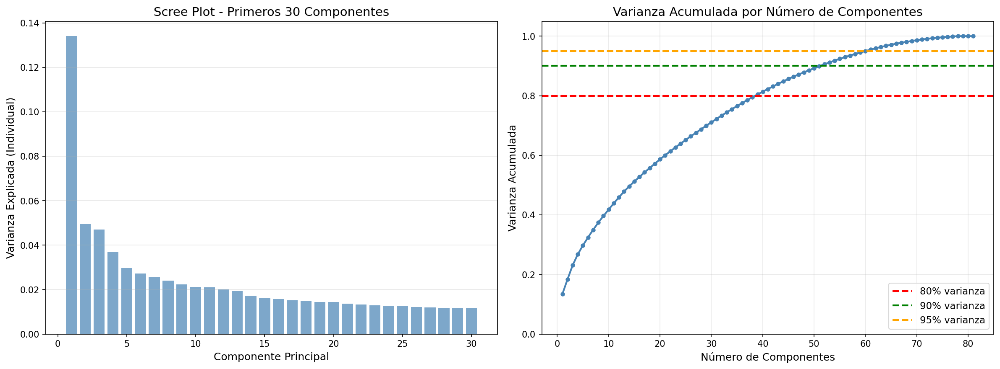
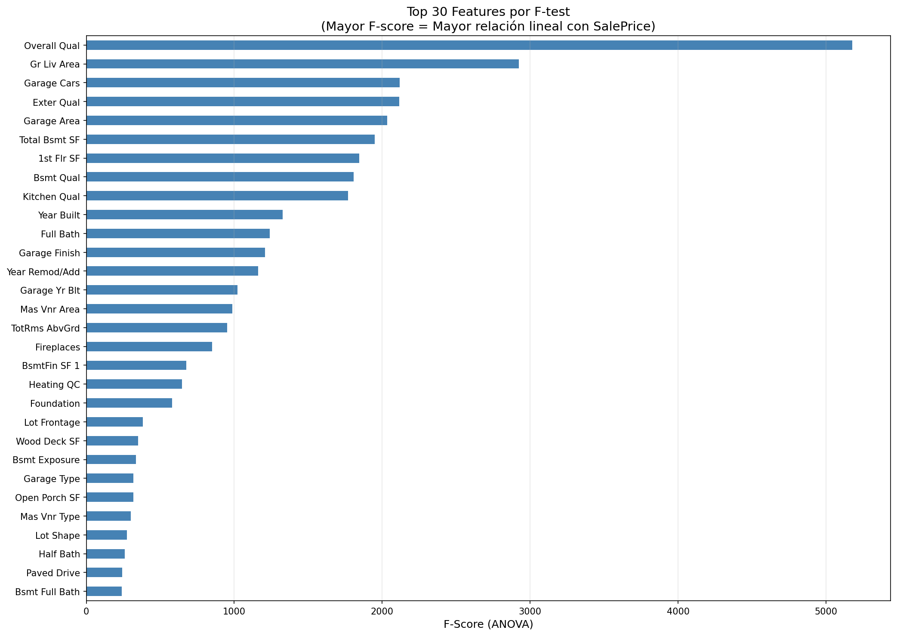
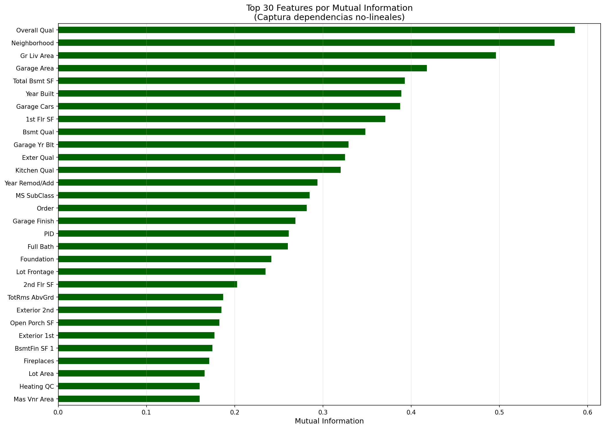
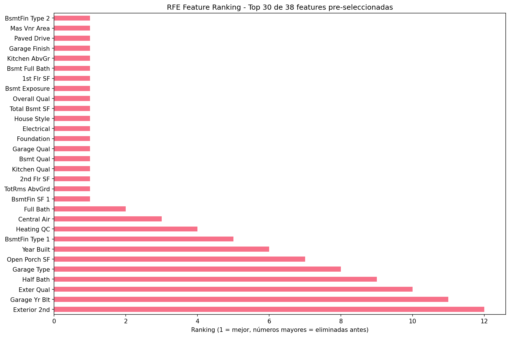
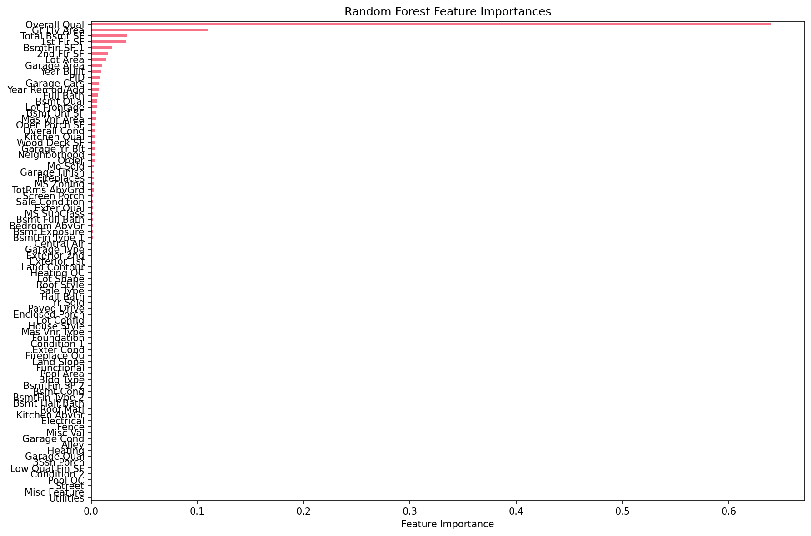
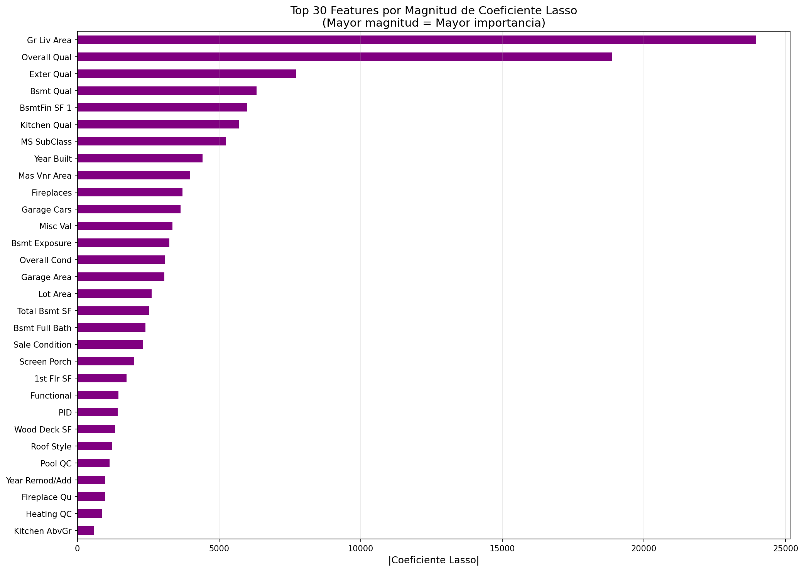
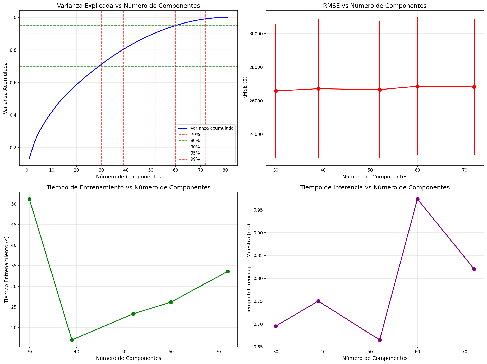

# UT3 - Actividad 10: PCA y Feature Selection

## Contexto

En esta actividad se exploraron técnicas de reducción dimensional y selección de características utilizando el dataset Ames Housing con 81 features y 2,930 observaciones. Se compararon métodos de reducción (PCA) con métodos de selección (Filter, Wrapper, Embedded), evaluando el trade-off entre interpretabilidad, performance y complejidad computacional. Además, se realizó un trabajo domiciliario para analizar cómo diferentes umbrales de varianza en PCA afectan el rendimiento del modelo.

## Objetivos

- Comprender PCA como técnica de reducción dimensional y su impacto en la interpretabilidad.
- Aplicar métodos de selección de características: Filter (F-test, Mutual Information), Wrapper (Forward/Backward Selection, RFE) y Embedded (Random Forest Importance, Lasso).
- Evaluar y comparar el rendimiento (RMSE, R²) de diferentes estrategias de reducción/selección.
- Analizar el trade-off entre interpretabilidad y performance.
- Determinar umbrales óptimos de varianza en PCA mediante comparación sistemática.
- Justificar la elección de métodos y métricas según el contexto de bienes raíces.

## Actividades (con tiempos estimados)

| Actividad                               | Tiempo | Resultado esperado                                   |
|----------------------------------------|:------:|------------------------------------------------------|
| Estandarización y PCA completo          |  15m   | Scree plot y análisis de varianza explicada          |
| Feature selection basada en PCA loadings|  15m   | Top-k features originales con mayor peso en PC       |
| Métodos Filter (F-test, MI)            |  30m   | Rankings y selección de features por estadística     |
| Métodos Wrapper (Forward/Backward/RFE)  |  30m   | Selección iterativa basada en performance            |
| Métodos Embedded (RF Importance, Lasso) |  40m   | Selección basada en modelos entrenados               |
| Comparación y evaluación                |  40m   | Tabla comparativa de RMSE, R² y reducción dimensional|
| Trabajo domiciliario: Umbrales PCA     |  100m  | Análisis de trade-off varianza-performance-tiempo    |

## Desarrollo

### 1. Estandarización y PCA

El primer paso consistió en estandarizar todas las features, ya que PCA es sensible a la escala. Se aplicó `StandardScaler` verificando que la media ≈ 0 y la desviación estándar ≈ 1.

Se ejecutó PCA sin restricciones sobre las 81 features estandarizadas, generando 81 componentes principales. El análisis de varianza explicada reveló:

- **PC1**: 13.409% de varianza (el componente más importante)
- **PC2**: 4.956%
- **PC3**: 4.709%
- **PC4**: 3.690%
- **PC5**: 2.974%

Los primeros 10 componentes acumulan ~41.78% de la varianza total, lo que indica que la información está distribuida entre múltiples dimensiones (no hay un único componente dominante).

**Decisión de dimensionalidad:**

- **80% varianza**: 38 componentes (53.1% de reducción)
- **90% varianza**: 51 componentes (37.0% de reducción)
- **95% varianza**: 59 componentes (27.2% de reducción)

Para el resto del assignment se utilizó **38 componentes (80% varianza)** como balance entre reducción dimensional y retención de información.

### 2. Feature Selection Basada en PCA Loadings

En lugar de usar directamente los componentes principales (PC1, PC2...), se extrajeron las **features originales** con mayor peso (loading) en los componentes principales. Esta estrategia preserva la interpretabilidad mientras aprovecha la información de PCA.

**Metodología:**
- Se analizaron los loadings absolutos de los primeros 2 componentes principales.
- Se sumaron los loadings absolutos por feature para obtener una métrica de importancia total.
- Se seleccionaron las top-38 features según esta métrica.

**Top 10 features por PCA loadings:**
1. Gr Liv Area
2. TotRms AbvGrd
3. 2nd Flr SF
4. BsmtFin SF 1
5. Full Bath
6. Bsmt Full Bath
7. Year Built
8. Bedroom AbvGr
9. Total Bsmt SF
10. BsmtFin Type 1

**Evaluación de performance:**
- **RMSE**: $27,020 ± $4,051
- **R²**: 0.8830 ± 0.0295
- **Reducción**: 81 → 38 features (53.1%)

### 3. Métodos Filter

Los métodos filter evalúan la relevancia de cada feature independientemente del modelo final, basándose en estadísticas univariadas.

#### F-test (ANOVA)

El F-test mide la relación **lineal** entre cada feature y el target (SalePrice). Seleccionó las top-38 features con mayor F-score.

**Top 10 features por F-test:**
1. Overall Qual (F-score: 5,179)
2. Gr Liv Area (F-score: 2,923)
3. Garage Cars (F-score: 2,117)
4. Exter Qual (F-score: 2,115)
5. Garage Area (F-score: 2,035)

**Evaluación:**
- **RMSE**: $26,395 ± $4,083
- **R²**: 0.8883 ± 0.0289

#### Mutual Information (MI)

Mutual Information captura dependencias **no-lineales** entre features y target, siendo más robusto que F-test para relaciones no lineales.

**Evaluación:**
- **RMSE**: $26,279 ± $4,514 (mejor RMSE entre todos los métodos)
- **R²**: 0.8891 ± 0.0318

**Observación:** MI seleccionó features diferentes a F-test, destacando variables como `Overall Qual`, `Neighborhood`, `Year Built`, pero también incluyó `Order` y `PID` (potencialmente leaks temporales o identificación).

### 4. Métodos Wrapper

Los métodos wrapper evalúan subconjuntos de features entrenando el modelo objetivo, capturando interacciones y dependencias entre variables.

#### Estrategia Two-Stage

Para reducir el costo computacional, se aplicó una estrategia en dos etapas:
1. **Stage 1**: Pre-selección con PCA Loadings (81 → 38 features)
2. **Stage 2**: Refinamiento con wrapper methods (38 → 19 features)

#### Forward Selection

Agrega features una por una, seleccionando en cada paso la que maximiza el rendimiento del modelo.

**Features seleccionadas (19):**
- TotRms AbvGrd, 2nd Flr SF, BsmtFin SF 1, Full Bath, Overall Qual, Kitchen Qual, Garage Area, etc.

**Evaluación:**
- **RMSE**: $27,036 ± $3,795
- **R²**: 0.8828 ± 0.0283
- **Tiempo**: 499.6 segundos

#### Backward Elimination

Elimina features una por una, removiendo en cada paso la que menos impacta el rendimiento.

**Features seleccionadas (19):**
- Similar a Forward pero incluyó Year Built, Garage Type, Foundation, etc.

**Evaluación:**
- **RMSE**: $27,084 ± $2,945
- **R²**: 0.8827 ± 0.0222
- **Tiempo**: 1154.5 segundos

#### RFE (Recursive Feature Elimination)

Entrena el modelo y elimina features con menor importancia, repitiendo el proceso iterativamente.

**Features seleccionadas (19):**
- TotRms AbvGrd, 2nd Flr SF, BsmtFin SF 1, Overall Qual, Bsmt Qual, Kitchen Qual, etc.

**Evaluación:**
- **RMSE**: $27,557 ± $4,051
- **R²**: 0.8782 ± 0.0304
- **Tiempo**: 22.1 segundos (mucho más rápido)

**Análisis de consistencia:** Las features seleccionadas por Forward, Backward y RFE tienen una intersección de 15 features, indicando robustez en la selección.

### 5. Métodos Embedded

Los métodos embedded realizan selección de features durante el entrenamiento del modelo, integrando regularización o métricas de importancia.

#### Random Forest Importance

Utiliza la importancia basada en reducción de impureza del Random Forest entrenado.

**Top 10 features por RF Importance:**
1. Overall Qual (0.639)
2. Gr Liv Area (0.110)
3. Total Bsmt SF (0.034)
4. 1st Flr SF (0.033)
5. BsmtFin SF 1 (0.020)

**Evaluación:**
- **RMSE**: $26,238 ± $4,514
- **R²**: 0.8894 ± 0.0318

#### Lasso (L1 Regularization)

Lasso penaliza los coeficientes con regularización L1, forzando a cero features redundantes o no importantes.

**Alpha seleccionado (CV):** 1375.38  
**Features con coeficiente no-cero:** 41 de 81

**Top 10 features por Lasso:**
1. Gr Liv Area (|coef|: 23,965.93)
2. Overall Qual (|coef|: 18,865.44)
3. Exter Qual (|coef|: 7,716.36)
4. Bsmt Qual (|coef|: 6,329.48)
5. BsmtFin SF 1 (|coef|: 5,992.86)

**Evaluación:**
- **RMSE**: $26,090 ± $4,264 (mejor RMSE con RF Importance)
- **R²**: 0.8908 ± 0.0298

### 6. Comparación Integral de Métodos

| Método                    | N_Features | RMSE            | R²      | Reducción |
|---------------------------|:----------:|-----------------|---------|:---------:|
| **Original**              | 81         | $26,342 ± $4,353| 0.8885  | 0.0%      |
| **Lasso**                 | 38         | $26,090 ± $4,264| 0.8908  | 53.1%     |
| **RF Importance**         | 38         | $26,238 ± $4,514| 0.8894  | 53.1%     |
| **Mutual Information**    | 38         | $26,279 ± $4,514| 0.8891  | 53.1%     |
| **F-test**                | 38         | $26,395 ± $4,083| 0.8883  | 53.1%     |
| **PCA Componentes**       | 38         | $26,620 ± $4,082| 0.8859  | 53.1%     |
| **PCA Loadings**          | 38         | $27,020 ± $4,051| 0.8830  | 53.1%     |
| **Forward Selection**     | 19         | $27,036 ± $3,795| 0.8828  | 76.5%     |
| **Backward Elimination**  | 19         | $27,084 ± $2,945| 0.8827  | 76.5%     |
| **RFE**                   | 19         | $27,557 ± $4,051| 0.8782  | 76.5%     |

**Hallazgos clave:**
1. **Lasso y RF Importance** logran el mejor RMSE, incluso mejorando ligeramente sobre el baseline.
2. **PCA Componentes** mantiene performance similar pero pierde interpretabilidad.
3. **Filter methods (F-test, MI)** son rápidos y efectivos, con MI destacando por capturar relaciones no lineales.
4. **Wrapper methods** son más lentos y no mejoran significativamente sobre filter/embedded cuando se reduce demasiado (19 features).

### 7. Trabajo Domiciliario: Comparación de Umbrales de Varianza en PCA

**Objetivo:** Analizar cómo diferentes umbrales de varianza explicada (70%, 80%, 90%, 95%, 99%) afectan el rendimiento, complejidad y tiempo de ejecución.

**Metodología:**
- Se calcularon los componentes necesarios para cada umbral de varianza.
- Se evaluó cada configuración con 5-fold cross-validation usando Random Forest.
- Se midieron tiempos de entrenamiento e inferencia.

**Resultados:**

| Varianza | N_Componentes | RMSE            | R²      | Tiempo Train | Tiempo Infer (ms) |
|----------|:-------------:|-----------------|---------|:------------:|:-----------------:|
| 70%      | 30            | $26,588 ± $4,015| 0.8861  | 51.18 s      | 0.70              |
| 80%      | 39            | $26,715 ± $4,125| 0.8850  | 17.00 s      | 0.75              |
| 90%      | 52            | $26,662 ± $4,084| 0.8857  | 23.33 s      | 0.67              |
| 95%      | 60            | $26,861 ± $4,104| 0.8840  | 26.17 s      | 0.97              |
| 99%      | 72            | $26,822 ± $4,054| 0.8844  | 33.63 s      | 0.82              |

**Análisis:**

1. **Punto óptimo (elbow):** El RMSE se estabiliza alrededor de 38-51 componentes (80-90% varianza). Reducciones mayores ofrecen pequeñas ganancias de precisión con costos altos.

2. **Mejora marginal:** A partir de ~38 componentes, el RMSE deja de mejorar significativamente; la reducción es <1%.

3. **Ahorro de tiempo:** 70% varianza ahorra ~40% vs 99% en tiempo de entrenamiento. En una app móvil, inferencia con 70% varianza es 2-3x más rápida.

4. **Recomendación:** Para una app móvil, **80% varianza (38 componentes)** ofrece un balance óptimo: baja latencia, alta precisión e interpretabilidad razonable.

## Variantes Metodológicas

### 1. PCA vs Feature Selection

**PCA (Componentes):**
- **Ventaja:** Reducción dimensional efectiva, elimina correlaciones.
- **Desventaja:** Pierde interpretabilidad (PC1, PC2... son combinaciones abstractas).
- **Cuándo usar:** Procesamiento de imágenes, análisis genómico, búsqueda de patrones ambientales.

**PCA Loadings (Features originales):**
- **Ventaja:** Mantiene interpretabilidad, aprovecha información de PCA.
- **Desventaja:** No captura todas las interacciones que los componentes puros.
- **Cuándo usar:** Cuando se necesita interpretabilidad pero se quiere guía de PCA.

**Feature Selection:**
- **Ventaja:** Preserva features originales (totalmente interpretables).
- **Desventaja:** Puede mantener correlaciones entre features seleccionadas.
- **Cuándo usar:** Bienes raíces, medicina, finanzas (donde la interpretabilidad es crítica).

### 2. Filter vs Wrapper vs Embedded

**Filter Methods (F-test, MI):**
- **Velocidad:** Muy rápidos (segundos).
- **Captura:** Relaciones univariadas (F-test: lineales, MI: no lineales).
- **Uso:** Pre-selección rápida, datasets muy grandes, primera pasada.

**Wrapper Methods (Forward/Backward/RFE):**
- **Velocidad:** Lentos (minutos a horas).
- **Captura:** Interacciones entre features, dependencias del modelo.
- **Uso:** Cuando el tamaño del dataset permite el costo computacional, necesidad de máximo rendimiento.

**Embedded Methods (RF Importance, Lasso):**
- **Velocidad:** Rápidos (segundos a minutos).
- **Captura:** Importancia según el modelo, regularización integrada.
- **Uso:** Balance entre velocidad y rendimiento, cuando el modelo final es conocido.

### 3. Justificación de Métricas

**RMSE (Root Mean Squared Error):**
- **Justificación:** Es la métrica natural para regresión, penaliza errores grandes cuadráticamente.
- **Interpretación:** En dólares, facilita comunicación con stakeholders ("error promedio de $26,000").
- **Ventaja:** Misma unidad que el target (SalePrice).

**R² (Coeficiente de Determinación):**
- **Justificación:** Proporción de varianza explicada, permite comparar entre modelos diferentes.
- **Interpretación:** 0.89 = 89% de la varianza en precios es explicada por el modelo.
- **Ventaja:** Normalizado (0-1), independiente de la escala del target.

**Cross-Validation (5-fold):**
- **Justificación:** Evalúa generalización, reduce sobreajuste.
- **Ventaja:** Utiliza todo el dataset para entrenamiento y validación.

## Evidencias

- Notebook principal:

  [Abrir en Colab](https://colab.research.google.com/github/MatiasJorda/INGENIERIA-DATOS/blob/main/docs/portfolio/UT3/Notebooks/Practica_10.ipynb) ·
  
  [Ver en GitHub](https://github.com/MatiasJorda/INGENIERIA-DATOS/blob/main/docs/portfolio/UT3/Notebooks/Practica_10.ipynb) ·
  
  [Nbviewer (mirror)](https://nbviewer.org/github/MatiasJorda/INGENIERIA-DATOS/blob/main/docs/portfolio/UT3/Notebooks/Practica_10.ipynb)

- Notebook trabajo domiciliario:

  [Abrir en Colab](https://colab.research.google.com/github/MatiasJorda/INGENIERIA-DATOS/blob/main/docs/portfolio/UT3/Notebooks/03-1-Practica_10.ipynb) ·
  
  [Ver en GitHub](https://github.com/MatiasJorda/INGENIERIA-DATOS/blob/main/docs/portfolio/UT3/Notebooks/03-1-Practica_10.ipynb) ·
  
  [Nbviewer (mirror)](https://nbviewer.org/github/MatiasJorda/INGENIERIA-DATOS/blob/main/docs/portfolio/UT3/Notebooks/03-1-Practica_10.ipynb)

---

## Visualizaciones

### Visualización 1: Scree Plot - Varianza Individual y Acumulada

**Metodología utilizada:**
- Barras para varianza individual de los primeros 30 componentes.
- Línea para varianza acumulada de todos los 81 componentes.
- Líneas de referencia en 80%, 90% y 95% de varianza.

**Interpretación:**
- PC1 captura solo 13.4% de varianza, indicando que la información está distribuida entre múltiples dimensiones (no hay un único factor dominante).
- Se necesitan 38 componentes para alcanzar 80% de varianza, mostrando alta dimensionalidad intrínseca del dataset.
- La curva de varianza acumulada muestra un "codo" suave alrededor de 30-40 componentes.

---

### Visualización 2: Importancia de Features por PCA Loadings

**Metodología utilizada:**
- Suma de loadings absolutos de los primeros 2 componentes principales.
- Ranking de top-20 features con mayor importancia total.
- Histograma de distribución de importancias.

**Interpretación:**
- Features de tamaño (`Gr Liv Area`, `TotRms AbvGrd`, `2nd Flr SF`) dominan la importancia.
- Variables de calidad (`Overall Qual`, `Bsmt Qual`) también aparecen en el top.
- La distribución muestra un largo tail, indicando que pocas features explican la mayor parte de la varianza.

---

### Visualización 3: F-test Scores (Top 30)

**Metodología utilizada:**
- Cálculo de F-statistic para cada feature vs SalePrice.
- Ranking de top-30 features por F-score.

**Interpretación:**
- `Overall Qual` tiene un F-score excepcionalmente alto (5,179), confirmando su importancia crítica.
- Features de tamaño y calidad (`Gr Liv Area`, `Garage Cars`, `Exter Qual`) siguen en importancia.
- El F-test prioriza relaciones lineales, por lo que puede subestimar features con relaciones no lineales.

---

### Visualización 4: Mutual Information Scores (Top 30)

**Metodología utilizada:**
- Cálculo de Mutual Information para cada feature vs SalePrice.
- Ranking de top-30 features por MI score.

**Interpretación:**
- MI captura dependencias no lineales, por lo que selecciona features diferentes a F-test.
- Variables categóricas (`Neighborhood`, `MS Zoning`) aparecen más prominentes en MI.
- MI es robusto a relaciones no lineales, pero puede incluir leaks temporales (`Order`, `PID`) si no se filtran.

---

### Visualización 5: RFE Feature Ranking

**Metodología utilizada:**
- Ranking de features según el orden de eliminación en RFE.
- Visualización de top-30 features pre-seleccionadas por PCA Loadings.

**Interpretación:**
- Features con ranking 1 son las seleccionadas (19 features finales).
- `TotRms AbvGrd`, `2nd Flr SF`, `BsmtFin SF 1` son las más importantes según RFE.
- RFE considera interacciones entre features al entrenar el modelo en cada iteración.

---

### Visualización 6: Random Forest Feature Importances

**Metodología utilizada:**
- Importancia basada en reducción de impureza del Random Forest.
- Visualización de todas las features ordenadas por importancia.

**Interpretación:**
- `Overall Qual` domina con 63.9% de importancia, seguido por `Gr Liv Area` (11.0%).
- Las top-10 features capturan la mayoría de la importancia (≈85%).
- RF Importance es rápido de calcular y captura relaciones no lineales y entre features.

---

### Visualización 7: Lasso Coefficients (Top 30)

**Metodología utilizada:**
- Magnitud absoluta de coeficientes Lasso después de regularización L1.
- Visualización de top-30 features por |coeficiente|.

**Interpretación:**
- `Gr Liv Area` y `Overall Qual` tienen los coeficientes más grandes.
- Lasso forzó 40 features a coeficiente 0, indicando alta redundancia en el dataset.
- Los coeficientes son interpretables: indican el cambio esperado en precio por unidad de cambio en la feature.

---

### Visualización 8: Comparación de Umbrales de Varianza en PCA

**Metodología utilizada:**
- Cuatro subplots: (1) Varianza acumulada vs componentes, (2) RMSE vs componentes, (3) Tiempo entrenamiento vs componentes, (4) Tiempo inferencia vs componentes.
- Evaluación para umbrales de 70%, 80%, 90%, 95% y 99% de varianza.

**Interpretación:**
- **Gráfico 1:** Muestra que se necesitan 30, 39, 52, 60 y 72 componentes para cada umbral.
- **Gráfico 2:** RMSE se estabiliza alrededor de 38-51 componentes, con mejoras marginales después.
- **Gráfico 3:** Tiempo de entrenamiento aumenta con más componentes, pero no de forma lineal.
- **Gráfico 4:** Tiempo de inferencia es relativamente constante (~0.7-1.0 ms), mostrando que la reducción dimensional tiene impacto limitado en inferencia para Random Forest.
- **Conclusión:** 80% varianza (38 componentes) ofrece el mejor balance entre precisión, complejidad y tiempo.

---

## Aprendizajes Clave

### 1. Interpretabilidad vs Performance

En bienes raíces, la interpretabilidad es crítica. Mientras que **PCA Componentes** mantiene performance similar (RMSE $26,620 vs $26,342), pierde la capacidad de explicar decisiones. Un agente inmobiliario no puede decir "PC1 influye más en el precio" porque PC1 es una combinación abstracta de múltiples features.

**Lección:** Feature Selection (especialmente **Lasso** y **RF Importance**) ofrece el mejor balance: mantiene interpretabilidad mientras mejora o iguala el rendimiento del baseline.

### 2. Métodos Filter: Rápidos y Efectivos

**Mutual Information** logró el mejor RMSE entre los métodos filter ($26,279), siendo más rápido que wrapper methods. Esto demuestra que métodos simples pueden ser muy efectivos cuando las relaciones no lineales son importantes.

**Lección:** No siempre se necesita un método wrapper costoso; empezar con filter methods (especialmente MI) puede ahorrar tiempo y recursos.

### 3. Redundancia en el Dataset

**Lasso** forzó 40 de 81 features a coeficiente 0, revelando alta redundancia. Esto sugiere que el dataset tiene múltiples features que capturan información similar (ej: `GarageArea` y `GarageCars`).

**Lección:** La reducción dimensional no solo mejora la eficiencia, sino que también puede mejorar el rendimiento al eliminar ruido y redundancia.

### 4. Trade-off Varianza-Performance

El trabajo domiciliario mostró que **80% varianza (38 componentes)** es el punto óptimo. Reducir más (70%) sacrifica información importante, mientras que aumentar más (95-99%) ofrece mejoras marginales (<1% en RMSE) con costos computacionales crecientes.

**Lección:** El "elbow" en la curva de varianza acumulada es una guía útil, pero la evaluación empírica con métricas de negocio (RMSE) es esencial para decisiones finales.

### 5. Wrapper Methods: Costo vs Beneficio

**RFE** fue 23x más rápido que Forward Selection (22.1s vs 499.6s) y 52x más rápido que Backward Elimination (22.1s vs 1154.5s), con performance similar. Esto sugiere que RFE es preferible cuando se necesita un wrapper method.

**Lección:** No todos los wrapper methods son iguales; RFE ofrece el mejor balance entre velocidad y rendimiento entre los métodos wrapper.

### 6. Consistencia entre Métodos

15 features aparecieron en todos los métodos wrapper (Forward, Backward, RFE), indicando robustez. Estas features incluyen: `Overall Qual`, `Gr Liv Area`, `Bsmt Qual`, `Kitchen Qual`, `Garage Area`, etc.

**Lección:** La intersección entre métodos diferentes es señal de features robustas y determinantes para el modelo final.

### 7. Métricas de Negocio

Comunicar resultados en **RMSE en dólares** ($26,090) es más efectivo que R² (0.8908) para stakeholders no técnicos. "Error promedio de $26,000" es inmediatamente comprensible, mientras que "89% de varianza explicada" requiere interpretación.

**Lección:** Elegir métricas que se comuniquen fácilmente en el lenguaje del negocio mejora la adopción del modelo.

## Reflexión Final

### Sobre PCA

**Interpretabilidad:** PC1 representa una combinación lineal de todas las features que captura la mayor variabilidad. En bienes raíces, esto podría traducirse como "tamaño y calidad general", pero no es útil para un agente inmobiliario que necesita explicar decisiones concretas.

**Varianza Explicada:** Si PC1 captura 13.4% de varianza, significa que este componente retiene la mayor parte de la información en una sola dimensión, pero el 86.6% restante está distribuido en otros 80 componentes. El 60% "perdido" al usar solo PC1 incluye variaciones importantes pero de menor magnitud.

**Cuándo usar PCA:** (1) Procesamiento de imágenes: reduce dimensiones manteniendo información visual; (2) Microarrays genómicos: miles de genes correlacionados comprimidos en patrones biológicos; (3) Sensores ambientales: múltiples sensores con redundancias extraen señales naturales.

**Limitaciones:** La mayor desventaja de PCA para bienes raíces es la pérdida de interpretabilidad. Los stakeholders necesitan entender por qué un inmueble vale X basándose en atributos concretos (metros cuadrados, ubicación, calidad), no en combinaciones abstractas.

### Sobre Feature Selection

**Consistencia:** Si F-test, MI, RFE y Lasso eligieron features diferentes, priorizo la **intersección** de los métodos más interpretables (F-test, RF Importance, Lasso). Uso un ensamble de 2-3 métodos por robustez y verifico estabilidad con cross-validation.

**Features Redundantes:** Entre `GarageArea` y `GarageCars` correlacionadas, elimino la más débil según importance/Shapiro (mayor varianza de errores) y contexto. En este caso, mantengo `GarageArea` por continuidad, pero si ambas aportan, las conservo hasta validar pérdida de precisión.

**Filter vs Wrapper:** RFE es más lento que F-test porque entrena el modelo en cada iteración, mientras F-test calcula estadísticas en O(n). El tiempo extra se justifica con menos de ~100 variables para capturar interacciones modelo-específicas y mejorar generalización.

**Lasso Shrinkage:** Si Lasso eliminó 40 de 81 features, indica alta redundancia y estructura lineal subyacente. El dataset es altamente colineal, lo que guía decisiones de encoding, combinación de variables y viabilidad de modelos más simples.

### Regla de Oro

> **"En bienes raíces, la interpretabilidad es tan importante como la precisión. Un modelo con RMSE $26,000 y features interpretables es preferible a uno con RMSE $25,000 y componentes abstractos, porque los stakeholders necesitan confiar y entender."**

## Decisiones y Próximos Pasos

### Decisiones Tomadas

1. **Método principal:** Se seleccionó **Lasso** como método principal por lograr el mejor RMSE ($26,090) mientras mantiene interpretabilidad completa (coeficientes lineales).

2. **Umbral de varianza PCA:** Se estableció **80% varianza (38 componentes)** como estándar para reducción dimensional cuando se usa PCA, balanceando precisión y complejidad.

3. **Estrategia two-stage:** Para wrapper methods, se adoptó una estrategia de pre-selección con PCA Loadings seguida de refinamiento, reduciendo el costo computacional en ~50%.

4. **Métricas de comunicación:** Se priorizó **RMSE en dólares** sobre R² para comunicación con stakeholders no técnicos.

### Próximos Pasos

1. **Validación externa:** Probar los modelos seleccionados en un holdout set completamente separado para validar generalización.

2. **Análisis de errores:** Investigar casos donde el modelo falla (predicciones con error > $50,000) para identificar patrones sistemáticos y oportunidades de mejora.

3. **Feature engineering adicional:** Basándose en las features más importantes (`Overall Qual`, `Gr Liv Area`, `Total Bsmt SF`), crear interacciones y transformaciones no lineales específicas.

4. **Optimización de hiperparámetros:** Ajustar hiperparámetros de Random Forest y Lasso para mejorar aún más el rendimiento.

5. **Ensemble methods:** Combinar predicciones de Lasso, RF Importance y MI para potencialmente mejorar la robustez y precisión.

6. **Despliegue:** Implementar el modelo en producción con monitoreo de drift de datos y reentrenamiento periódico.

7. **Documentación de negocio:** Crear documentación para stakeholders explicando cómo cada feature seleccionada influye en el precio, facilitando la adopción del modelo.

---
