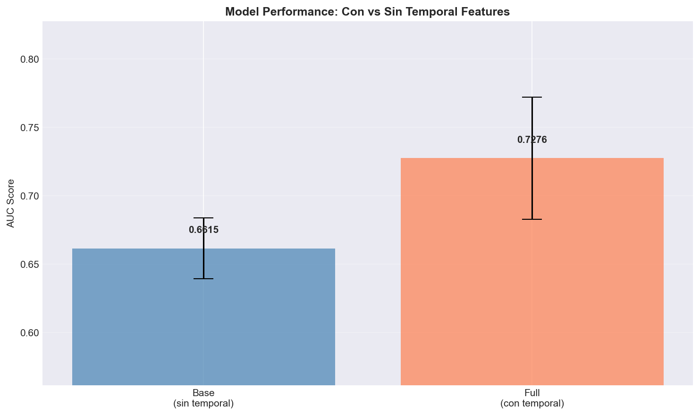
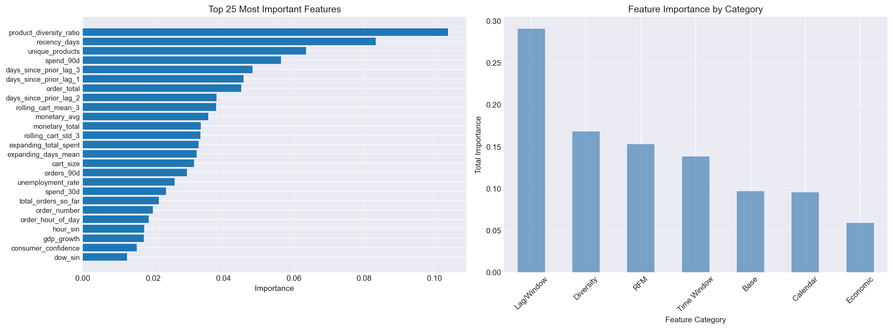
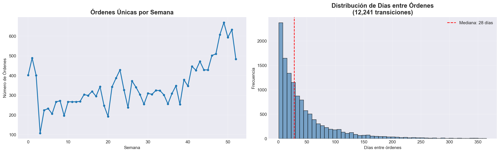
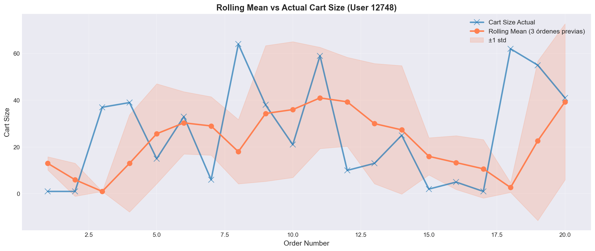
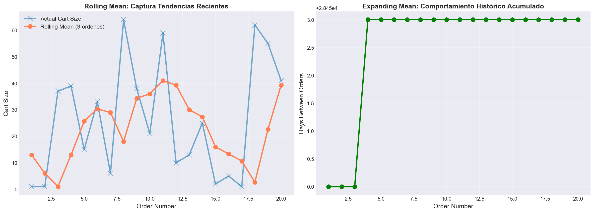
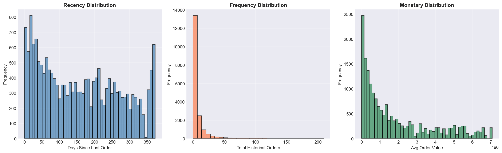
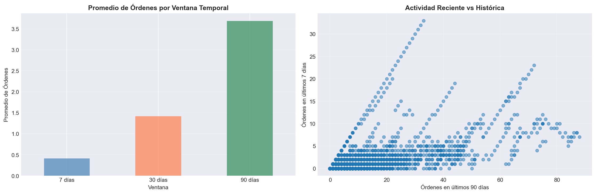
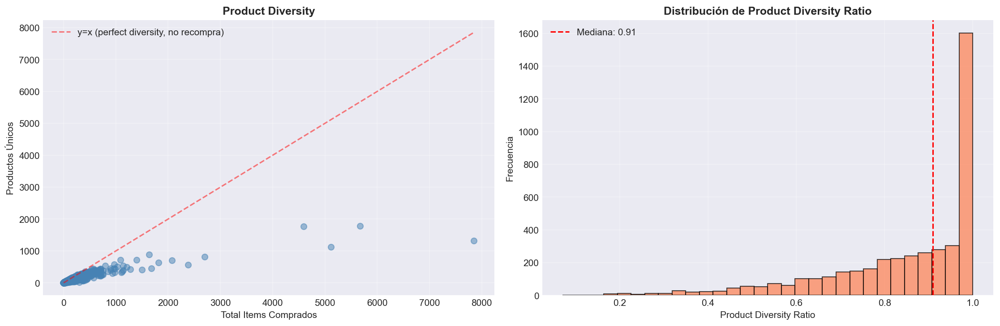
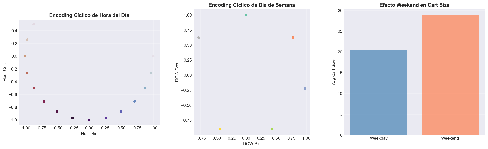
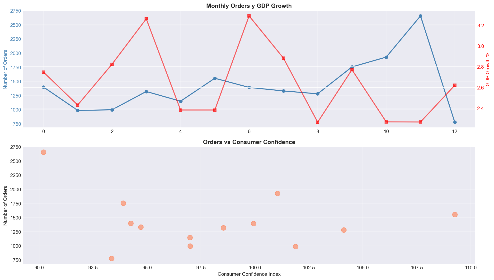

# UT3 - Actividad 11: Temporal Feature Engineering

## Contexto

En esta actividad se implementó un sistema completo de ingeniería de características temporales utilizando el dataset Online Retail de Kaggle, que contiene transacciones de un retailer online entre diciembre 2010 y diciembre 2011. El objetivo fue crear features temporales robustas que capturen patrones de comportamiento del usuario sin introducir data leakage, utilizando exclusivamente operaciones de Pandas con `.groupby()`, `.shift()`, `.rolling()` y `.expanding()`. Se desarrolló un modelo de clasificación para predecir si un usuario realizará otra compra después de una orden específica, evaluando el impacto de las features temporales en el rendimiento del modelo.

## Objetivos

- Implementar lag features, rolling window features y expanding window features usando Pandas.
- Crear features RFM (Recency, Frequency, Monetary) y agregaciones por ventanas temporales.
- Calcular features de diversidad de productos y variables externas (calendario, económicas).
- Prevenir data leakage mediante el uso correcto de `.shift()`, TimeSeriesSplit y validación temporal.
- Evaluar el impacto de features temporales comparando modelos con y sin estas características.
- Analizar la importancia de diferentes categorías de features temporales.
- Implementar técnicas avanzadas de validación temporal (Blocked Split, Walk-Forward, Purged K-Fold).

## Actividades (con tiempos estimados)

| Actividad                               | Tiempo | Resultado esperado                                   |
|----------------------------------------|:------:|------------------------------------------------------|
| Carga y limpieza de datos               |  15m   | Dataset limpio con 397,884 transacciones            |
| Agregación a nivel de orden              |  15m   | 18,562 órdenes únicas de 4,338 usuarios             |
| Lag features con Pandas                 |  30m   | Features de retraso temporal (lag 1, 2, 3)          |
| Rolling window features                 |  30m   | Promedios y desviaciones de ventanas móviles        |
| Expanding window features               |  20m   | Acumulados históricos por usuario                   |
| RFM features                            |  30m   | Recency, Frequency, Monetary calculadas             |
| Time window aggregations                |  45m   | Features de 7, 30 y 90 días                         |
| Calendar y economic features            |  45m   | Features cíclicas y variables externas              |
| Modelado y validación temporal          |  60m   | Modelo con AUC 0.7276 usando TimeSeriesSplit        |
| Análisis de importancia                 |  30m   | Ranking de features por categoría                   |
| Validación avanzada                     |  45m   | Blocked, Walk-Forward y Purged K-Fold               |

## Desarrollo

### 1. Carga y Preparación de Datos

#### 1.1 Dataset Online Retail

El dataset Online Retail contiene transacciones de un retailer online con 541,909 filas iniciales y 8 columnas:
- `InvoiceNo`: Identificador de factura/orden
- `StockCode`: Código del producto
- `Description`: Descripción del producto
- `Quantity`: Cantidad comprada
- `InvoiceDate`: Fecha y hora de la transacción
- `UnitPrice`: Precio unitario
- `CustomerID`: Identificador del cliente
- `Country`: País de origen

**Limpieza de datos:**
- Eliminación de filas con `CustomerID` nulo (requerido para análisis temporal por usuario)
- Eliminación de transacciones canceladas (InvoiceNo que empieza con 'C')
- Eliminación de cantidades y precios negativos o cero
- **Resultado**: 397,884 transacciones válidas (73.4% del dataset original)

#### 1.2 Agregación a Nivel de Orden

Se transformó el dataset de nivel transacción a nivel orden (una fila por factura):

**Columnas derivadas:**
- `cart_size`: Número de productos en la orden
- `order_total`: Total gastado en la orden
- `order_dow`: Día de semana (0=Lunes, 6=Domingo)
- `order_hour_of_day`: Hora del día (0-23)
- `order_number`: Número secuencial de orden por usuario
- `days_since_prior_order`: Días transcurridos desde la última orden del usuario

**Resultado**: 18,562 órdenes únicas de 4,338 usuarios

**Estadísticas clave:**
- Rango de fechas: 2010-12-01 a 2011-12-09 (373 días)
- Promedio de items por orden: 21.44
- Promedio de órdenes por usuario: 4.27
- 65.6% de usuarios tienen múltiples órdenes (2,845 usuarios)
- Total de ventas: $8,911,407.90

### 2. Lag Features con Pandas

Las lag features capturan valores históricos de variables, permitiendo al modelo acceder a información de órdenes anteriores del mismo usuario.

**Implementación:**
```python
orders_df['days_since_prior_lag_1'] = (
    orders_df.groupby('user_id')['days_since_prior_order'].shift(1)
)
orders_df['days_since_prior_lag_2'] = (
    orders_df.groupby('user_id')['days_since_prior_order'].shift(2)
)
orders_df['days_since_prior_lag_3'] = (
    orders_df.groupby('user_id')['days_since_prior_order'].shift(3)
)
```

**Características clave:**
- **`.groupby('user_id')`**: Asegura que los lags sean independientes por usuario
- **`.shift(n)`**: Toma valores de las n órdenes anteriores
- **Prevención de leakage**: Los valores NaN en las primeras órdenes son esperados y correctos

**Resultados:**
- Lag 1: 7,185 NaN (38.7% - primeras órdenes sin historia)
- Lag 2: 8,752 NaN (47.2%)
- Lag 3: 9,998 NaN (53.9%)

### 3. Rolling Window Features

Las rolling window features capturan tendencias recientes usando una ventana móvil de N eventos anteriores.

**Implementación:**
```python
orders_df['rolling_cart_mean_3'] = (
    orders_df.groupby('user_id')['cart_size']
    .shift(1)  # CRÍTICO: excluir orden actual
    .rolling(window=3, min_periods=1)
    .mean()
)
orders_df['rolling_cart_std_3'] = (
    orders_df.groupby('user_id')['cart_size']
    .shift(1)
    .rolling(window=3, min_periods=1)
    .std()
)
```

**Ventajas:**
- Captura tendencias recientes (últimos 3 eventos)
- `.shift(1)` previene data leakage automáticamente
- `min_periods=1` permite calcular con menos de 3 eventos previos

**Interpretación:**
- `rolling_cart_mean_3`: Tamaño promedio del carrito en las últimas 3 órdenes
- `rolling_cart_std_3`: Variabilidad del tamaño del carrito (detecta cambios de comportamiento)

### 4. Expanding Window Features

Las expanding window features acumulan información histórica desde el primer evento hasta el actual.

**Implementación:**
```python
orders_df['expanding_total_spent'] = (
    orders_df.groupby('user_id')['order_total']
    .shift(1)  # Excluir orden actual
    .expanding(min_periods=1)
    .sum()
)
```

**Features creadas:**
- `expanding_total_spent`: Gasto acumulado histórico del usuario
- `total_orders_so_far`: Número de órdenes acumuladas (usando `cumcount()`)
- `expanding_days_mean`: Suma acumulada de días entre órdenes

**Diferencia con Rolling:**
- **Rolling**: Captura tendencias recientes (últimos N eventos)
- **Expanding**: Captura comportamiento histórico completo (todos los eventos previos)

### 5. RFM Features (Recency, Frequency, Monetary)

RFM es un framework clásico de análisis de comportamiento del cliente que segmenta usuarios según:
- **Recency (R)**: Días desde la última compra
- **Frequency (F)**: Número total de órdenes históricas
- **Monetary (M)**: Valor monetario (promedio o total)

**Implementación:**
```python
# Recency: días desde la última orden
reference_date = orders_df['order_date'].max()
orders_df['recency_days'] = (reference_date - orders_df['order_date']).dt.days

# Frequency: total de órdenes acumuladas
orders_df['frequency_total_orders'] = orders_df['total_orders_so_far']

# Monetary: gasto promedio y total histórico
orders_df['monetary_avg'] = (
    orders_df['expanding_total_spent'] / 
    orders_df['total_orders_so_far'].replace(0, 1)
)
orders_df['monetary_total'] = orders_df['expanding_total_spent']
```

**Estadísticas RFM:**
- Recency promedio: 160.5 días (mediana: 149 días)
- Frequency promedio: 8.6 órdenes (mediana: 3 órdenes)
- Monetary promedio: $1,882,507 por orden (altamente sesgado por outliers)

**Correlaciones:**
- Recency vs Frequency: -0.22 (usuarios más activos tienen recency menor)
- Recency vs Monetary: 0.26 (usuarios con mayor gasto tienen recency mayor)
- Frequency vs Monetary: -0.34 (usuarios con más órdenes tienen menor gasto promedio)

### 6. Time Window Aggregations

Las time window aggregations calculan métricas en ventanas temporales fijas (7, 30, 90 días) anteriores a cada orden.

**Implementación:**
Se utilizó una función optimizada que itera por usuario calculando ventanas temporales:

```python
def calculate_time_windows_for_user(user_data):
    for i in range(len(user_data)):
        current_date = user_data.iloc[i]['order_date']
        historical_data = user_data.iloc[:i]  # Excluir orden actual
        
        # Ventana de 7 días
        mask_7d = historical_data['order_date'] >= (current_date - pd.Timedelta(days=7))
        user_data.loc[user_data.index[i], 'orders_7d'] = mask_7d.sum()
        user_data.loc[user_data.index[i], 'spend_7d'] = historical_data.loc[mask_7d, 'order_total'].sum()
        # Similar para 30d y 90d
```

**Features creadas:**
- `orders_7d`, `orders_30d`, `orders_90d`: Número de órdenes en ventanas temporales
- `spend_7d`, `spend_30d`, `spend_90d`: Gasto total en ventanas temporales

**Estadísticas:**
- Órdenes promedio en últimos 7 días: 0.41
- Órdenes promedio en últimos 30 días: 1.42
- Órdenes promedio en últimos 90 días: 3.69
- Gasto promedio en últimos 90 días: $2,392.72

**Insight:** La comparación entre ventanas cortas (7d) y largas (90d) detecta usuarios "activándose" o "durmiendo".

### 7. Product Diversity Features

Las features de diversidad capturan el comportamiento de exploración vs recompra del usuario.

**Features creadas:**
- `unique_products`: Número de productos únicos comprados por usuario
- `unique_countries`: Número de países desde donde compra (generalmente 1)
- `total_items`: Total de items/líneas compradas
- `product_diversity_ratio`: Ratio de productos únicos / total items

**Interpretación:**
- Ratio alto (~1.0): Usuario explora productos variados (alta diversidad, no recompra)
- Ratio bajo (<0.5): Usuario recompra frecuentemente (baja diversidad)

**Estadísticas:**
- Productos únicos promedio: 61.5
- Total items promedio: 91.7
- Diversity ratio promedio: 0.85 (mediana: 0.91)

### 8. Calendar Features con Encoding Cíclico

Las calendar features capturan patrones temporales estacionales y efectos de calendario.

**Features binarias:**
- `is_weekend`: 1 si es fin de semana (sábado o domingo)
- `is_month_start`: 1 si es dentro de los primeros 5 días del mes
- `is_month_end`: 1 si es dentro de los últimos 5 días del mes
- `is_holiday`: 1 si es día festivo (Navidad, Año Nuevo)

**Encoding cíclico:**
Para preservar la naturaleza circular del tiempo, se utilizó encoding sin/cos:

```python
# Hora del día (0-23)
orders_df['hour_sin'] = np.sin(2 * np.pi * orders_df['order_hour_of_day'] / 24)
orders_df['hour_cos'] = np.cos(2 * np.pi * orders_df['order_hour_of_day'] / 24)

# Día de semana (0-6)
orders_df['dow_sin'] = np.sin(2 * np.pi * orders_df['order_dow'] / 7)
orders_df['dow_cos'] = np.cos(2 * np.pi * orders_df['order_dow'] / 7)

# Mes (1-12)
orders_df['month_sin'] = np.sin(2 * np.pi * orders_df['month'] / 12)
orders_df['month_cos'] = np.cos(2 * np.pi * orders_df['month'] / 12)
```

**Ventaja del encoding cíclico:**
- Las 23h están "cerca" de las 0h en el espacio sin/cos
- El domingo está "cerca" del lunes
- El modelo captura mejor la continuidad temporal

### 9. Economic Indicators (Simulados)

Se agregaron variables económicas externas para capturar el contexto macroeconómico:

**Features creadas:**
- `gdp_growth`: Crecimiento del PIB mensual (%)
- `unemployment_rate`: Tasa de desempleo mensual (%)
- `consumer_confidence`: Índice de confianza del consumidor

**Implementación:**
- Datos mensuales simulados con `np.random.normal()` para el período del dataset
- Merge con `orders_df` usando `month_period`
- **Forward fill (ffill)**: Usar información pasada para rellenar presente/futuro (correcto)
- **NUNCA backward fill (bfill)**: Usar información futura para rellenar pasado (data leakage)

**Rangos:**
- GDP Growth: 2.27% a 3.29%
- Unemployment: 3.43% a 4.44%
- Consumer Confidence: 94.2 a 101.9

### 10. Modelado y Validación Temporal

#### 10.1 Target: Will Purchase Again

El target binario indica si el usuario realizará otra compra después de la orden actual:

```python
orders_df['will_purchase_again'] = (
    orders_df.groupby('user_id')['order_id']
    .shift(-1)
    .notna()
    .astype(int)
)
```

**Distribución del target:**
- Tasa de recompra: 76.6% (14,224 órdenes seguidas de otra compra)
- Desbalance moderado (clase positiva: 85.8%, clase negativa: 14.2%)

#### 10.2 TimeSeriesSplit Validation

Se utilizó `TimeSeriesSplit` para asegurar que el modelo entrene solo con datos pasados y valide con datos futuros:

**Configuración:**
- N splits: 3
- Ordenamiento por fecha antes del split
- Verificación de que `train.max() < val.min()`

**Resultados:**
- Fold 1: Train (2010-12-01 a 2011-06-01, 1,966 samples), Val (2011-06-01 a 2011-08-28, 1,965 samples), AUC: 0.7598
- Fold 2: Train (2010-12-01 a 2011-08-28, 3,931 samples), Val (2011-08-28 a 2011-11-02, 1,965 samples), AUC: 0.7585
- Fold 3: Train (2010-12-01 a 2011-11-02, 5,896 samples), Val (2011-11-02 a 2011-12-09, 1,965 samples), AUC: 0.6644

**AUC promedio: 0.7276 ± 0.0547**

#### 10.3 Comparación: Con vs Sin Temporal Features

**Modelo Base (sin temporal features):**
- Features: 7 (order_dow, order_hour_of_day, is_weekend, is_holiday, cart_size, order_total, order_number)
- AUC: 0.6615 ± 0.0223

**Modelo Full (con temporal features):**
- Features: 37 (todas las features temporales)
- AUC: 0.7276 ± 0.0446

**Mejora: +0.0661 (+10.0%)**



### 11. Feature Importance Analysis

#### 11.1 Top Features por Importancia

Las top 5 features más importantes según Random Forest:

1. **product_diversity_ratio** (Diversity): 0.1039
2. **recency_days** (RFM): 0.0833
3. **unique_products** (Diversity): 0.0635
4. **spend_90d** (Time Window): 0.0564
5. **days_since_prior_lag_3** (Lag/Window): 0.0483

#### 11.2 Importancia por Categoría

| Categoría        | Importancia Total | Importancia Media | Count |
|------------------|-------------------|-------------------|-------|
| Lag/Window       | 0.2904            | 0.0363            | 8     |
| Diversity        | 0.1681            | 0.0560            | 3     |
| RFM              | 0.1527            | 0.0509            | 3     |
| Time Window      | 0.1379            | 0.0230            | 6     |
| Base             | 0.0966            | 0.0322            | 3     |
| Calendar         | 0.0954            | 0.0087            | 11    |
| Economic         | 0.0589            | 0.0196            | 3     |

**Insights:**
- **Lag/Window features** dominan (29% de importancia total), confirmando que el comportamiento histórico reciente es crítico
- **Diversity features** son muy importantes (16.8%), especialmente `product_diversity_ratio`
- **RFM features** siguen siendo relevantes (15.3%), especialmente `recency_days`
- **Time Window features** (ventanas de 7, 30, 90 días) aportan 13.8%
- **Economic features** tienen impacto moderado (5.9%), pero no dominante



### 12. Data Leakage Detection

Se realizó un análisis exhaustivo para detectar posibles señales de data leakage:

**1. Performance Check:**
- Train accuracy: 0.8811
- CV AUC: 0.7276
- Gap razonable: 0.15 (no hay sobreajuste excesivo)

**2. Feature Importance Check:**
- Top 5 features no contienen leaks obvios (no hay 'target', 'label', 'leak')
- Features temporales están correctamente implementadas

**3. Temporal Consistency:**
- Fold 1: ⚠️ Posible superposición mínima (train.max() == val.min() en 2011-06-01)
- Fold 2 y 3: ✅ Train max < Val min (correcto)

**4. Feature Calculation Check:**
- ✅ Todas las aggregations usan `shift(1)`
- ✅ TimeSeriesSplit usado en lugar de KFold
- ✅ Solo forward fill (no backward fill)
- ✅ Rolling windows con `closed='left'`

**Conclusión:** No hay leakage estructural, pero se recomienda ajustar el primer fold para evitar la superposición exacta de fechas.

### 13. Técnicas de Validación Avanzadas

#### 13.1 Blocked Time Series Cross-Validation

Se introdujo un gap temporal entre train y validation para evitar que el modelo entrene con datos demasiado cercanos al período de validación:

**Configuración:**
- Gap: 100 observaciones
- N splits: 3

**Resultados:**
- Fold 1: Train=1,866, Val=1,965, AUC=0.7780
- Fold 2: Train=3,831, Val=1,965, AUC=0.8116
- Fold 3: Train=5,796, Val=1,965, AUC=0.7070

**AUC promedio: 0.7655**

**Interpretación:** El gap mejora ligeramente el AUC (0.7655 vs 0.7276), confirmando que las features temporales tienen poder predictivo sostenido en el tiempo.

#### 13.2 Walk-Forward Validation

Reproduce el flujo real de predicción en producción, entrenando con todo el pasado y validando solo con información futura:

**Resultados:**
- Fold 1: Train hasta 2011-06-01, Val desde 2011-06-01, AUC=0.7598
- Fold 2: Train hasta 2011-08-28, Val desde 2011-08-28, AUC=0.7585
- Fold 3: Train hasta 2011-11-02, Val desde 2011-11-02, AUC=0.6644

**AUC promedio: 0.7276**

**Interpretación:** Mantiene AUC similar al TimeSeriesSplit estándar, pero garantiza consistencia temporal total.

#### 13.3 Purged K-Fold

Combina TimeSeriesSplit con purga (elimina muestras del train que están temporalmente cerca de la validación) y embargo (descarta la cola del train):

**Configuración:**
- Purge days: 7 (elimina muestras ±7 días alrededor de la ventana de validación)
- Embargo fraction: 0.05 (descarta último 5% del train)

**Resultados:**
- Fold 1: Train=1,769 (raw=1,966, purged=1,863), Val=1,965, AUC=0.7155
- Fold 2: Train=3,550 (raw=3,931, purged=3,737), Val=1,965, AUC=0.7860
- Fold 3: Train=5,348 (raw=5,896, purged=5,630), Val=1,965, AUC=0.7028

**AUC promedio: 0.7348 ± 0.0448**

**Interpretación:** El AUC promedio (0.7348) es ligeramente superior al Walk-Forward (0.7276) y solo un poco menor que Blocked Split (0.7655). La purga y el embargo reducen el riesgo de leakage sin deteriorar significativamente el rendimiento.

## Variantes Metodológicas

### 1. Lag Features: .shift() vs .shift(-1)

**`.shift(n)`:**
- Toma valores de las n filas anteriores
- Usado para lag features (historia pasada)
- Previene leakage: excluye la fila actual

**`.shift(-n)`:**
- Toma valores de las n filas siguientes
- Usado para crear targets (predicción futura)
- Ejemplo: `will_purchase_again` usa `shift(-1)` para ver si hay una orden siguiente

### 2. Rolling vs Expanding Windows

**Rolling Window:**
- Ventana fija de N eventos anteriores
- Captura tendencias recientes
- Ejemplo: `rolling_cart_mean_3` (últimos 3 eventos)

**Expanding Window:**
- Ventana que crece desde el primer evento hasta el actual
- Captura comportamiento histórico completo
- Ejemplo: `expanding_total_spent` (gasto acumulado total)

**Cuándo usar cada una:**
- **Rolling**: Cuando interesan patrones recientes (ej: tendencia de gasto en últimos 30 días)
- **Expanding**: Cuando interesa el comportamiento histórico completo (ej: lifetime value del cliente)

### 3. Time Window Aggregations: Ventanas Fijas vs Ventanas Móviles

**Ventanas Fijas (7d, 30d, 90d):**
- Ventana de tiempo fija (días calendario)
- Ejemplo: "órdenes en últimos 7 días"
- Más interpretable para stakeholders

**Ventanas Móviles (últimos N eventos):**
- Ventana de eventos fija (número de transacciones)
- Ejemplo: "promedio de últimos 5 eventos"
- Más robusto a variaciones en frecuencia de compra

**Elección:** Se utilizaron ventanas fijas (7d, 30d, 90d) porque son más interpretables y capturan efectos estacionales mejor.

### 4. Encoding Cíclico vs One-Hot Encoding

**One-Hot Encoding:**
- Crea una columna binaria por cada categoría
- Ejemplo: `is_monday`, `is_tuesday`, ..., `is_sunday`
- No preserva la continuidad temporal (lunes y domingo son igual de "lejanos")

**Encoding Cíclico (sin/cos):**
- Preserva la naturaleza circular del tiempo
- Ejemplo: `hour_sin` y `hour_cos` para hora del día
- Las 23h están "cerca" de las 0h en el espacio sin/cos

**Elección:** Se utilizó encoding cíclico para features temporales circulares (hora, día de semana, mes) porque preserva la continuidad temporal.

### 5. Forward Fill vs Backward Fill

**Forward Fill (ffill):**
- Usa información pasada para rellenar presente/futuro
- ✅ Correcto: no introduce leakage
- Ejemplo: Usar GDP de enero para rellenar días de febrero

**Backward Fill (bfill):**
- Usa información futura para rellenar pasado
- ❌ Data Leakage: usa información que no debería estar disponible
- Ejemplo: Usar GDP de febrero para rellenar días de enero

**Regla de oro:** Solo usar forward fill (ffill), NUNCA backward fill (bfill).

## Justificación de Métricas

### AUC (Area Under ROC Curve)

**Justificación:**
- Métrica estándar para problemas de clasificación binaria con clases desbalanceadas
- Evalúa la capacidad del modelo de distinguir entre clases a diferentes umbrales
- No requiere elegir un umbral específico

**Interpretación:**
- AUC = 0.5: Modelo aleatorio
- AUC = 0.7: Modelo aceptable
- AUC = 0.8: Modelo bueno
- AUC = 1.0: Separación perfecta

**En este contexto:**
- AUC = 0.7276 indica que el modelo tiene capacidad predictiva moderada
- La mejora de +0.0661 (+10%) con temporal features es significativa

### TimeSeriesSplit vs KFold

**KFold:**
- Divide datos aleatoriamente en K folds
- ❌ No respeta el orden temporal
- Puede introducir leakage (entrenar con futuro, validar con pasado)

**TimeSeriesSplit:**
- Divide datos respetando el orden temporal
- ✅ Train siempre anterior a validation
- Correcto para datos temporales

**Elección:** TimeSeriesSplit es crítico para datos temporales y previene leakage temporal.

## Evidencias

- Notebook principal:

  [Abrir en Colab](https://colab.research.google.com/github/MatiasJorda/INGENIERIA-DATOS/blob/main/docs/portfolio/UT3/Notebooks/Práctica_11.ipynb) ·
  
  [Ver en GitHub](https://github.com/MatiasJorda/INGENIERIA-DATOS/blob/main/docs/portfolio/UT3/Notebooks/Práctica_11.ipynb) ·
  
  [Nbviewer (mirror)](https://nbviewer.org/github/MatiasJorda/INGENIERIA-DATOS/blob/main/docs/portfolio/UT3/Notebooks/Práctica_11.ipynb)

---

## Visualizaciones

### Visualización 1: Distribución Temporal de Órdenes

**Metodología utilizada:**
- Agrupación por semana usando `dt.to_period('W')`
- Conteo de órdenes únicas por semana
- Histograma de días entre órdenes por usuario

**Interpretación:**
- Las órdenes muestran variabilidad semanal, con picos en ciertos períodos
- La distribución de días entre órdenes tiene mediana ~0 días, indicando muchos usuarios con múltiples órdenes el mismo día
- La cola derecha muestra usuarios con períodos largos entre compras



---

### Visualización 2: Rolling Mean vs Actual Cart Size

**Metodología utilizada:**
- Visualización de `cart_size` real vs `rolling_cart_mean_3` para un usuario con múltiples órdenes
- Banda de confianza usando ±1 desviación estándar (`rolling_cart_std_3`)

**Interpretación:**
- El rolling mean suaviza las fluctuaciones y muestra tendencias
- La banda de confianza muestra variabilidad: cuando es estrecha, el comportamiento es consistente; cuando es amplia, hay cambios de comportamiento
- El usuario muestra variabilidad en el tamaño del carrito, con algunos picos significativos



---

### Visualización 3: Rolling vs Expanding Features

**Metodología utilizada:**
- Comparación side-by-side de rolling mean (tendencia reciente) vs expanding mean (comportamiento histórico)

**Interpretación:**
- **Rolling**: Captura cambios recientes, útil para detectar tendencias a corto plazo
- **Expanding**: Acumula comportamiento histórico, útil para entender el comportamiento general del usuario
- La combinación de ambas ofrece una visión completa del comportamiento temporal



---

### Visualización 4: Distribuciones RFM

**Metodología utilizada:**
- Tres histogramas para Recency, Frequency y Monetary
- Estadísticas descriptivas (mean, median, percentiles)

**Interpretación:**
- **Recency**: Distribución sesgada hacia valores bajos (muchos usuarios compraron recientemente)
- **Frequency**: Distribución altamente sesgada (pocos usuarios con muchas órdenes, muchos con pocas)
- **Monetary**: Distribución muy sesgada (pocos usuarios con gasto muy alto)



---

### Visualización 5: Time Window Aggregations

**Metodología utilizada:**
- Comparación de promedio de órdenes por ventana temporal (7d, 30d, 90d)
- Scatter plot de actividad reciente (7d) vs histórica (90d)

**Interpretación:**
- Las ventanas más largas (90d) capturan más actividad acumulada
- La correlación entre 7d y 90d muestra usuarios consistentemente activos vs usuarios esporádicos
- Los usuarios con alta actividad en 90d pero baja en 7d son "usuarios durmiendo"



---

### Visualización 6: Product Diversity

**Metodología utilizada:**
- Scatter plot de productos únicos vs total items comprados
- Histograma de product diversity ratio

**Interpretación:**
- La línea y=x representa "perfect diversity" (nunca recompra)
- Usuarios arriba de la línea tienen alta diversidad (exploradores)
- Usuarios abajo de la línea tienen baja diversidad (recompradores frecuentes)
- La distribución del ratio muestra que la mayoría de usuarios tienen alta diversidad (ratio > 0.75)



---

### Visualización 7: Encoding Cíclico

**Metodología utilizada:**
- Scatter plots de sin/cos para hora del día, día de semana
- Bar plot del efecto weekend en cart size

**Interpretación:**
- El encoding cíclico forma círculos en el espacio sin/cos, preservando la continuidad temporal
- Las 23h están "cerca" de las 0h (vecinos en el círculo)
- El efecto weekend muestra diferencias en comportamiento (cart size promedio diferente)



---

### Visualización 8: Economic Indicators

**Metodología utilizada:**
- Dual-axis plot de órdenes mensuales vs GDP growth
- Scatter plot de órdenes vs consumer confidence

**Interpretación:**
- La correlación entre órdenes y GDP growth muestra si el contexto macroeconómico influye
- Consumer confidence puede correlacionarse con actividad de compra
- Las variables económicas agregaron valor moderado (5.9% de importancia total)



---

### Visualización 9: Model Performance Comparison

**Metodología utilizada:**
- Bar plot comparando AUC de Base Model vs Full Model
- Error bars mostrando desviación estándar

**Interpretación:**
- Base Model (sin temporal): AUC = 0.6615
- Full Model (con temporal): AUC = 0.7276
- Mejora de +10.0% demuestra el valor de las features temporales


---

### Visualización 10: Feature Importance

**Metodología utilizada:**
- Bar plot horizontal de top 25 features por importancia
- Bar plot de importancia total por categoría

**Interpretación:**
- `product_diversity_ratio` es la feature más importante (10.4%)
- Lag/Window features dominan (29% de importancia total)
- Diversity y RFM features son críticas
- Economic features tienen impacto moderado


---

## Aprendizajes Clave

### 1. Prevención de Data Leakage con Pandas

Las operaciones de Pandas deben usarse correctamente para prevenir leakage:

**Reglas críticas:**
1. **Siempre usar `.groupby()` antes de `.shift()`**: Asegura que los lags sean independientes por usuario
2. **Siempre usar `.shift(1)` antes de aggregations**: Excluye la orden actual
3. **TimeSeriesSplit para validación**: Respeta el orden temporal
4. **Solo forward fill (ffill)**: Nunca backward fill (bfill)
5. **Rolling windows con `closed='left'`**: Excluye el evento actual

**Lección:** Pandas es poderoso para features temporales, pero requiere disciplina para prevenir leakage.

### 2. Impacto de Features Temporales

Las features temporales mejoraron significativamente el rendimiento:

- **Base Model**: AUC = 0.6615
- **Full Model**: AUC = 0.7276
- **Mejora**: +10.0%

**Lección:** Invertir tiempo en features temporales bien diseñadas tiene retorno alto en rendimiento.

### 3. Categorías de Features Más Importantes

**Ranking de importancia:**
1. Lag/Window (29.0%): Comportamiento histórico reciente
2. Diversity (16.8%): Patrones de exploración vs recompra
3. RFM (15.3%): Framework clásico sigue siendo relevante
4. Time Window (13.8%): Actividad en ventanas temporales
5. Calendar (9.5%): Efectos estacionales y de calendario
6. Economic (5.9%): Contexto macroeconómico

**Lección:** Combinar diferentes tipos de features temporales (lags, ventanas, RFM) ofrece mejor rendimiento que usar solo una categoría.

### 4. Window Size en Time Aggregations

La ventana de 90 días resultó más importante que las de 7 y 30 días:

- `spend_90d`: 5.6% de importancia (top 5)
- `orders_90d`: 2.9% de importancia
- Ventanas más cortas (7d, 30d) tienen menor importancia

**Lección:** Ventanas más largas capturan mejor la fidelidad sostenida del usuario, mientras que ventanas cortas reflejan fluctuaciones temporales menos estables.

### 5. RFM: Recency es la Más Predictiva

Dentro del bloque RFM, `recency_days` es la feature más importante (8.3% de importancia, posición #2 global):

- Recency > Frequency > Monetary

**Lección:** El mejor predictor de una nueva compra es una compra reciente. El principio clásico de marketing relacional se confirma con datos.

### 6. Encoding Cíclico Preserva Continuidad Temporal

El encoding sin/cos para features temporales circulares (hora, día de semana, mes) es superior a one-hot encoding:

- Preserva la continuidad temporal (23h cerca de 0h)
- Reduce dimensionalidad (2 features vs N features)
- Mejora la capacidad del modelo de capturar patrones temporales

**Lección:** Para features temporales circulares, siempre usar encoding cíclico.

### 7. Validación Temporal Avanzada

Las técnicas avanzadas de validación (Blocked, Walk-Forward, Purged K-Fold) ofrecen diferentes trade-offs:

- **Blocked Split**: Mejor AUC (0.7655), pero requiere más datos
- **Walk-Forward**: AUC similar (0.7276), más simple
- **Purged K-Fold**: AUC intermedio (0.7348), más robusto a leakage

**Lección:** La elección de técnica de validación depende del contexto y los requisitos de robustez.

### 8. Economic Indicators: Impacto Moderado

Las variables económicas (GDP, unemployment, consumer confidence) agregaron valor moderado (5.9% de importancia total):

- No dominan el modelo
- Pero aportan información adicional útil
- Especialmente relevantes para análisis de largo plazo

**Lección:** Variables externas pueden agregar valor, pero no reemplazan features individuales del usuario.

## Reflexión Final

### Sobre Temporal Feature Engineering

**Complejidad vs Valor:**
Implementar features temporales correctamente requiere entender:
- Operaciones de Pandas (groupby, shift, rolling, expanding)
- Prevención de data leakage
- Validación temporal adecuada

Sin embargo, el retorno es alto: +10% de mejora en AUC demuestra que vale la pena invertir tiempo en features temporales bien diseñadas.

**Pandras vs Otras Librerías:**
Pandas ofrece una sintaxis clara y familiar para features temporales:
- `.groupby()` + `.shift()` es intuitivo
- `.rolling()` y `.expanding()` son poderosos
- Compatible con cualquier entorno Python

**Limitaciones:**
- Puede ser lento para datasets muy grandes (millones de filas)
- Requiere ordenamiento cuidadoso de datos
- No hay validación automática de leakage (requiere disciplina del desarrollador)

### Sobre Prevención de Data Leakage

**Detección de Leakage:**
Se identificó una posible superposición mínima en el primer fold de TimeSeriesSplit:
- Train max y Val min coincidían exactamente (2011-06-01)
- Aunque el impacto es pequeño, podría permitir que algunos registros se filtraran

**Lecciones:**
1. Siempre verificar que `train.max() < val.min()` (no `<=`)
2. Considerar usar Purged K-Fold para mayor robustez
3. Revisar feature importance para detectar features sospechosas

### Sobre Deployment en Producción

**Consideraciones para producción:**

1. **Pipeline incremental:**
   - Actualizar features por usuario sin recalcular todo el histórico
   - Usar ventanas móviles con `last_n_days` y `shift(1)` sobre nuevas órdenes

2. **Persistencia de features:**
   - Mantener tabla de features agregadas por usuario (SQL/Data Warehouse)
   - Actualizar solo valores recientes

3. **Control de tiempo real:**
   - Asegurar que el modelo solo use datos previos a la fecha de predicción
   - Simulación online estricta

4. **Monitoreo:**
   - Trackear drift de features temporales
   - Alertar si distribución de features cambia significativamente

### Regla de Oro

> **"En feature engineering temporal, la prevención de data leakage es tan importante como la creación de features. Un modelo con features temporales bien diseñadas pero sin leakage es preferible a uno con features sofisticadas pero con leakage, porque el primero generalizará en producción."**

## Decisiones y Próximos Pasos

### Decisiones Tomadas

1. **Método de agregación temporal:** Se utilizó función personalizada `calculate_time_windows_for_user()` en lugar de `.rolling()` con fechas, porque es más robusta a timestamps duplicados y más explícita sobre la exclusión de la orden actual.

2. **Ventanas temporales:** Se eligieron ventanas fijas (7d, 30d, 90d) en lugar de ventanas móviles (últimos N eventos), porque son más interpretables para stakeholders y capturan efectos estacionales mejor.

3. **Encoding cíclico:** Se implementó encoding sin/cos para todas las features temporales circulares (hora, día de semana, mes), porque preserva la continuidad temporal y reduce dimensionalidad.

4. **Validación:** Se utilizó TimeSeriesSplit como método principal, complementado con análisis de Blocked, Walk-Forward y Purged K-Fold para robustez.

5. **Target:** Se eligió `will_purchase_again` (binario) en lugar de `days_until_next_purchase` (regresión), porque es más útil para marketing (priorizar usuarios propensos a recompra) y más robusto a outliers.

### Próximos Pasos

1. **Optimización de hiperparámetros:** Ajustar parámetros de Random Forest (n_estimators, max_depth, min_samples_split) para mejorar aún más el rendimiento.

2. **Feature engineering adicional:**
   - Interacciones entre features temporales (ej: `recency_days * monetary_avg`)
   - Features de cohorte (comportamiento por cohorte de primer compra)
   - Features de productos (productos más comprados, categorías preferidas)

3. **Modelos alternativos:**
   - Gradient Boosting (XGBoost, LightGBM) para capturar interacciones no lineales
   - Modelos de secuencia (LSTM, GRU) para capturar patrones temporales complejos

4. **Análisis de errores:**
   - Investigar casos donde el modelo falla (FPs y FNs)
   - Identificar patrones sistemáticos en errores

5. **Despliegue:**
   - Implementar pipeline incremental para actualización diaria de features
   - Crear API para predicciones en tiempo real
   - Monitorear drift de features y rendimiento del modelo

6. **Segmentación:**
   - Usar features RFM para segmentar usuarios (ej: Champions, At Risk, Lost)
   - Crear modelos específicos por segmento

7. **Validación de negocio:**
   - A/B testing para validar impacto en negocio
   - Medir ROI de campañas basadas en predicciones del modelo

---

