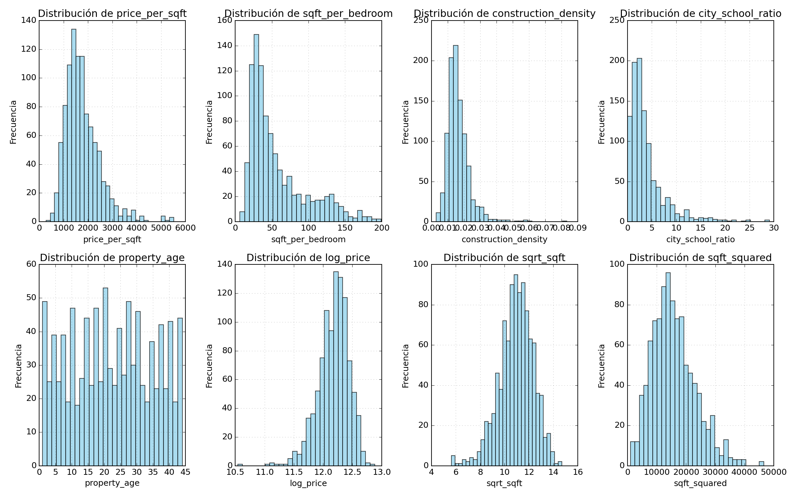
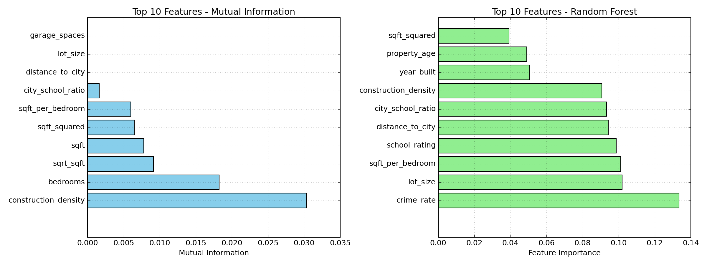
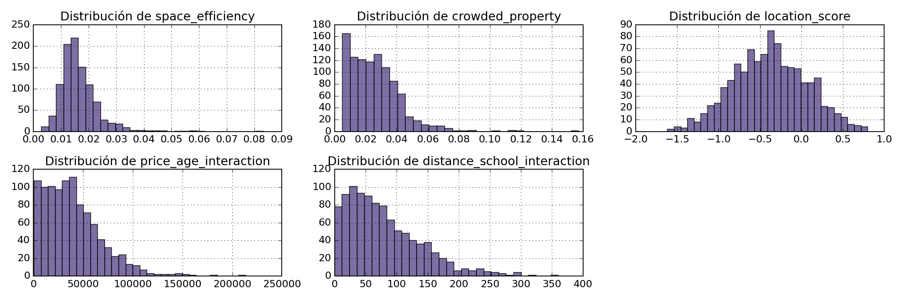

# UT3 - Actividad 8: Feature Engineering y Evaluación

## Contexto

En esta actividad se construyó un dataset sintético de viviendas y se aplicaron técnicas de ingeniería de características para enriquecer la información disponible. Se evaluó el impacto de las nuevas features en la distribución, la presencia de outliers, la importancia para el target y la correlación con el precio. Además, se realizó una investigación libre para proponer y analizar nuevas variables derivadas y se probó el enfoque con una pequeña muestra real de Ames Housing.

## Objetivos

- Crear features derivadas de valor (ratios, transformaciones, temporales e interacciones).
- Analizar distribuciones y detectar outliers de forma sistemática.
- Evaluar la relevancia de features con Mutual Information y Random Forest.
- Comparar correlaciones con el target y discutir hallazgos.
- Diseñar y analizar nuevas features a partir del dominio.
- Probar el enfoque en datos reales (muestra Ames Housing).

## Actividades (con tiempos estimados)

| Actividad                               | Tiempo | Resultado esperado                                   |
|----------------------------------------|:------:|------------------------------------------------------|
| Generar dataset y features derivadas   |  45m   | DataFrame enriquecido con nuevas columnas            |
| Análisis de distribución y outliers    |  45m   | Métricas resumidas y rangos IQR                      |
| Evaluación de importancia de features  |  45m   | Rankings por MI y Random Forest                      |
| Correlación con el target              |  30m   | Top correlaciones y discusión                        |
| Investigación libre (nuevas features)  |  45m   | Propuestas, correlaciones e interpretaciones         |
| Prueba en datos reales (Ames muestra)  |  30m   | Correlaciones y validez del enfoque                  |

## Desarrollo

### 1. Construcción del Dataset y Features

Se generó un dataset sintético de 1,000 viviendas con variables de precio, superficie, dormitorios, baños, año de construcción, etc. A partir de él se crearon features derivadas:

- Ratios: `price_per_sqft`, `sqft_per_bedroom`, `construction_density`, `city_school_ratio`.
- Temporales: `property_age`, `age_category`, `is_new_property`.
- Transformaciones: `log_price`, `sqrt_sqft`, `sqft_squared`.
- Compuestas: `luxury_score`, `location_score`.

### 2. Distribuciones y Outliers

Se analizaron estadísticas (count, mean, std, percentiles) y se visualizaron histogramas para nuevas features. La detección de outliers se realizó con IQR para `price_per_sqft`, `sqft_per_bedroom` y `property_age`.

**Hallazgos clave:**
- `price_per_sqft` presenta ~3.7% outliers, con rango normal aproximado [48.94, 3350.93].
- `sqft_per_bedroom` con ~4.5% outliers; `property_age` sin outliers relevantes.

### 3. Importancia de Features y Correlación

Se evaluó la relevancia con Mutual Information (MI) y con la importancia de un Random Forest Regressor.

- MI top: `construction_density`, `bedrooms`, `sqrt_sqft`, `sqft`.
- RF top: `crime_rate`, `lot_size`, `sqft_per_bedroom`, `school_rating`, `distance_to_city`.

Se compararon correlaciones absolutas con el precio. En general, las correlaciones fueron bajas en el dataset sintético (señal débil por construcción), destacándose levemente `crime_rate` y transformaciones de `sqft`.

### 4. Investigación Libre: Nuevas Features

Se diseñaron nuevas variables:
- `space_efficiency` (superficie/lote),
- `crowded_property` (dormitorios/superficie),
- `location_score` (combinación normalizada de crimen, escuela, distancia),
- Interacciones: `price_age_interaction`, `distance_school_interaction`.

**Correlaciones destacadas (sintético):**
- `price_age_interaction` ≈ 0.36 (más informativa).
- `space_efficiency` ≈ -0.03, `crowded_property` ≈ 0.026, `location_score` ≈ -0.014 (débiles o contrarias a lo esperado por la naturaleza sintética).

### 5. Prueba con Datos Reales (Ames - muestra)

Se creó un subconjunto con 5 filas de Ames Housing y se generaron:
- `property_age`, `space_efficiency`, `age_size_interaction`, `bath_per_bedroom`, `garage_per_size`.

Correlaciones con `SalePrice` en la muestra:
- Altas positivas: `space_efficiency` (≈ 0.88), `garage_per_size` (≈ 0.70), `bath_per_bedroom` (≈ 0.66).
- Negativas: `property_age` (≈ -0.82) y `age_size_interaction` (≈ -0.44).

Esto sugiere que, con datos reales, la señal de algunas features es más consistente con la intuición del dominio.

## Evidencias

- Notebook de análisis:

  [Abrir en Colab](https://colab.research.google.com/github/MatiasJorda/INGENIERIA-DATOS/blob/main/docs/portfolio/UT3/Notebooks/Practica_8.ipynb) ·

  [Ver en GitHub](https://github.com/MatiasJorda/INGENIERIA-DATOS/blob/main/docs/portfolio/UT3/Notebooks/Practica_8.ipynb) ·

  [Nbviewer (mirror)](https://nbviewer.org/github/MatiasJorda/INGENIERIA-DATOS/blob/main/docs/portfolio/UT3/Notebooks/Practica_8.ipynb)

---

### Visualización: Distribuciones de Features Derivadas

**Metodología utilizada:**
- Histogramas para 8 features nuevas en grilla 2x4.
- Estadísticas descriptivas por feature.

**Interpretación:**
- La mayoría de las distribuciones son unimodales; `price_per_sqft` muestra cola derecha.
- Transformaciones (`sqrt_sqft`, `sqft_squared`) alteran forma y escala de `sqft`.

---

### Visualización: Importancia de Features (MI vs RF)

**Metodología utilizada:**
- Cálculo de Mutual Information para ranking informativo.
- Entrenamiento de Random Forest para importancia basada en reducción de impureza.
- Barras horizontales para Top-10 en cada método.

**Interpretación:**
- MI y RF priorizan diferentes señales: MI favorece transformaciones de `sqft` y densidad; RF prioriza variables exógenas (`crime_rate`, `school_rating`, `distance_to_city`).
- La discrepancia es esperable por la sinteticidad de los datos y la no linealidad capturada por RF.

---

## Reflexión

La ingeniería de características agrega valor cuando combina conocimiento del dominio con transformaciones que estabilizan distribuciones y exponen relaciones no lineales (p. ej., interacciones y efectos de escala). En datos sintéticos, la señal puede ser débil o contraintuitiva; en datos reales, algunas features mostraron relaciones más sólidas con el precio. Es crítico validar con métricas robustas y comparar métodos (MI vs RF) para evitar conclusiones sesgadas por una única técnica.

### Lecciones Clave
- Las interacciones (`price_age_interaction`) pueden capturar efectos relevantes que no aparecen en features simples.
- La detección de outliers con IQR orienta el preprocesamiento y la robustez de modelos.
- Rankings de importancia difieren por metodología; conviene triangulación.
- Al migrar a datos reales, revisar supuestos y recalibrar scores compuestos.

---
