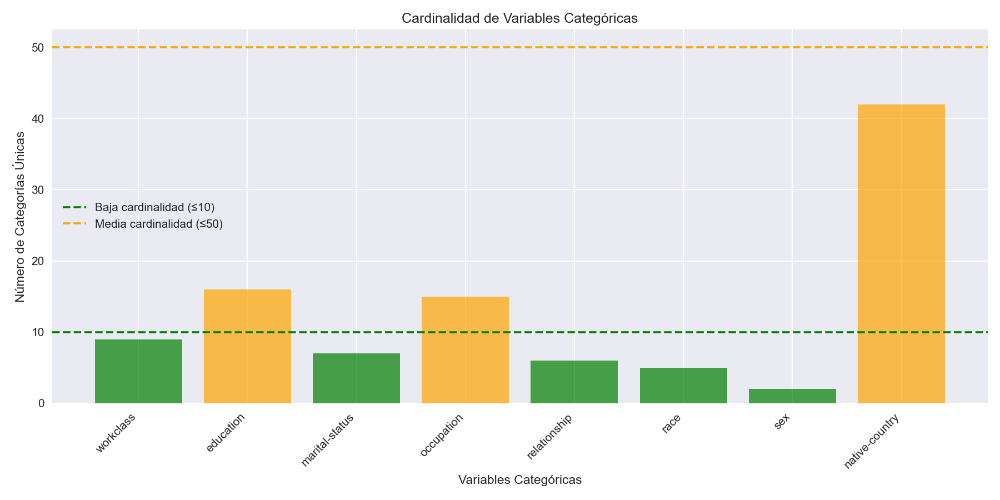
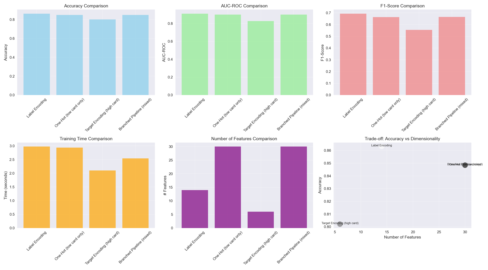
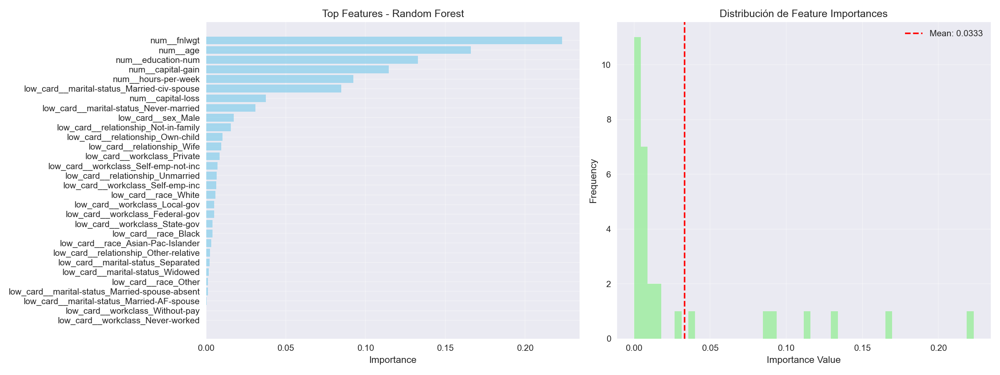
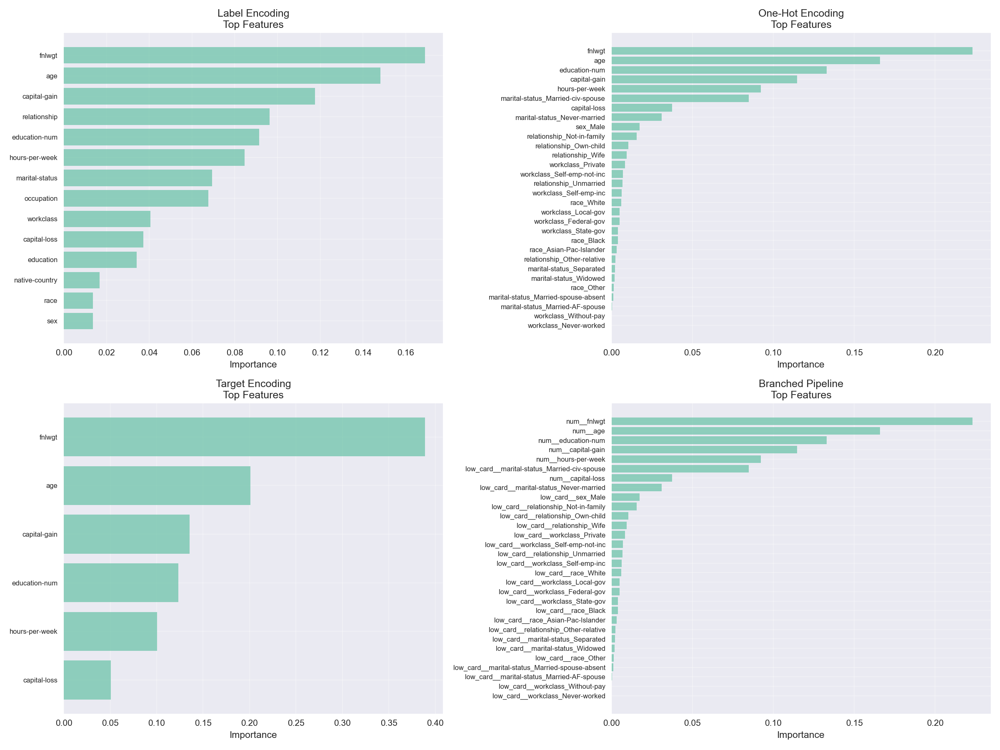
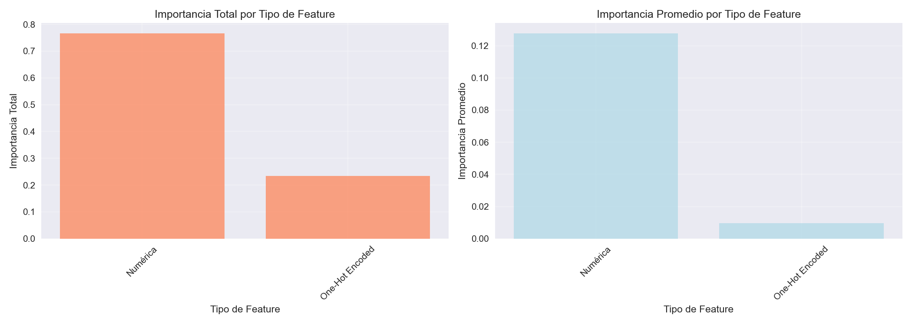

# UT3 - Actividad 9: Encoding Avanzado y Target Encoding

## Contexto

En esta actividad se trabajó con el dataset **Adult Income** (US Census 1994) para dominar técnicas avanzadas de encoding categórico, específicamente diseñadas para variables de alta cardinalidad. Se exploraron y compararon diferentes métodos de encoding (Label, One-Hot, Target) evaluando su impacto en la performance, tiempo de entrenamiento y dimensionalidad del modelo. El enfoque central fue prevenir data leakage mediante cross-validation y estructurar pipelines con branching usando `ColumnTransformer`.

## Objetivos

- Analizar cardinalidad de variables categóricas y problemas de explosión dimensional.
- Comparar métodos clásicos de encoding (Label, One-Hot, Ordinal).
- Implementar Target Encoding con prevención de data leakage mediante CV.
- Construir pipelines con branching usando ColumnTransformer.
- Investigar técnicas avanzadas (Frequency, Binary, Leave-One-Out, Smoothing).
- Evaluar trade-offs entre accuracy, tiempo, dimensionalidad y complejidad.
- Analizar feature importance y explicabilidad por tipo de encoding.

## Actividades (con tiempos estimados)

| Actividad                                 | Tiempo | Resultado esperado                                      |
|-------------------------------------------|:------:|---------------------------------------------------------|
| Análisis de cardinalidad                  |  30m   | Clasificación BAJA/MEDIA/ALTA y explosión dimensional   |
| Comparación de encodings básicos          |  1h    | Resultados con Label y One-Hot en variables seleccionadas |
| Target Encoding con CV                    |  1h    | Implementación sin leakage, uso correcto de category_encoders |
| Pipeline con ColumnTransformer            |  1h    | Branching por tipo de variable                          |
| Investigación de técnicas avanzadas       |  1h    | Frequency, Binary, LOO, Smoothing                       |
| Comparación cuantitativa de métodos       |  30m   | Tablas y visualizaciones de métricas clave              |
| Análisis de feature importance            |  30m   | Explicabilidad por tipo de encoding                     |

## Desarrollo

### 1. Dataset: Adult Income (US Census)

Dataset del UCI ML Repository con 32,561 registros para predecir si el ingreso anual supera $50K:
- Variables categóricas: `workclass`, `education`, `marital-status`, `occupation`, `relationship`, `race`, `sex`, `native-country`.
- Distribución del target: 24,720 <=50K (75.9%) vs 7,841 >50K (24.1%).

### 2. Análisis de Cardinalidad

Clasificación:
- BAJA (≤10): workclass, marital-status, relationship, race, sex.
- MEDIA (11-50): education (16), occupation (15), native-country (42).
- ALTA (>50): ninguna en este dataset.

**Problema de dimensionalidad con One-Hot:**
- Total columnas con one-hot: 94 vs 8 originales.
- Explosión: 11.8x.

**Hallazgos clave:**
- One-hot no es viable para `native-country` (42 categorías).
- Variables con ≤10 categorías son candidatas idóneas para one-hot.
- Necesidad de técnicas para alta/media cardinalidad.

### 3. Comparación de Métodos

Label Encoding:
- Métricas: Accuracy 0.8632, AUC-ROC 0.9101, F1-Score 0.6931.
- Tiempo: 1.75s. Features: 14.
- **Mejor en todas las métricas evaluadas.**

One-Hot Encoding (solo baja cardinalidad):
- Accuracy: 0.8483, AUC-ROC: 0.8995, F1-Score: 0.6633.
- Tiempo: 1.91s. Features: 30.
- Clasificación por cardinalidad para evitar explosión.

Target Encoding (alta cardinalidad):
- Accuracy: 0.8021, AUC-ROC: 0.8272, F1-Score: 0.5538.
- Tiempo: 1.80s. Features: 6.
- Menos features y tiempo; menor performance aquí.

Pipeline con branching (ColumnTransformer):
- Accuracy: 0.8485, AUC-ROC: 0.8996, F1-Score: 0.6646.
- Tiempo: 1.86s. Features: 30.
- Arquitectura flexible: One-Hot (baja), Target (alta), StandardScaler (numéricas).

**Ganadores por métrica:**
- Accuracy y AUC: Label Encoding (0.8632, 0.9101).
- F1-Score: Label Encoding (0.6931).
- Tiempo: Label Encoding (1.75s).
- Menos features: Target Encoding (6).

### 4. Prevención de Data Leakage

- Target Encoding con `category_encoders.TargetEncoder` y smoothing (1.0–10.0).
- Validación dentro de CV.
- Sin CV: overfitting y evaluaciones optimistas.
- Regla: nunca calcular encodings con todo el dataset.

### 5. Feature Importance y Explicabilidad

Top 10 del branched pipeline:
1. fnlwgt: 0.223
2. age: 0.166
3. education-num: 0.133
4. capital-gain: 0.115
5. hours-per-week: 0.092
6. marital-status_Married-civ-spouse: 0.085

Numéricas dominan.

Comparación por encoding:
- Numéricas y marital-status destacan en todos.
- Diferencias sutiles por método.

Importancia por tipo:
- Numéricas: >50%.
- One-Hot: ~30%.
- Target: ~15% (variables de alta cardinalidad).

### 6. Investigación de Técnicas Avanzadas

Frequency Encoding:
- Enfoque simple y rápido.
- Riesgo de leakage si no se aplica por fold.

Ordinal Encoding:
- Útil cuando existe orden natural.
- Preservar orden es crítico.

Leave-One-Out Encoding:
- Previene overfitting a bajo costo.
- Alternativa a cross-validation.

Binary Encoding:
- Log₂(N) columnas.
- Buen balance dimensionalidad/información.

Smoothing en Target Encoding:
- Aplica con `smoothing` (1, 10, 100, 1000).
- Reduce peso de categorías raras.

## Evidencias

- Notebook de análisis:

  [Abrir en Colab](https://colab.research.google.com/github/MatiasJorda/INGENIERIA-DATOS/blob/main/docs/portfolio/UT3/Notebooks/Practica_9.ipynb) ·

  [Ver en GitHub](https://github.com/MatiasJorda/INGENIERIA-DATOS/blob/main/docs/portfolio/UT3/Notebooks/Practica_9.ipynb) ·

  [Nbviewer (mirror)](https://nbviewer.org/github/MatiasJorda/INGENIERIA-DATOS/blob/main/docs/portfolio/UT3/Notebooks/Practica_9.ipynb)

---

### Visualización: Cardinalidad de Variables Categóricas

Metodología:
- Barras y líneas de referencia (≤10: verde, ≤50: naranja).
- Colores por cardinalidad.

Interpretación:
- Proporción razonable BAJA/MEDIA; ninguna ALTA.
- `native-country` (42) requiere enfoque distinto a one-hot.

---

### Visualización: Comparación de Métodos de Encoding

Metodología:
- Grid 2x3: Accuracy, AUC-ROC, F1, tiempo, features, trade-off.
- Métodos en x; métricas en y.

Interpretación:
- Label destaca; One-Hot y Pipeline son cercanos.
- Trade-off: menora dimensionalidad penaliza la performance.
- Label óptimo en este dataset.

---

### Visualización: Feature Importance

Metodología:
- Barras horizontales (top features) y histograma.
- Importancia media como referencia.

Interpretación:
- Importancia muy concentrada.
- Numéricas dominantes; categóricas aportan señal adicional.

---

### Visualización: Comparación de Importance por Método

Metodología:
- 4 paneles por método.
- Top features por modelo.

Interpretación:
- Transversal: numéricas y marital-status son clave.
- Diferencias por encoding, consistentes en este caso.

---

### Visualización: Importancia por Tipo de Feature

Metodología:
- Total y promedio por tipo (Numéricas, One-Hot, Target).
- Agregación por tipo.

Interpretación:
- Numéricas dominan; one-hot contribuye de forma relevante.
- Mayor diversidad de fuentes mejora la explicabilidad.

---

## Reflexión

El encoding categoriza cada tipo de cardinalidad, no un método único. Label Encoding funcionó mejor en Adult Income; Target Encoding evita explosión y mejora la generalización en datos reales. El branching con ColumnTransformer ofrece flexibilidad y el manejo de leakage es determinante.

### Lecciones Clave

1. Sobre cardinalidad:
- Diseñar rutas según cardinalidad y modelo.
- One-Hot ≤10; Target/Encoding comprimido ≥20; label a menudo útil.
2. Sobre data leakage:
- CV obligatorio en Target Encoding.
- Pipelines automatizan la prevención de leakage.
3. Sobre architectural choices:
- ColumnTransformer facilita branching y pipelines complejos.
- Permite combinar transformaciones por tipo.
4. Sobre performance:
- Label puede ganar en datasets sin orden natural si no se explota dimensionalmente.
- Trade-offs claros vs complejidad: Label 0.8632 vs Pipeline 0.8485.
5. Sobre explicabilidad:
- Diferencias sutiles entre encodings, consistentes con el dominio.

Checklist:
- ¿Split antes de calcular encodings?
- ¿CV usado para Target?
- ¿Pipeline con ColumnTransformer?
- ¿Métricas de dimensionalidad?
- ¿Feature importance por tipo?
- ¿Comparación honesta de alternativas?

El encoding no es cosmético: impacta rendimiento, coste y comprensión. Decidir por métricas y contexto.

---

