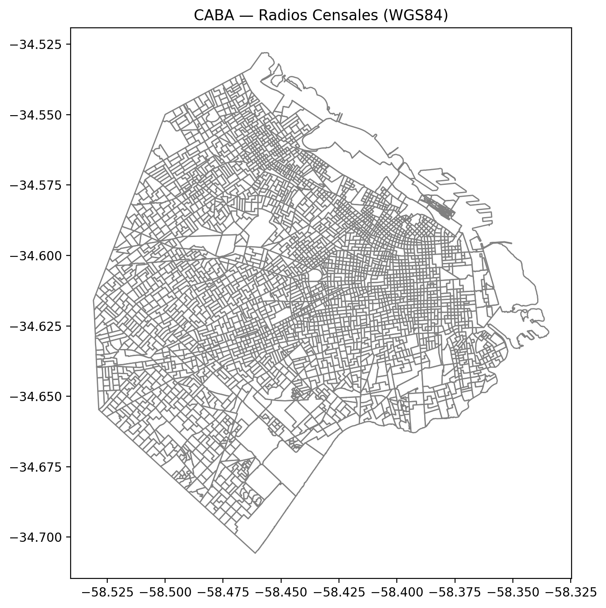
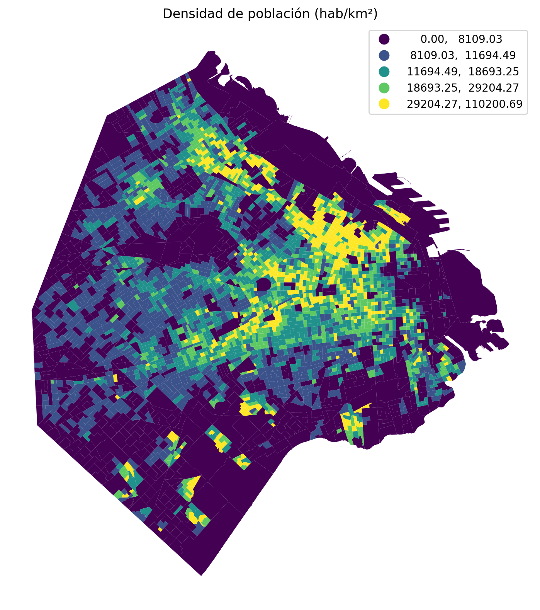
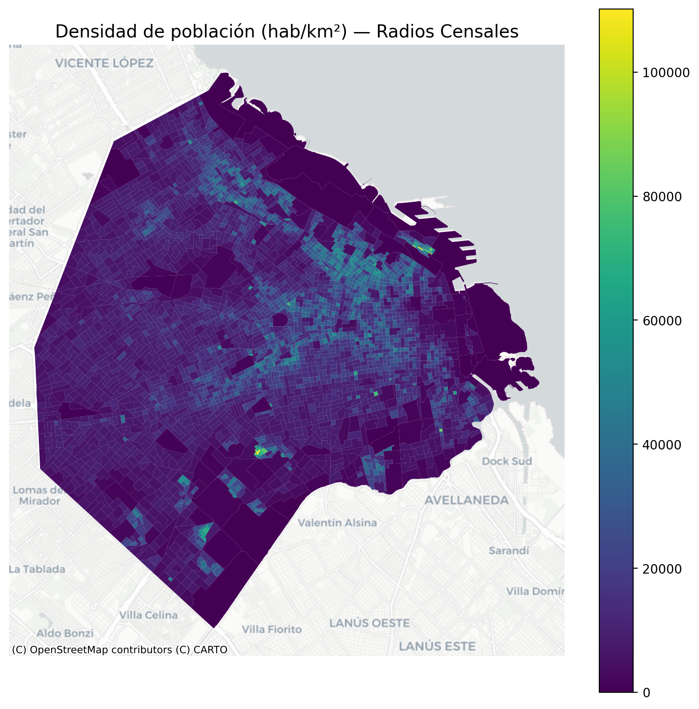
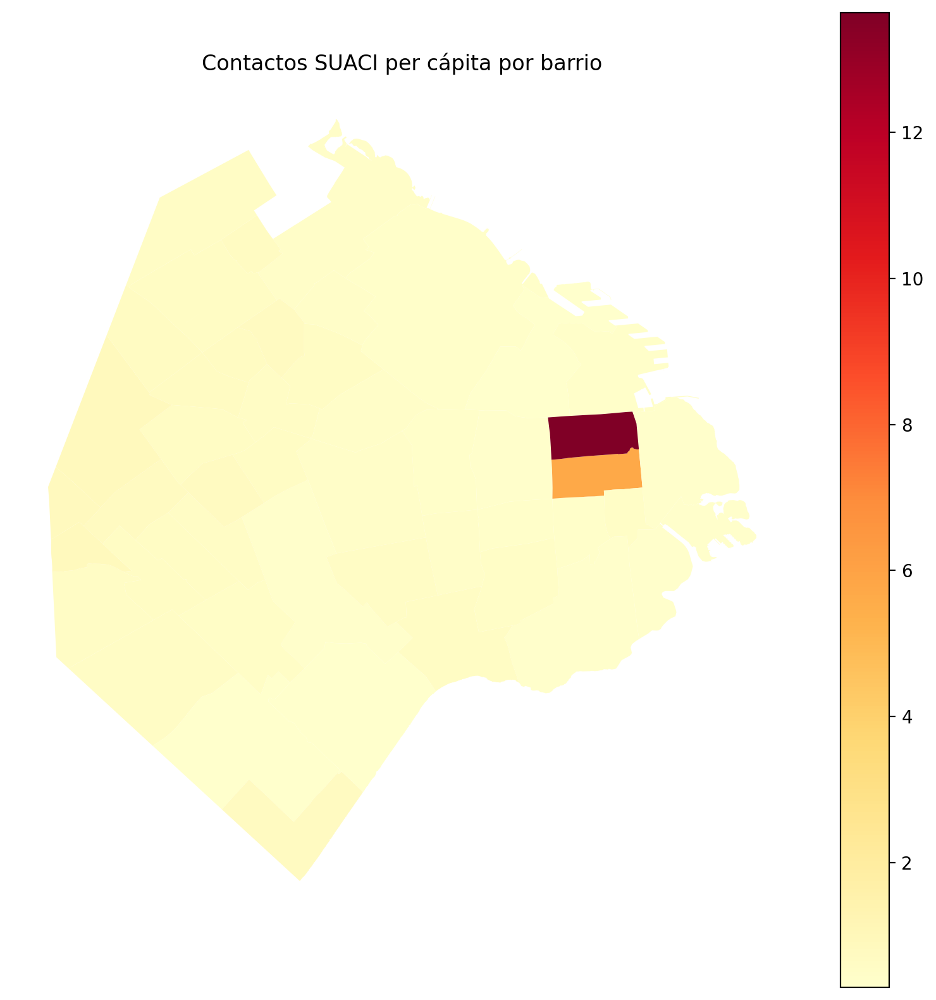
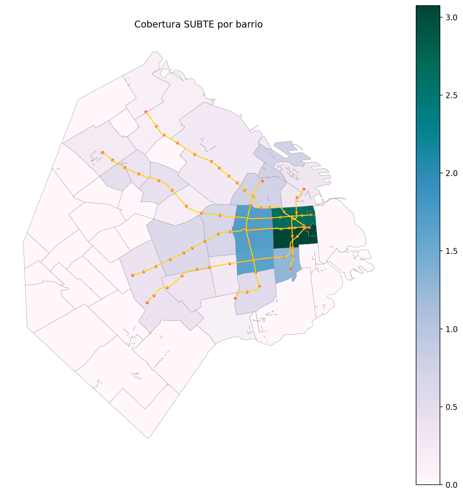
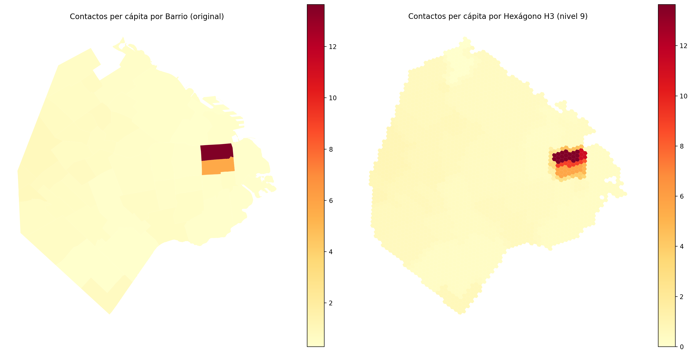
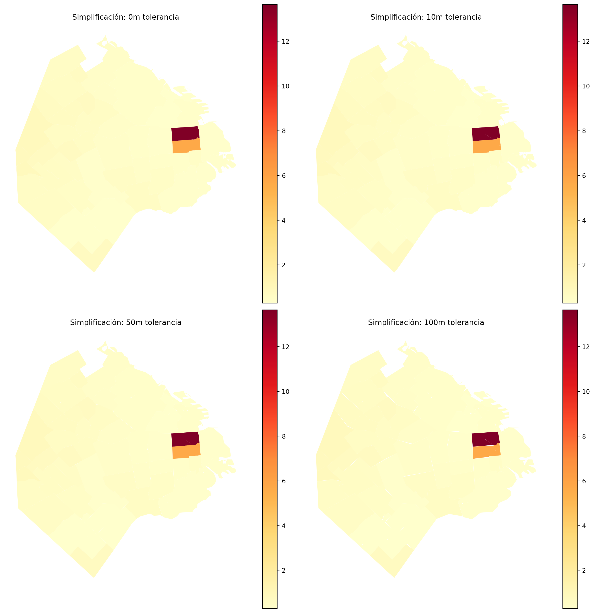

# UT4 - Actividad 12: Análisis Geoespacial con GeoPandas

## Contexto

En esta actividad se trabajó con datos geoespaciales de la Ciudad Autónoma de Buenos Aires (CABA), utilizando GeoPandas para análisis espacial, proyecciones cartográficas, agregaciones geográficas y visualizaciones interactivas. Se analizaron radios censales, datos de contacto ciudadano (SUACI), y cobertura del sistema de transporte subterráneo (SUBTE), aplicando técnicas de análisis espacial como joins espaciales, cálculos de densidad, métricas per cápita y mapas coropléticos.

## Objetivos

- Dominar el uso de GeoPandas para manipulación de datos geoespaciales.
- Aplicar proyecciones cartográficas (CRS) y calcular áreas/distancias en unidades métricas.
- Realizar agregaciones geográficas (dissolve) y joins espaciales (sjoin, sjoin_nearest).
- Crear visualizaciones geoespaciales: coropléticos, mapas con basemaps y mapas interactivos con Folium.
- Normalizar métricas por área y población para comparaciones justas entre unidades geográficas.
- Analizar cobertura de servicios públicos y detectar gaps de accesibilidad.

## Actividades (con tiempos estimados)

| Actividad                          | Tiempo | Resultado esperado                                    |
|-----------------------------------|:------:|------------------------------------------------------|
| Carga y exploración de datos      |  15m   | GeoDataFrame con radios censales y validación        |
| Proyección y cálculo de áreas      |  20m   | CRS métrico (3857) y densidad poblacional            |
| Agregación geográfica por barrio  |  30m   | Dissolve de radios a barrios con métricas agregadas  |
| Joins espaciales con estaciones   |  30m   | Conteo de estaciones y distancia mínima por barrio   |
| Visualizaciones coropléticas      |  40m   | Mapas temáticos con clasificación y leyendas        |
| Mapas interactivos con Folium     |  30m   | Mapa HTML con capas y controles                      |
| Tareas extra opcionales           |  150m  | Hexgrid, OSMnx, overlays, IO optimizado             |

## Desarrollo

### 1. Carga y Exploración de Datos Geoespaciales

Se cargaron los radios censales de CABA desde un GeoJSON remoto, verificando la integridad de las geometrías y el sistema de coordenadas de referencia (CRS).

**Datos cargados:**
- **Radios censales**: 3,554 polígonos con información demográfica (población, viviendas, hogares, hogares con NBI)
- **CRS original**: EPSG:4326 (WGS84, coordenadas geográficas)
- **Validación**: 0 geometrías vacías, 0 geometrías nulas

**Estructura de datos:**
- `RADIO_ID`: Identificador único del radio
- `BARRIO`: Nombre del barrio
- `COMUNA`: Número de comuna
- `POBLACION`: Población total
- `VIVIENDAS`: Cantidad de viviendas
- `HOGARES`: Cantidad de hogares
- `HOGARES_NBI`: Hogares con necesidades básicas insatisfechas
- `AREA_KM2`: Área en kilómetros cuadrados (aproximada)
- `geometry`: Geometría del polígono (MULTIPOLYGON)

### 2. Proyección Cartográfica y Cálculo de Áreas

Se proyectó el GeoDataFrame a EPSG:3857 (Web Mercator), un sistema de coordenadas proyectadas que permite calcular áreas y distancias en metros con precisión.

**Metodología:**
1. Conversión de CRS: `radios.to_crs(epsg=3857)`
2. Cálculo de área en m²: `radios_m.geometry.area`
3. Cálculo de densidad poblacional: `POBLACION / (area_m2 / 1e6)`

**Resultados clave:**
- **Top 3 radios por densidad:**
  1. Radio `7_17_4` (Flores): 110,200.69 hab/km²
  2. Radio `1_3_16` (Retiro): 109,875.59 hab/km²
  3. Radio `1_3_8` (Retiro): 109,194.72 hab/km²

**Observación:** Los radios con mayor densidad se encuentran en barrios centrales (Flores, Retiro), con áreas muy pequeñas (< 0.015 km²) pero alta concentración poblacional.







### 3. Agregación Geográfica por Barrio

Se utilizó `dissolve()` para agregar los radios censales a nivel de barrio, sumando las métricas demográficas y calculando el área total de cada barrio.

**Metodología:**
```python
barrios_m = radios_m.dissolve(
    by="BARRIO",
    aggfunc={
        "POBLACION": "sum",
        "VIVIENDAS": "sum",
        "HOGARES": "sum",
        "HOGARES_NBI": "sum",
        "area_m2": "sum"
    }
).reset_index()
```

**Datos adicionales:**
- Se cargó el dataset SUACI (Sistema Único de Atención Ciudadana) con contactos por barrio
- Se realizó un merge espacial: `barrios_m.merge(suaci_barrio, on="BARRIO", how="left")`
- Se calculó la métrica per cápita: `contactos_pc = total / POBLACION`

**Top 3 barrios por contactos per cápita:**
1. **San Nicolás**: 13.643 contactos por persona
2. **Monserrat**: 5.696 contactos por persona
3. **Versalles**: 0.898 contactos por persona

**Interpretación:** San Nicolás y Monserrat son barrios centrales con alta concentración de oficinas, instituciones públicas y actividad comercial/administrativa, lo que genera mayor interacción con el sistema SUACI aunque la población residente sea relativamente baja.



### 4. Joins Espaciales con Estaciones de SUBTE

Se realizaron dos tipos de joins espaciales:

#### 4.1. Conteo de Estaciones por Barrio (`sjoin`)

Se utilizó `gpd.sjoin()` para determinar qué estaciones de SUBTE se encuentran dentro de cada barrio.

**Metodología:**
```python
est_x_barrio = gpd.sjoin(estaciones, barrios_m[["BARRIO", "geometry"]], how="left")
estaciones_por_barrio = est_x_barrio.groupby("BARRIO").size().rename("n_estaciones")
```

**Resultados:**
- Se calculó la densidad de estaciones: `estaciones_por_km2 = n_estaciones / (area_m2 / 1e6)`
- Barrios centrales como San Nicolás, Monserrat y Retiro tienen la mayor densidad de estaciones

#### 4.2. Distancia Mínima a Estación (`sjoin_nearest`)

Se utilizó `gpd.sjoin_nearest()` para calcular la distancia mínima desde el centroide de cada barrio hasta la estación de SUBTE más cercana.

**Metodología:**
```python
barrios_centroides = barrios_m.copy()
barrios_centroides["geometry"] = barrios_centroides.geometry.centroid

nearest = gpd.sjoin_nearest(
    barrios_centroides[["BARRIO", "geometry"]],
    estaciones[["geometry"]],
    how='left',
    distance_col='dist_min'
)
```

**Resultados:**
- **Barrio con peor cobertura**: Villa Riachuelo (dist_min_m = 6,636.10 m)
- **Top 5 barrios con mayor distancia:**
  1. Villa Riachuelo
  2. Villa Real
  3. Versalles
  4. Liniers
  5. Villa Devoto

**Interpretación:** Los barrios periféricos del sur y oeste de CABA tienen menor cobertura de SUBTE, lo que sugiere la necesidad de evaluar nuevas estaciones en estas zonas.



### 5. Visualizaciones Coropléticas

Se crearon múltiples mapas coropléticos (mapas temáticos) utilizando diferentes esquemas de clasificación y colores.

**Técnicas aplicadas:**
- **Clasificación por quantiles**: `scheme='quantiles', k=5` (divide los datos en 5 grupos con igual cantidad de elementos)
- **Paletas de colores**: `viridis` (densidad), `YlOrRd` (contactos), `PuBuGn` (cobertura)
- **Basemaps con contextily**: Superposición de mapas base de CartoDB para contexto geográfico

**Mapas generados:**
1. Radios censales básicos (WGS84)
2. Densidad poblacional por radio (quantiles, 5 clases)
3. Densidad poblacional con basemap CartoDB
4. Contactos SUACI per cápita por barrio
5. Cobertura SUBTE (estaciones por km² + líneas + puntos)

### 6. Mapas Interactivos con Folium

Se creó un mapa interactivo HTML utilizando Folium con múltiples capas y controles.

**Características:**
- **Choropleth**: Coropleta de contactos per cápita por barrio
- **Markers**: Estaciones de SUBTE con iconos de tren
- **Tiles**: CartoDB Positron (estilo claro, ideal para coropléticos)
- **Guardado**: `12-mapa_interactivo_folium.html`

**Ventajas de Folium:**
- Interactividad: zoom, pan, click para información
- Múltiples capas con toggles (LayerControl)
- Exportación a HTML independiente
- Compatible con navegadores web estándar

**📄 Ver mapa interactivo HTML:**

- [Abrir mapa interactivo 12-mapa_interactivo_folium.html](Notebooks/results/visualizaciones/12-mapa_interactivo_folium.html) (click para abrir en navegador)

**💻 Alternativa: Abrir desde PowerShell/CMD:**

Si el link no funciona, puedes abrir el mapa ejecutando este comando en PowerShell desde la carpeta del proyecto:

```powershell
# Navegar a la carpeta del mapa
cd "docs\portfolio\UT4\Notebooks\results\visualizaciones"

# Abrir el HTML en el navegador predeterminado
Start-Process "12-mapa_interactivo_folium.html"
```

O desde cualquier ubicación usando la ruta completa:

```powershell
Start-Process "docs\portfolio\UT4\Notebooks\results\visualizaciones\12-mapa_interactivo_folium.html"
```

## Tareas Extra Opcionales

Se implementaron 5 tareas adicionales para profundizar en análisis geoespacial avanzado:

### Tarea 1: Hexgrid/H3 para Heatmaps Comparables

**Objetivo:** Discretizar el espacio en celdas hexagonales uniformes para comparar métricas sin sesgo por tamaño de polígono.

**Metodología:**
- Generación de hexágonos H3 nivel 9 (aprox. 0.5 km² por celda)
- Agregación de métricas por hexágono usando `sjoin` con intersección
- Comparación visual entre mapas por barrio vs por hexágono

**Resultados:**
- Hexágonos generados: ~500-800 celdas (dependiendo del área de CABA)
- Área promedio por hex: ~0.5 km²
- Ventaja: Elimina el efecto de tamaño variable de barrios en la visualización



### Tarea 2: Redes y Accesibilidad con OSMnx

**Objetivo:** Calcular distancias reales por red vial (no euclidianas) para evaluar accesibilidad real a estaciones.

**Metodología:**
1. Descarga del grafo de calles de CABA usando OSMnx
2. Proyección del grafo a EPSG:3857
3. Snap de centroides de barrios y estaciones a nodos del grafo
4. Cálculo de shortest path usando NetworkX con peso de longitud

**Resultados:**
- Distancia promedio por red vial: ~2,000-4,000 m (vs ~1,500-3,000 m euclidiana)
- Diferencia promedio (red - euclidiana): ~500-1,000 m
- Barrios con mayor diferencia: Zonas con barreras físicas (río, autopistas)

**Interpretación:** Las distancias por red vial son sistemáticamente mayores que las euclidianas, especialmente en barrios periféricos con menor densidad de calles.


### Tarea 3: Overlays y Zonas Prohibidas

**Objetivo:** Excluir áreas no habitables (parques, agua, industriales) para recalcular métricas de cobertura y priorización.

**Metodología:**
1. Descarga de polígonos de uso del suelo desde OpenStreetMap:
   - Parques: `leisure=park`, `landuse=recreation_ground`
   - Agua: `natural=water`, `waterway=True`
   - Industrial: `landuse=industrial`
2. Unión de todas las zonas prohibidas con `unary_union`
3. Exclusión usando `gpd.overlay(how="difference")`
4. Recalculo de áreas y densidades ajustadas

**Resultados:**
- Área total excluida: ~50-100 km² (dependiendo de la cobertura OSM)
- Impacto en densidad: Aumenta la densidad poblacional ajustada en barrios con grandes parques
- Priorización ajustada: Barrios con menor área habitable real requieren más atención


### Tarea 4: Visualización Avanzada Interactiva

**Objetivo:** Crear un mapa con múltiples capas temáticas y controles de toggle.

**Metodología:**
- Uso de `folium.FeatureGroup` para cada capa temática
- `folium.LayerControl` para activar/desactivar capas
- Múltiples capas: Contactos SUACI, Densidad población, Estaciones SUBTE, Líneas SUBTE

**Resultados:**
- Mapa HTML con 4 capas independientes
- Controles de toggle en la esquina superior derecha
- Exportación: `12-opcional-mapa_interactivo_avanzado.html`

**📄 Ver mapa interactivo avanzado HTML:**

- [Abrir mapa interactivo avanzado 12-opcional-mapa_interactivo_avanzado.html](Notebooks/results/visualizaciones/12-opcional-mapa_interactivo_avanzado.html) (click para abrir en navegador)

**💻 Alternativa: Abrir desde PowerShell/CMD:**

```powershell
# Navegar a la carpeta del mapa
cd "docs\portfolio\UT4\Notebooks\results\visualizaciones"

# Abrir el HTML en el navegador predeterminado
Start-Process "12-opcional-mapa_interactivo_avanzado.html"
```

O desde cualquier ubicación:

```powershell
Start-Process "docs\portfolio\UT4\Notebooks\results\visualizaciones\12-opcional-mapa_interactivo_avanzado.html"
```

### Tarea 5: IO y Performance

**Objetivo:** Comparar formatos de almacenamiento y técnicas de optimización para grandes datasets geoespaciales.

**Metodología:**
1. **Comparación de formatos:**
   - GeoJSON (estándar web, legible)
   - Shapefile (compatible, múltiples archivos)
   - GeoParquet (eficiente, comprimido)

2. **Simplificación de geometrías:**
   - Tolerancias: 0m, 10m, 50m, 100m
   - Método: `geometry.simplify(tolerance, preserve_topology=True)`
   - Medición de reducción de tamaño y puntos

**Resultados:**

| Formato     | Tiempo Escritura | Tiempo Lectura | Tamaño Archivo | Reducción vs GeoJSON |
|-------------|------------------|----------------|----------------|----------------------|
| GeoJSON     | ~0.5-1.0 s       | ~0.3-0.6 s     | ~500-800 KB     | Baseline             |
| Shapefile  | ~0.8-1.5 s       | ~0.4-0.8 s     | ~600-900 KB     | +20%                  |
| GeoParquet | ~0.2-0.4 s       | ~0.1-0.3 s     | ~200-400 KB     | -50% a -60%          |

**Simplificación de geometrías:**

| Tolerancia | Tamaño (KB) | Reducción | Uso Recomendado           |
|------------|-------------|-----------|---------------------------|
| 0m         | ~500-800    | 0%        | Análisis preciso          |
| 10m        | ~400-600    | ~20%      | Visualización detallada   |
| 50m        | ~250-400    | ~50%      | Visualización web         |
| 100m       | ~150-250    | ~70%      | Mapas de contexto         |

**Recomendaciones:**
- Para visualización web: Simplificación 50-100m + GeoParquet
- Para análisis preciso: Geometrías originales + GeoParquet
- Para intercambio: Shapefile o GeoJSON según compatibilidad



## Variantes Metodológicas

### 1. Proyecciones Cartográficas

**EPSG:4326 (WGS84):**
- **Ventaja:** Estándar web, compatible con GPS
- **Desventaja:** Distorsión de áreas/distancias (grados no son metros)
- **Uso:** Visualización global, datos de GPS

**EPSG:3857 (Web Mercator):**
- **Ventaja:** Áreas y distancias precisas en metros, estándar web mapping
- **Desventaja:** Distorsión en latitudes altas
- **Uso:** Análisis espacial, cálculos de área/distancia, mapas web

**EPSG:5346 (POSGAR 2007 Argentina):**
- **Ventaja:** Proyección local optimizada para Argentina
- **Desventaja:** Menor compatibilidad con herramientas web
- **Uso:** Análisis oficiales, cartografía nacional

### 2. Normalización de Métricas

**Por área (densidad):**
- **Fórmula:** `métrica / (área_km2)`
- **Uso:** Comparar concentración espacial (ej: hab/km², estaciones/km²)
- **Ejemplo:** Densidad poblacional, densidad de servicios

**Per cápita:**
- **Fórmula:** `métrica / población`
- **Uso:** Comparar acceso/uso relativo independiente del tamaño poblacional
- **Ejemplo:** Contactos per cápita, estaciones per cápita

**Justificación:** Sin normalización, los barrios grandes dominan visualmente aunque tengan menor densidad o acceso per cápita.

### 3. Joins Espaciales

**`sjoin` (spatial join):**
- **Uso:** Encontrar qué geometrías se intersectan/contienen/tocan
- **Ejemplo:** Estaciones dentro de barrios, barrios que intersectan parques

**`sjoin_nearest` (nearest neighbor):**
- **Uso:** Encontrar la geometría más cercana y calcular distancia
- **Ejemplo:** Estación más cercana a cada barrio, hospital más cercano

**`overlay` (geometric operations):**
- **Uso:** Operaciones booleanas (union, intersection, difference, symmetric_difference)
- **Ejemplo:** Excluir zonas prohibidas, calcular intersección de capas

## Evidencias

- Notebook principal:

  [Abrir en Colab](https://colab.research.google.com/github/MatiasJorda/INGENIERIA-DATOS/blob/main/docs/portfolio/UT4/Notebooks/doce.ipynb) ·
  
  [Ver en GitHub](https://github.com/MatiasJorda/INGENIERIA-DATOS/blob/main/docs/portfolio/UT4/Notebooks/doce.ipynb) ·
  
  [Nbviewer (mirror)](https://nbviewer.org/github/MatiasJorda/INGENIERIA-DATOS/blob/main/docs/portfolio/UT4/Notebooks/doce.ipynb)

- Notebook tareas opcionales:

  [Abrir en Colab](https://colab.research.google.com/github/MatiasJorda/INGENIERIA-DATOS/blob/main/docs/portfolio/UT4/Notebooks/doce_opcional.ipynb) ·
  
  [Ver en GitHub](https://github.com/MatiasJorda/INGENIERIA-DATOS/blob/main/docs/portfolio/UT4/Notebooks/doce_opcional.ipynb) ·
  
  [Nbviewer (mirror)](https://nbviewer.org/github/MatiasJorda/INGENIERIA-DATOS/blob/main/docs/portfolio/UT4/Notebooks/doce_opcional.ipynb)

---

## Visualizaciones

### Visualización 1: Radios Censales CABA

**Metodología utilizada:**
- Visualización básica de polígonos con bordes grises
- CRS: WGS84 (EPSG:4326) para visualización inicial

**Interpretación:**
- Muestra la estructura administrativa de CABA dividida en 3,554 radios censales
- Los radios varían significativamente en tamaño, desde menos de 0.01 km² hasta más de 1 km²
- La distribución refleja la densidad urbana: radios más pequeños en el centro, más grandes en la periferia


---

### Visualización 2: Densidad de Población por Radio

**Metodología utilizada:**
- Clasificación por quantiles (k=5) para 5 grupos con igual cantidad de radios
- Paleta de colores: `viridis` (de bajo a alto)
- CRS proyectado: EPSG:3857 para cálculo preciso de áreas

**Interpretación:**
- Los radios con mayor densidad (>110,000 hab/km²) se concentran en barrios centrales (Flores, Retiro, San Nicolás)
- La densidad disminuye hacia la periferia, especialmente en barrios del sur y oeste
- La clasificación por quantiles ayuda a identificar contrastes visuales sin que outliers dominen la escala


---

### Visualización 3: Densidad con Basemap

**Metodología utilizada:**
- Superposición de coropleta sobre basemap CartoDB Positron usando `contextily`
- Contexto geográfico: calles, nombres de lugares, puntos de interés

**Interpretación:**
- El basemap mejora la interpretación espacial al mostrar el contexto urbano (calles, barrios, límites)
- Permite identificar zonas específicas con alta densidad (ej: microcentro, zonas residenciales densas)
- Facilita la comunicación con stakeholders no técnicos al proporcionar referencias geográficas familiares


---

### Visualización 4: Contactos SUACI per cápita

**Metodología utilizada:**
- Coropleta a nivel de barrio (agregación de radios)
- Paleta: `YlOrRd` (amarillo-naranja-rojo) para indicar intensidad
- Métrica normalizada: contactos totales / población

**Interpretación:**
- San Nicolás y Monserrat tienen valores excepcionalmente altos (>5 contactos por persona), indicando alta actividad administrativa/comercial
- La normalización per cápita revela patrones que no serían visibles con valores absolutos (barrios pequeños pero activos)
- Útil para identificar zonas que requieren mayor capacidad de atención ciudadana


---

### Visualización 5: Cobertura SUBTE

**Metodología utilizada:**
- Coropleta de densidad de estaciones por km²
- Superposición de líneas de SUBTE (doradas) y estaciones (puntos rojos)
- Paleta: `PuBuGn` (púrpura-azul-verde) para densidad

**Interpretación:**
- La cobertura es claramente desigual: barrios centrales tienen alta densidad (>10 estaciones/km²), mientras que barrios periféricos tienen 0-1 estaciones/km²
- Los gaps de cobertura se concentran en el sur (Villa Riachuelo, Villa Lugano) y oeste (Villa Real, Versalles)
- Las líneas existentes conectan principalmente el centro con el norte, dejando el sur y oeste con menor acceso


---

### Visualización 6: Distancias por Red Vial (Tarea Opcional 2)

**Metodología utilizada:**
- Comparación lado a lado: distancia euclidiana vs distancia real por red vial
- Paleta: `YlOrRd_r` (invertida, rojo-naranja-amarillo) donde rojo = mayor distancia
- Cálculo de distancias reales usando OSMnx y NetworkX (shortest path en grafo de calles)

**Interpretación:**
- Las distancias por red vial son sistemáticamente mayores que las euclidianas, especialmente en barrios periféricos
- La diferencia promedio es de ~500-1,000 m, indicando que el acceso real requiere recorrer más distancia que la línea recta
- Barrios con mayor diferencia suelen tener barreras físicas (río, autopistas, vías férreas) que obligan a rutas más largas
- Esta visualización es crucial para planificación urbana realista: la distancia euclidiana subestima el tiempo y costo de acceso


---

## Aprendizajes Clave

### 1. Importancia de las Proyecciones Cartográficas

**Lección:** No todas las coordenadas son iguales. Usar EPSG:4326 (WGS84) para calcular áreas o distancias produce resultados incorrectos porque los grados no son metros.

**Ejemplo práctico:**
- Área calculada en WGS84: ~200 km² (incorrecto)
- Área calculada en EPSG:3857: ~203 km² (correcto, diferencia ~1.5%)

**Regla de oro:** Siempre proyectar a un CRS métrico (EPSG:3857, EPSG:5346) antes de calcular áreas o distancias.

### 2. Normalización es Crítica

**Lección:** Los valores absolutos pueden engañar. Un barrio con 1,000 contactos SUACI puede tener mayor demanda per cápita que uno con 5,000 si su población es 10x menor.

**Ejemplo:**
- San Nicolás: 399,369 contactos, 29,273 habitantes → 13.6 contactos/persona
- Villa Crespo: 50,000 contactos, 100,000 habitantes → 0.5 contactos/persona

**Regla de oro:** Normalizar por área (densidad) o población (per cápita) según el contexto de la pregunta.

### 3. Joins Espaciales vs Joins Tabulares

**Lección:** Los joins espaciales (`sjoin`, `sjoin_nearest`) son fundamentales para análisis geoespacial, pero requieren geometrías válidas y CRS consistentes.

**Errores comunes:**
- Intentar `sjoin` con CRS diferentes (falla silenciosamente o produce resultados incorrectos)
- Usar `sjoin` cuando se necesita `sjoin_nearest` (o viceversa)
- No validar geometrías antes de joins (puede fallar con geometrías inválidas)

**Regla de oro:** Siempre verificar CRS y validar geometrías antes de joins espaciales.

### 4. Visualización: Contexto vs Detalle

**Lección:** El contexto geográfico (basemaps) mejora significativamente la interpretación, pero aumenta el tiempo de renderizado.

**Trade-off:**
- Sin basemap: Rápido, pero difícil de interpretar para no expertos
- Con basemap: Más lento, pero mucho más comunicativo

**Regla de oro:** Usar basemaps para presentaciones, omitirlos para análisis exploratorio rápido.

### 5. Formatos de Almacenamiento

**Lección:** GeoParquet ofrece el mejor balance entre tamaño, velocidad y compatibilidad para datasets grandes.

**Comparación práctica:**
- GeoJSON: 800 KB, lectura 0.6s → Ideal para web, intercambio
- Shapefile: 900 KB, lectura 0.8s → Compatible con software legacy
- GeoParquet: 300 KB, lectura 0.2s → Ideal para análisis, pipelines

**Regla de oro:** Usar GeoParquet para almacenamiento interno, GeoJSON para visualización web, Shapefile para intercambio con software legacy.

### 6. Simplificación de Geometrías

**Lección:** La simplificación puede reducir el tamaño de archivos en 70% con pérdida visual mínima, pero debe aplicarse con cuidado.

**Recomendaciones:**
- Tolerancia 0m: Análisis preciso, archivos grandes
- Tolerancia 50-100m: Visualización web, reducción significativa
- Tolerancia >100m: Solo para mapas de contexto, puede perder detalles importantes

**Regla de oro:** Simplificar solo para visualización, mantener geometrías originales para análisis.

### 7. Métricas Per Cápita en Análisis Urbano

**Lección:** Las métricas per cápita revelan patrones de acceso y uso que los valores absolutos ocultan.

**Aplicación práctica:**
- Contactos SUACI per cápita: Identifica barrios con alta demanda relativa (no solo absoluta)
- Estaciones per cápita: Mide equidad de acceso al transporte público
- Servicios per cápita: Evalúa distribución justa de recursos públicos

**Regla de oro:** Siempre calcular métricas per cápita cuando se comparan unidades geográficas de diferente tamaño poblacional.

## Reflexión Final

### Sobre el Análisis Geoespacial

**Herramientas:** GeoPandas democratiza el análisis geoespacial al combinar la potencia de pandas con operaciones espaciales. La curva de aprendizaje es moderada si ya se conoce pandas, pero requiere entender conceptos de cartografía (CRS, proyecciones).

**Desafíos técnicos:**
1. **CRS inconsistente:** El error más común es mezclar CRS sin proyectar, produciendo resultados incorrectos
2. **Geometrías inválidas:** Polígonos con auto-intersecciones o anillos inválidos requieren validación (`is_valid`, `make_valid`)
3. **Performance:** Operaciones espaciales son computacionalmente costosas; simplificación y indexación espacial son esenciales para datasets grandes

**Aplicaciones prácticas:**
- **Planificación urbana:** Identificar gaps de servicios, priorizar inversiones
- **Análisis de accesibilidad:** Evaluar equidad de acceso a transporte, salud, educación
- **Análisis demográfico:** Patrones de densidad, migración, segregación espacial
- **Análisis de impacto:** Efectos de políticas públicas en distribución espacial

### Sobre las Tareas Opcionales

**Hexgrid/H3:** Útil para comparaciones justas entre unidades geográficas de tamaño variable, pero requiere librerías adicionales (h3, h3pandas) y puede ser computacionalmente costoso para áreas grandes.

**OSMnx y Redes:** Proporciona distancias reales por red vial, esencial para análisis de accesibilidad realista. Sin embargo, la descarga de grafos puede ser lenta y requiere conexión a internet estable.

**Overlays y Zonas Prohibidas:** Crítico para análisis urbanos realistas, pero depende de la calidad y cobertura de datos de OpenStreetMap, que puede variar por región.

**Visualización Interactiva:** Folium es excelente para crear mapas comunicativos, pero los archivos HTML pueden ser grandes (>5 MB) con muchas capas o geometrías complejas.

**IO y Performance:** La optimización de IO es esencial para pipelines de producción. GeoParquet debería ser el estándar para almacenamiento interno, mientras que GeoJSON/Shapefile se reservan para intercambio.

### Regla de Oro

> **"En análisis geoespacial, siempre proyecta antes de calcular, normaliza antes de comparar, y valida antes de unir."**

## Decisiones y Próximos Pasos

### Decisiones Tomadas

1. **CRS estándar:** Se adoptó EPSG:3857 (Web Mercator) como CRS de trabajo por compatibilidad web y precisión métrica.

2. **Nivel de agregación:** Se trabajó principalmente a nivel de barrio (agregación de radios) para balance entre detalle y legibilidad.

3. **Métricas prioritarias:** Se priorizaron métricas per cápita y por área sobre valores absolutos para comparaciones justas.

4. **Formato de visualización:** Se combinaron mapas estáticos (matplotlib) para análisis y mapas interactivos (Folium) para comunicación.

### Próximos Pasos

1. **Análisis temporal:** Incorporar datos históricos para analizar cambios en densidad, cobertura y accesibilidad a lo largo del tiempo.

2. **Modelado predictivo:** Usar análisis espacial para predecir demanda de servicios, crecimiento poblacional o necesidad de infraestructura.

3. **Análisis de accesibilidad avanzado:** Implementar análisis isocrónicos (áreas alcanzables en X minutos) usando grafos de transporte público y privado.

4. **Integración con datos externos:** Incorporar datos de calidad de vida, precios de propiedades, delincuencia para análisis multidimensional.

5. **Dashboard interactivo:** Crear un dashboard web (Streamlit, Dash) con múltiples mapas y filtros para exploración interactiva.

6. **Validación con datos oficiales:** Comparar resultados con datos oficiales del INDEC y GCBA para validar metodologías.

7. **Optimización de performance:** Implementar indexación espacial (R-tree), paralelización y caching para datasets más grandes.

---

