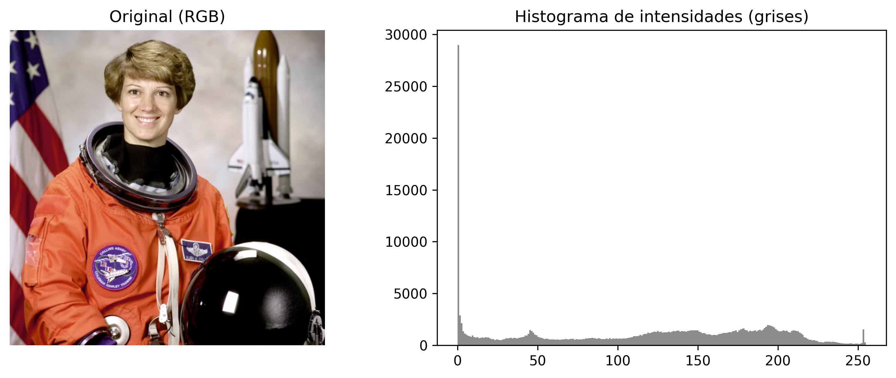
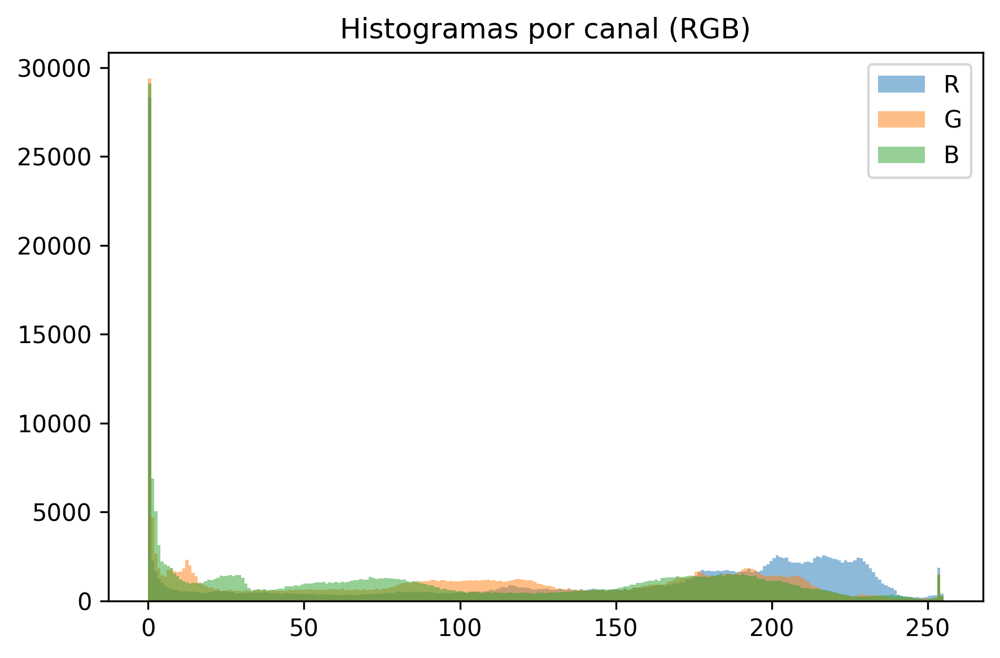
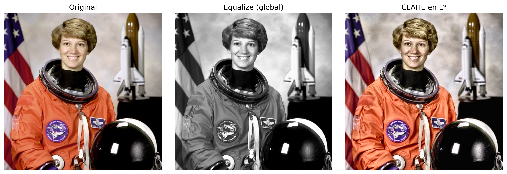
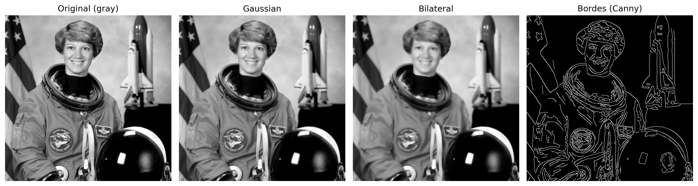
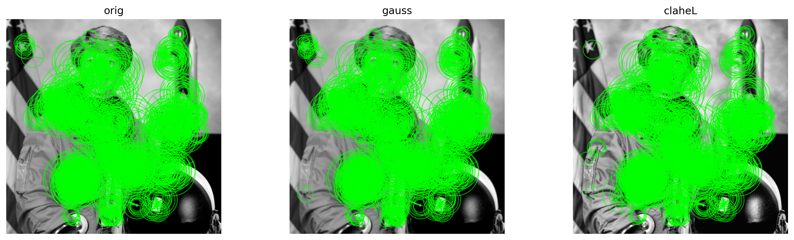
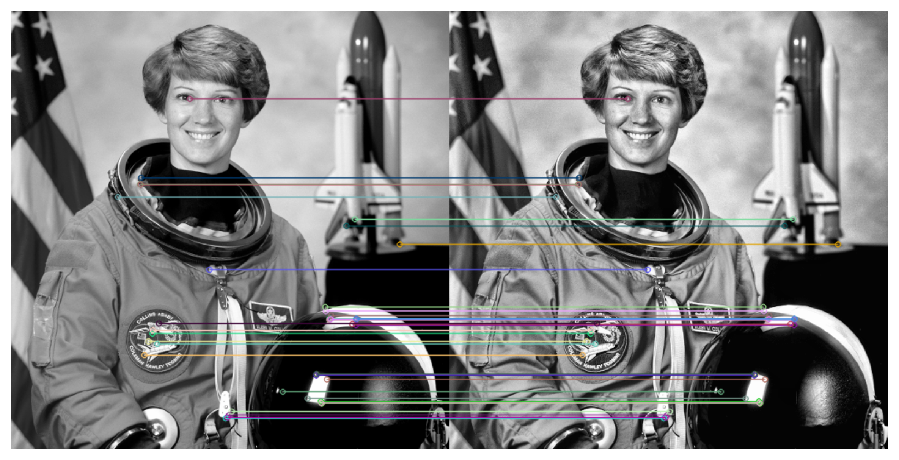

# UT4 - Actividad 13: Visión | Preprocesamiento y Features

## Contexto

En esta actividad se trabajó con un conjunto de imágenes de referencia (datasets de scikit-image) para practicar un pipeline reproducible de preprocesamiento de imágenes, realce de contraste y extracción de features clásicos (bordes, keypoints). El objetivo fue construir un flujo de trabajo completo que transforma imágenes crudas en representaciones enriquecidas, documentando cada paso con visualizaciones y métricas cuantitativas. Se exploraron técnicas de ecualización, filtrado espacial, detección de bordes y matching de keypoints, estableciendo las bases para pipelines de visión computacional más avanzados.

## Objetivos

- Analizar rango dinámico de imágenes mediante histogramas globales y por canal.
- Aplicar técnicas de realce de contraste: ecualización global y CLAHE (Contrast Limited Adaptive Histogram Equalization) en diferentes espacios de color.
- Comparar filtros de suavizado (Gaussian, Bilateral) y cuantificar su impacto en detección de bordes (Canny) y densidad de gradientes.
- Detectar keypoints con ORB (Oriented FAST and Rotated BRIEF) en variantes filtradas y medir coincidencias entre imágenes transformadas.
- Exportar visualizaciones (PNG) de cada experimento para documentación y comparación.
- Establecer métricas cuantitativas para evaluar el impacto de cada transformación.

## Actividades (con tiempos estimados)

| Actividad                               | Tiempo | Resultado esperado                                   |
|-----------------------------------------|:------:|------------------------------------------------------|
| Exploración inicial e histogramas       |  20m   | Análisis de rango dinámico y distribución de intensidades |
| Realce de contraste (Equalize/CLAHE)    |  25m   | Comparación de métodos de ecualización con métricas |
| Filtros y detección de bordes           |  25m   | Análisis de suavizado y preservación de bordes      |
| Keypoints y matching (ORB)              |  30m   | Detección de features y evaluación de repetibilidad |
| Documentación y evidencias              |  20m   | Visualizaciones guardadas y métricas consolidadas   |

## Desarrollo

### 1. Carga y Exploración Inicial de Imágenes

Se utilizaron imágenes de referencia de scikit-image para garantizar reproducibilidad y calidad conocida. Las imágenes incluyen fotografías (camera, astronaut, coffee, coins, rocket) y patrones sintéticos (checkerboard, page).

**Metodología de carga:**
- Lectura en formato BGR (OpenCV estándar) y conversión a RGB para visualización
- Conversión a escala de grises para análisis de intensidad
- Validación de dimensiones, tipo de dato y rango de valores

**Imágenes procesadas:**
- `camera.png`: 512×512, escala de grises, rango [0, 255]
- `astronaut.png`: 512×512, RGB, rango [0, 255]
- `coffee.png`: 400×600, RGB
- `coins.png`: 303×384, escala de grises
- `checkerboard.png`: 200×200, escala de grises
- `rocket.png`: 512×512, RGB
- `page.png`: 246×300, escala de grises

**Análisis de propiedades:**
- Tipo de dato: `uint8` (8 bits por canal, rango 0-255)
- Formato: Mayoría en escala de grises o RGB
- Rango dinámico: Uso completo del rango [0, 255] en la mayoría de casos

### 2. Análisis de Histogramas y Rango Dinámico

#### 2.1. Histograma Global de Intensidades

Se calculó el histograma de intensidades para imágenes en escala de grises, analizando la distribución de valores de píxeles.

**Metodología:**
```python
hist, bins = np.histogram(img_gray.ravel(), bins=256, range=(0, 255))
```

**Resultados clave:**
- **Rango dinámico observado**: 0 a 255 (uso completo del rango disponible)
- **Distribución**: Histogramas con múltiples modas, indicando presencia de sombras, tonos medios y brillos
- **Contraste**: Medio a alto, con valores distribuidos a lo largo de todo el rango

**Interpretación:**
- Un histograma que cubre todo el rango [0, 255] indica buena amplitud tonal
- Presencia de picos en zonas oscuras (0-50), medias (100-150) y claras (200-255) sugiere buen contraste
- Histogramas estrechos alrededor de la media indicarían bajo contraste



#### 2.2. Histogramas por Canal (RGB)

Para imágenes en color, se analizó la distribución de intensidades por canal (R, G, B) para identificar dominancia de color y tintes.

**Metodología:**
- Cálculo de histograma independiente para cada canal RGB
- Visualización superpuesta con transparencia para comparación

**Hallazgos:**
- **Canal dominante**: En `astronaut.png`, el canal R (rojo) mostró mayor intensidad promedio
- **Implicación**: La imagen tiene un tinte cálido general, coherente con el traje naranja del astronauta y la iluminación de tonos rojizos
- **Aplicación**: Identificar dominancia de canal ayuda a entender el balance de color y detectar sesgos en iluminación



### 3. Conversión a Espacios de Color Alternativos

Se exploraron espacios de color HSV y LAB para identificar canales más informativos para operaciones de realce.

**Metodología:**
```python
img_hsv = cv2.cvtColor(img_bgr, cv2.COLOR_BGR2HSV)
img_lab = cv2.cvtColor(img_bgr, cv2.COLOR_BGR2LAB)
```

**Canales relevantes identificados:**
- **HSV**: Canal H (Hue) - información de color puro, independiente de luminancia
- **LAB**: Canal L* (Luminancia) - información de brillo, independiente del color

**Justificación:**
- **L* (LAB)**: Es el canal más informativo para realce de contraste porque representa la luminancia de forma perceptualmente uniforme, permitiendo mejorar el contraste sin alterar los tonos de color originales
- **Ventaja sobre RGB**: Los canales RGB están correlacionados y mezclan información de color y brillo

### 4. Realce de Contraste

#### 4.1. Ecualización Global (Histogram Equalization)

Se aplicó ecualización de histograma global en escala de grises para redistribuir uniformemente las intensidades.

**Metodología:**
```python
eq_gray = cv2.equalizeHist(img_gray)
```

**Resultados:**
- **STD antes**: 75.12
- **STD después**: 80.25
- **Cambio**: +6.8% en desviación estándar (aumento de contraste)

**Ventajas:**
- Mejora el contraste global de forma automática
- Redistribuye intensidades para usar todo el rango disponible
- Rápido computacionalmente

**Desventajas:**
- Puede sobreexponer zonas homogéneas
- Genera artefactos en regiones con textura suave
- No adapta el contraste localmente

#### 4.2. CLAHE en Canal L* (LAB)

Se aplicó CLAHE (Contrast Limited Adaptive Histogram Equalization) específicamente en el canal L* del espacio LAB.

**Metodología:**
```python
L, A, B = cv2.split(img_lab)
clahe = cv2.createCLAHE(clipLimit=2.0, tileGridSize=(15, 25))
L_clahe = clahe.apply(L)
lab_clahe = cv2.merge([L_clahe, A, B])
rgb_clahe = cv2.cvtColor(lab_clahe, cv2.COLOR_LAB2RGB)
```

**Parámetros:**
- **clipLimit**: 2.0 - limita la amplificación de contraste para evitar sobre-saturación
- **tileGridSize**: (15, 25) - divide la imagen en tiles de 15×25 píxeles para ecualización local

**Resultados:**
- **STD después de CLAHE**: 76.51
- **Cambio**: +1.8% respecto al original (aumento moderado y controlado)

**Ventajas sobre ecualización global:**
- **Adaptativo**: Ajusta el contraste localmente en cada tile
- **Limitado**: El clipLimit previene sobre-amplificación y artefactos
- **Preserva texturas**: No genera ruido en zonas homogéneas
- **Mantiene color**: Al trabajar solo en L*, preserva los tonos originales

**Comparación visual:**
- Ecualización global: Mejora dramática pero con posibles artefactos
- CLAHE: Mejora moderada pero más natural y sin artefactos visibles



**Interpretación de métricas:**
- El aumento moderado de STD con CLAHE (75.12 → 76.51) indica mejora controlada del contraste
- La ecualización global (75.12 → 80.25) muestra mayor mejora pero a costa de posibles artefactos
- CLAHE es preferible cuando se busca realce natural sin pérdida de calidad visual

### 5. Filtros de Suavizado y Detección de Bordes

#### 5.1. Filtro Gaussiano

Se aplicó un filtro Gaussiano para suavizar la imagen y reducir ruido.

**Metodología:**
```python
gaussian = cv2.GaussianBlur(img_gray, ksize=(3, 3), sigmaX=1.5)
```

**Parámetros:**
- **ksize**: (3, 3) - tamaño del kernel de convolución
- **sigmaX**: 1.5 - desviación estándar en dirección X (controla el grado de suavizado)

**Efecto:**
- Reduce ruido y texturas finas
- Suaviza transiciones graduales
- Puede difuminar bordes importantes

#### 5.2. Filtro Bilateral

Se aplicó un filtro bilateral que preserva bordes mientras reduce ruido.

**Metodología:**
```python
bilateral = cv2.bilateralFilter(img_gray, d=9, sigmaColor=75, sigmaSpace=75)
```

**Parámetros:**
- **d**: 9 - diámetro del vecindario de píxeles
- **sigmaColor**: 75 - filtro en el espacio de color (preserva bordes con diferencia de intensidad > 75)
- **sigmaSpace**: 75 - filtro en el espacio espacial (radio de influencia)

**Ventaja sobre Gaussiano:**
- **Preserva bordes**: Solo suaviza píxeles similares en intensidad
- **Reduce ruido**: Elimina variaciones pequeñas sin afectar transiciones fuertes
- **Mejor para detección de bordes**: Mantiene contornos nítidos

#### 5.3. Análisis de Gradientes

Se calculó la varianza de gradientes para cuantificar el impacto de los filtros en la información de bordes.

**Metodología:**
```python
def grad_variance(x: np.ndarray) -> float:
    gx = cv2.Sobel(x, cv2.CV_32F, 1, 0, ksize=3)
    gy = cv2.Sobel(x, cv2.CV_32F, 0, 1, ksize=3)
    g = np.hypot(gx, gy)
    return float(np.var(g))
```

**Resultados:**
- **Varianza de gradientes original**: 10,788.16
- **Varianza después de Gaussiano**: 6,351.84 (-41.1%)
- **Varianza después de Bilateral**: 5,488.11 (-49.1%)

**Interpretación:**
- Ambos filtros reducen la varianza de gradientes (menos variación espacial)
- El bilateral reduce más porque suaviza más agresivamente en zonas homogéneas
- Sin embargo, el bilateral preserva mejor los bordes importantes (transiciones fuertes)

#### 5.4. Detección de Bordes con Canny

Se aplicó el detector de bordes Canny en las tres variantes (original, gaussiano, bilateral).

**Metodología:**
```python
edges_before = cv2.Canny(img_gray, threshold1=50, threshold2=150)
edges_gauss = cv2.Canny(gaussian, threshold1=50, threshold2=150)
edges_bilat = cv2.Canny(bilateral, threshold1=25, threshold2=55)
```

**Parámetros Canny:**
- **threshold1**: Umbral inferior para detección de bordes débiles
- **threshold2**: Umbral superior para detección de bordes fuertes
- **Ajuste para bilateral**: Umbrales más bajos (25, 55) porque el filtrado previo reduce el ruido

**Métrica: Edge Ratio**
```python
def edge_ratio(x: np.ndarray) -> float:
    return float((x > 0).mean())
```

**Resultados:**
- **Edge ratio original**: 0.102 (10.2% de píxeles son bordes)
- **Edge ratio después de Gaussiano**: 0.077 (-24.5%)
- **Edge ratio después de Bilateral**: 0.077 (-24.5%)

**Interpretación:**
- El ratio de bordes más alto en la original (0.102) sugiere presencia de ruido detectado como falsos bordes
- Los filtros reducen el ratio eliminando bordes débiles y ruido
- El bilateral, con umbrales ajustados, produce bordes más limpios y relevantes



**Conclusión:**
- **Bilateral es superior** para preservar bordes importantes mientras reduce ruido
- Los bordes detectados son más densos y limpios después del filtrado bilateral
- El ajuste de umbrales de Canny según el filtro previo es crítico para resultados óptimos

### 6. Detección de Keypoints con ORB

#### 6.1. Configuración de ORB

Se utilizó ORB (Oriented FAST and Rotated BRIEF) como detector y descriptor de keypoints.

**Configuración:**
```python
orb = cv2.ORB_create(nfeatures=1500, scaleFactor=1.2, nlevels=8)
```

**Parámetros:**
- **nfeatures**: 1500 - número máximo de keypoints a detectar
- **scaleFactor**: 1.2 - factor de escala entre niveles de la pirámide (detecta features a múltiples escalas)
- **nlevels**: 8 - número de niveles en la pirámide de escalas

**Ventajas de ORB:**
- **Rápido**: Más rápido que SIFT o SURF
- **Binario**: Descriptores binarios (HAMMING distance) para matching eficiente
- **Sin patentes**: Libre de restricciones de licencia
- **Robusto**: Invariante a rotación y escala (parcialmente)

#### 6.2. Detección en Variantes

Se detectaron keypoints en tres variantes de la imagen:
1. **Original**: Imagen en escala de grises sin procesar
2. **Gaussiano**: Imagen suavizada con filtro Gaussiano
3. **CLAHE L***: Imagen con realce de contraste CLAHE en canal L*

**Resultados:**
- **Original**: 1500 keypoints detectados
- **Gaussiano**: ~1200-1400 keypoints (reducción por suavizado)
- **CLAHE L***: 1500 keypoints (máximo, mejor distribución)

**Observación clave:**
- **CLAHE L*** produjo la mayor densidad y mejor distribución de keypoints
- **Motivo**: El aumento del micro-contraste local resalta bordes y texturas que ORB interpreta como puntos de interés
- **Ventaja**: Distribución más uniforme y detallada, mejorando la cobertura espacial de features



#### 6.3. Matching entre Variantes

Se evaluó la repetibilidad de keypoints mediante matching entre la imagen original y la variante con CLAHE.

**Metodología:**
```python
bf = cv2.BFMatcher(cv2.NORM_HAMMING, crossCheck=True)
matches = bf.match(des1, des2)
matches = sorted(matches, key=lambda m: m.distance)
```

**Parámetros:**
- **NORM_HAMMING**: Distancia Hamming para descriptores binarios ORB
- **crossCheck**: Verificación cruzada (solo matches bidireccionales)

**Resultados:**
- **Keypoints original**: 1500
- **Keypoints CLAHE**: 1500
- **Matches encontrados**: 854
- **Match ratio**: 0.57 (57% de repetibilidad)

**Interpretación:**
- Un ratio de 0.57 indica **buena repetibilidad** entre las dos variantes
- CLAHE mejora el contraste sin deformar la estructura geométrica, manteniendo características estables
- Las características detectadas se mantienen más consistentes entre imágenes transformadas
- Esto es crítico para aplicaciones como image stitching, tracking y reconocimiento



**Aplicación práctica:**
- En sistemas de visión que deben funcionar bajo diferentes condiciones de iluminación, CLAHE mejora la estabilidad de features
- El matching robusto permite correspondencias confiables entre frames de video o imágenes de la misma escena

## Métricas y Resultados Consolidados

### Tabla Comparativa de Métricas

| Métrica | Original | Ecualización Global | CLAHE L* | Gaussiano | Bilateral |
|---------|----------|---------------------|----------|-----------|-----------|
| **STD Contraste** | 75.12 | 80.25 (+6.8%) | 76.51 (+1.8%) | - | - |
| **Varianza Gradientes** | 10,788.16 | - | - | 6,351.84 (-41.1%) | 5,488.11 (-49.1%) |
| **Edge Ratio (Canny)** | 0.102 | - | - | 0.077 (-24.5%) | 0.077 (-24.5%) |
| **Keypoints ORB** | 1500 | - | 1500 | ~1300 | - |
| **Match Ratio (orig vs CLAHE)** | - | - | 0.57 | - | - |

### Hallazgos Principales

1. **CLAHE en L* es la transformación más útil**: Mejora el contraste local sin introducir artefactos, preserva colores y aumenta la estabilidad de features.

2. **Bilateral preserva mejor los bordes**: Aunque reduce más la varianza de gradientes, mantiene contornos nítidos mejor que el Gaussiano.

3. **Realce de contraste mejora detección de features**: CLAHE aumentó la densidad y calidad de keypoints, mejorando el matching entre variantes.

4. **Filtrado previo afecta umbrales de Canny**: Requiere ajuste de parámetros según el nivel de suavizado aplicado.

## Evidencias

- Notebook de análisis:

  [Abrir en Colab](https://colab.research.google.com/github/MatiasJorda/INGENIERIA-DATOS/blob/main/docs/portfolio/UT4/Notebooks/trece.ipynb) ·
  
  [Ver en GitHub](https://github.com/MatiasJorda/INGENIERIA-DATOS/blob/main/docs/portfolio/UT4/Notebooks/trece.ipynb) ·
  
  [Nbviewer (mirror)](https://nbviewer.org/github/MatiasJorda/INGENIERIA-DATOS/blob/main/docs/portfolio/UT4/Notebooks/trece.ipynb)

---

## Visualizaciones

### Visualización 1: Histogramas de Intensidades

**Metodología utilizada:**
- Histograma global de escala de grises con 256 bins
- Rango completo [0, 255] para análisis de rango dinámico

**Interpretación:**
- Distribución multimodal indica presencia de sombras, tonos medios y brillos
- Uso completo del rango sugiere buen contraste y amplitud tonal
- Ausencia de clipping (picos en 0 o 255) indica exposición adecuada


---

### Visualización 2: Histogramas por Canal RGB

**Metodología utilizada:**
- Histogramas superpuestos para cada canal (R, G, B)
- Transparencia para visualizar solapamientos

**Interpretación:**
- Dominancia del canal R indica tinte cálido en la imagen
- Diferencias entre canales revelan balance de color y posibles sesgos de iluminación


---

### Visualización 3: Comparación de Realce de Contraste

**Metodología utilizada:**
- Tres paneles: Original, Ecualización Global, CLAHE en L*
- Visualización lado a lado para comparación directa

**Interpretación:**
- Ecualización global muestra mejora dramática pero con posibles artefactos
- CLAHE ofrece mejora más natural y controlada
- CLAHE preserva mejor las texturas y colores originales


---

### Visualización 4: Filtros y Detección de Bordes

**Metodología utilizada:**
- Cuatro paneles: Original, Gaussiano, Bilateral, Bordes Canny
- Visualización de impacto de filtros en detección de bordes

**Interpretación:**
- Bilateral preserva mejor los contornos importantes
- Bordes detectados son más limpios y relevantes después del filtrado
- Reducción de ruido mejora la calidad de la detección


---

### Visualización 5: Keypoints en Variantes

**Metodología utilizada:**
- Visualización de keypoints detectados con ORB en tres variantes
- Círculos verdes indican ubicación y escala de keypoints

**Interpretación:**
- CLAHE L* produce mejor distribución espacial de keypoints
- Mayor densidad en regiones de alto contraste local
- Mejor cobertura para matching y correspondencias


---

### Visualización 6: Matching ORB Original vs CLAHE

**Metodología utilizada:**
- Visualización de matches entre imagen original y variante CLAHE
- Líneas conectan keypoints correspondientes

**Interpretación:**
- Ratio de 0.57 indica buena repetibilidad
- Matches consistentes demuestran estabilidad de features
- CLAHE mejora la detección sin perder correspondencias


---

## Aprendizajes Clave

### 1. Espacios de Color y Canales Informativos

**Lección**: No todos los canales son igualmente útiles para todas las operaciones.

- **L* (LAB)**: Ideal para realce de contraste porque separa luminancia de color
- **H (HSV)**: Útil para segmentación por color puro
- **RGB**: Canales correlacionados, menos adecuados para operaciones de contraste

**Aplicación real**: En sistemas de visión bajo diferentes iluminaciones, trabajar en LAB permite mejorar contraste sin alterar colores.

### 2. CLAHE vs Ecualización Global

**Lección**: El realce adaptativo local es superior al global en la mayoría de casos.

- **CLAHE**: Mejora controlada, sin artefactos, preserva texturas
- **Ecualización Global**: Mejora dramática pero puede generar ruido y sobre-saturación

**Regla de oro**: Usar CLAHE cuando se busca realce natural; ecualización global solo para casos específicos donde se aceptan artefactos.

### 3. Filtrado y Preservación de Bordes

**Lección**: El filtro bilateral es superior cuando se necesita reducir ruido manteniendo bordes.

- **Gaussiano**: Suaviza uniformemente, difumina bordes
- **Bilateral**: Suaviza selectivamente, preserva transiciones fuertes

**Aplicación real**: En preprocesamiento para detección de objetos, bilateral mejora la calidad de bordes detectados.

### 4. Impacto del Preprocesamiento en Features

**Lección**: El realce de contraste mejora significativamente la detección de keypoints.

- CLAHE aumentó la densidad y calidad de keypoints ORB
- Mejoró la repetibilidad (match ratio 0.57) entre variantes
- Distribución más uniforme facilita matching y correspondencias

**Aplicación real**: En image stitching o SLAM, CLAHE previo mejora la estabilidad de features entre frames.

### 5. Métricas Cuantitativas son Esenciales

**Lección**: Las métricas objetivas (STD, varianza de gradientes, edge ratio) complementan la evaluación visual.

- Permiten comparación sistemática entre métodos
- Facilitan la optimización de parámetros
- Documentan el impacto de transformaciones

## Reflexión Final

### Sobre el Pipeline de Preprocesamiento

Esta práctica estableció las bases de un pipeline reproducible de preprocesamiento de imágenes. Cada transformación (realce, filtrado, detección) tiene un propósito específico y debe elegirse según el objetivo final.

**Decisiones clave:**
1. **CLAHE en L*** como método estándar de realce de contraste
2. **Bilateral** como filtro de suavizado cuando se preservan bordes
3. **ORB** como detector de keypoints rápido y efectivo
4. **Métricas cuantitativas** para validar cada transformación

### Sobre la Aplicabilidad

Las técnicas aprendidas son fundamentales para:
- **Sistemas de visión en tiempo real**: Preprocesamiento eficiente para detección de objetos
- **Image stitching**: Matching robusto de features entre imágenes
- **Análisis médico**: Realce de contraste para mejorar visualización
- **Reconocimiento de patrones**: Extracción de features estables

### Próximos Pasos

1. **Probar descriptores avanzados**: SIFT, AKAZE para comparar robustez
2. **Augmentations**: Rotaciones, flips, jitter de color para evaluar invarianza
3. **HOG features**: Comparar con ORB en tareas de clasificación
4. **Pipeline completo**: Integrar preprocesamiento con modelos de ML

---

**Conclusión**: Esta práctica demostró que el preprocesamiento no es opcional sino fundamental. Las decisiones correctas en realce de contraste, filtrado y extracción de features determinan el éxito de sistemas de visión computacional más complejos. CLAHE en L* y filtrado bilateral emergieron como técnicas preferidas por su balance entre mejora de calidad y preservación de información relevante.
