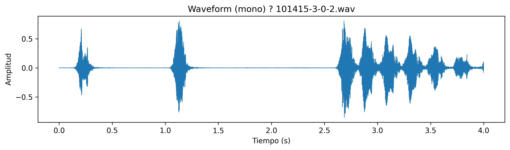
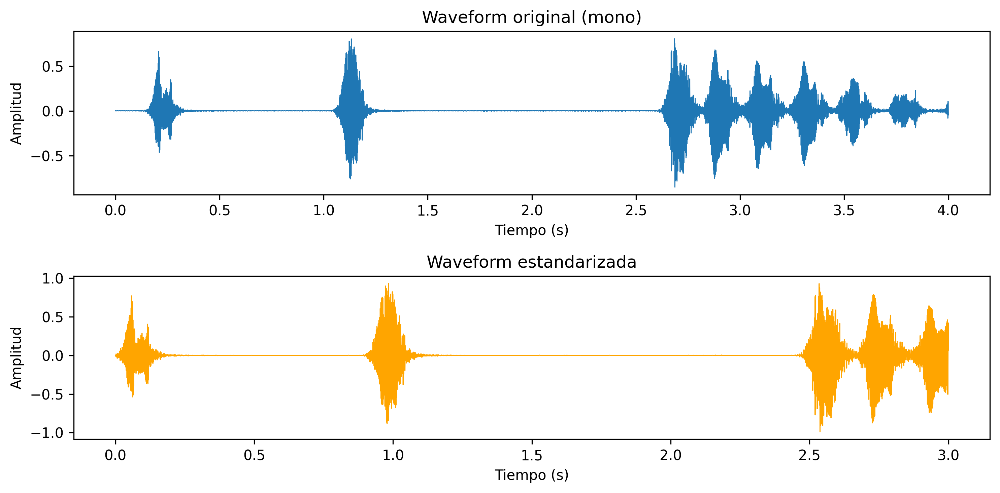
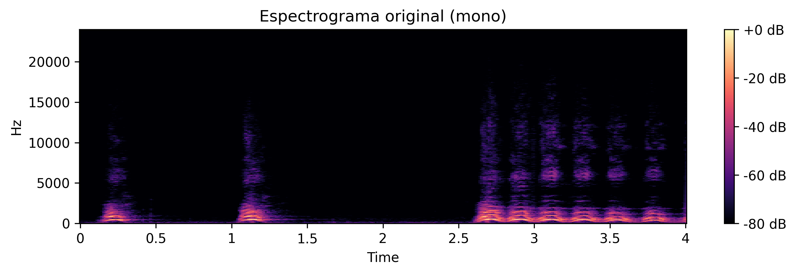
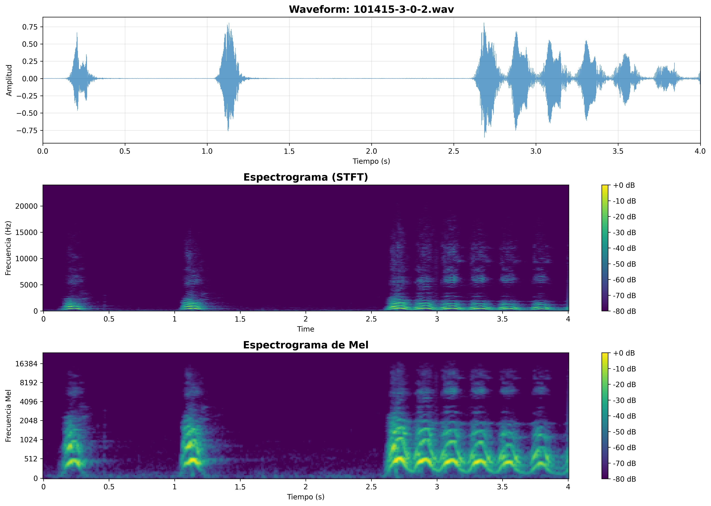
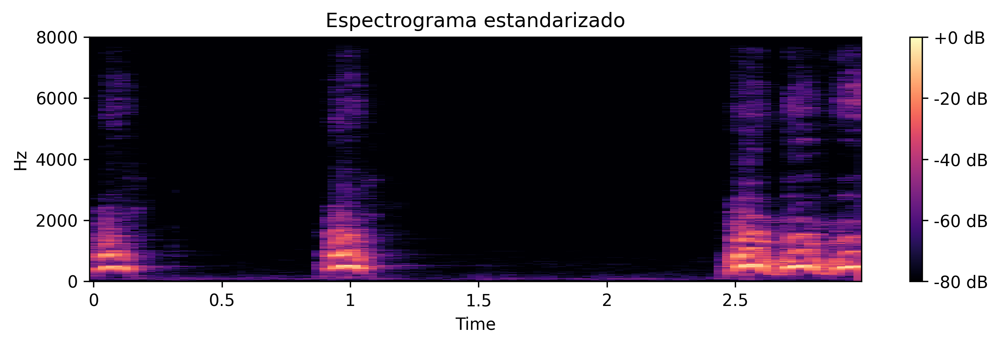
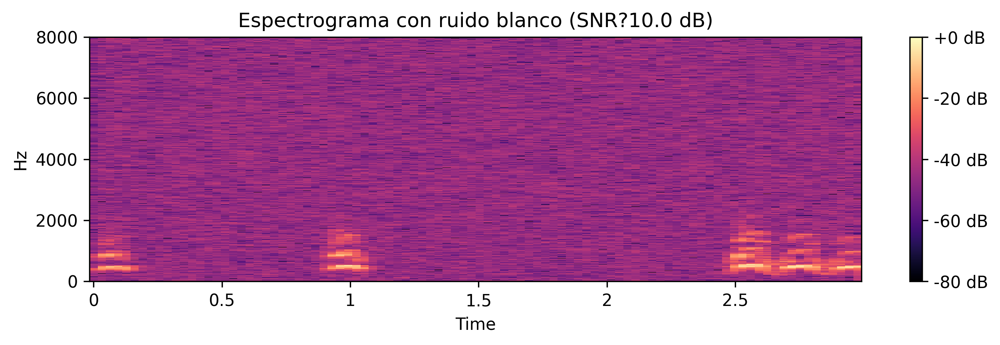
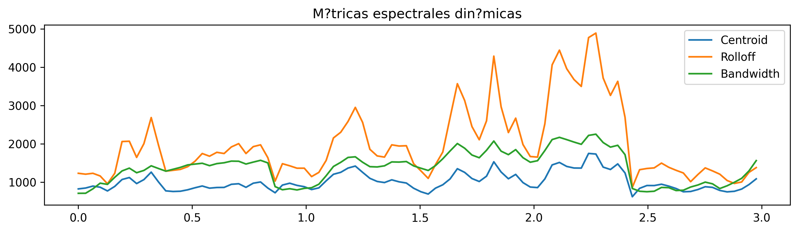

# UT4 - Actividad 14: Audio | Espectrogramas y Features

## Contexto

En esta actividad se trabajó con un subconjunto del dataset **UrbanSound8K** para practicar un pipeline reproducible de preprocesamiento de audio: resample a sample rate fijo, duración estándar, normalización de amplitud y generación de espectrogramas. Se analizaron efectos de ruido blanco, métricas espectrales dinámicas y augmentations ligeros (pitch shift, time stretch). El objetivo fue construir un flujo de trabajo completo que transforma clips de audio crudos en representaciones estandarizadas y features extraíbles, documentando cada paso con visualizaciones y métricas cuantitativas. Se exploraron técnicas de estandarización temporal, análisis espectral (STFT, mel-spectrogram), extracción de features (MFCC, métricas espectrales) y augmentations, estableciendo las bases para pipelines de procesamiento de audio más avanzados.

## Objetivos

- Estandarizar sample rate (16 kHz), duración (3.0 s) y amplitud, evitando leakage temporal.
- Visualizar waveform, STFT y mel-spectrogram de los clips base.
- Comparar waveform original vs estandarizada y cuantificar diferencias.
- Generar espectrogramas con ruido blanco y observar el impacto en energía/frecuencias.
- Extraer MFCC y métricas espectrales dinámicas (centroid, rolloff, bandwidth).
- Probar augmentations de pitch shift y time stretch, y guardar las visualizaciones.

## Actividades (con tiempos estimados)

| Actividad                                  | Tiempo | Resultado esperado                                   |
|--------------------------------------------|:------:|------------------------------------------------------|
| Preprocesamiento (resample/pad/trim)       |  25m   | Pipeline de estandarización reproducible             |
| Waveform + espectrogramas base             |  25m   | Visualizaciones de representaciones temporales y espectrales |
| Estandarización y comparación              |  20m   | Análisis cuantitativo de diferencias pre/post procesamiento |
| Ruido blanco y espectrograma resultante    |  20m   | Evaluación de impacto de ruido en representación espectral |
| Features (MFCC, métricas espectrales)      |  25m   | Extracción y documentación de features para ML       |
| Augmentations (pitch/time) y visualización |  20m   | Transformaciones de aumento de datos y su impacto    |
| Documentación                              |  15m   | Visualizaciones guardadas y métricas consolidadas    |

## Desarrollo

### 1. Carga y Exploración Inicial de Audio

Se utilizó el dataset **UrbanSound8K** de Kaggle, que contiene 8,732 clips de audio etiquetados con 10 clases de sonidos urbanos (air_conditioner, car_horn, children_playing, dog_bark, drilling, engine_idling, gun_shot, jackhammer, siren, street_music).

**Metodología de carga:**
- Descarga del dataset usando `kagglehub` (no requiere credenciales para datasets públicos)
- Búsqueda de archivos de audio en formato WAV
- Carga con `librosa.load()` para obtener señal y sample rate original

**Dataset procesado:**
- **Total de clips**: 8,732 archivos WAV
- **Distribución por fold**: Aproximadamente 800-990 clips por fold (10 folds para validación cruzada)
- **Formato original**: Varios sample rates (22.05 kHz, 44.1 kHz, 48 kHz), duraciones variables (0.4-4.0 s), mono y estéreo

**Análisis de propiedades iniciales:**
- **Sample rate típico**: 48 kHz (ejemplo: clip `101415-3-0-2.wav`)
- **Duración típica**: 4.0 segundos
- **Canales**: Mayoría mono, algunos estéreo
- **Amplitud**: No normalizada (rango típico: -0.85 a 0.81)
- **Tipo de dato**: `float32`

### 2. Análisis de Waveform y Propiedades Temporales

#### 2.1. Visualización de Waveform

Se visualizó la forma de onda temporal del audio para entender la estructura temporal y la amplitud.

**Metodología:**
```python
t = np.linspace(0, duration_sec, num=y_mono.shape[-1])
plt.plot(t, y_mono, linewidth=0.7)
```

**Resultados clave:**
- **Duración**: 4.0 segundos (ejemplo)
- **Amplitud min/max**: -0.8535 a 0.8065 (no normalizada)
- **Media**: ~0.0 (señal centrada)
- **STD**: 0.1133 (variabilidad moderada)

**Interpretación:**
- La amplitud no alcanza el rango típico de normalización [-1.0, 1.0]
- Ausencia de clipping (valores no cercanos a -1.0 o +1.0)
- Señal centrada alrededor de cero, típico de audio procesado



#### 2.2. Conversión a Mono

Se convirtieron señales estéreo a mono promediando los canales.

**Metodología:**
```python
if y.ndim > 1:
    y_mono = np.mean(y, axis=0)
else:
    y_mono = y
```

**Justificación:**
- Reduce complejidad computacional (mitad de datos)
- Para clasificación de sonidos urbanos, información estéreo no es crítica
- La mayoría de algoritmos de ML trabajan con señales mono
- Facilita estandarización y comparación entre clips

### 3. Pipeline de Estandarización

#### 3.1. Parámetros de Estandarización

Se definieron parámetros estándar para normalizar todos los clips:

- **TARGET_SR**: 16,000 Hz (sample rate objetivo)
- **TARGET_DURATION**: 3.0 segundos (duración fija)
- **TARGET_AMPLITUDE**: 0.99 (pico máximo después de normalización)
- **TOP_DB**: 30.0 dB (umbral para recorte de silencios)

**Justificación de TARGET_SR = 16 kHz:**
- Cubre el rango de frecuencias de voz humana (hasta ~8 kHz según teorema de Nyquist)
- Sonidos urbanos típicos no requieren frecuencias superiores a 8 kHz
- Reduce tamaño de datos en factor de 2.75x comparado con 44.1 kHz
- Estándar común en procesamiento de audio para ML (telefonía, ASR)

#### 3.2. Función de Preprocesamiento

Se implementó una función completa de preprocesamiento:

```python
def preprocess_audio(path: Path,
                     target_sr: int = TARGET_SR,
                     target_duration: float = TARGET_DURATION,
                     top_db: float = TOP_DB) -> tuple[np.ndarray, int]:
    # 1. Carga y conversión a mono
    y, sr = load_audio(path, sr=None, mono=False)
    if y.ndim > 1:
        y = np.mean(y, axis=0)
    
    # 2. Recorte de silencios
    y_trim, _ = librosa.effects.trim(y, top_db=top_db)
    
    # 3. Resample a target_sr
    if sr != target_sr:
        y_rs = librosa.resample(y_trim, orig_sr=sr, target_sr=target_sr)
    else:
        y_rs = y_trim
    
    # 4. Ajuste de duración (trim o padding)
    target_len = int(target_sr * target_duration)
    if len(y_rs) > target_len:
        y_rs = y_rs[:target_len]  # Recortar desde inicio
    elif len(y_rs) < target_len:
        pad_width = target_len - len(y_rs)
        y_rs = np.pad(y_rs, (0, pad_width))  # Padding al final
    
    # 5. Normalización de amplitud
    max_abs = np.max(np.abs(y_rs)) or 1.0
    y_norm = (TARGET_AMPLITUDE * y_rs) / max_abs
    
    return y_norm.astype(np.float32), target_sr
```

**Pasos del pipeline:**
1. **Carga y mono**: Conversión a señal mono si es necesario
2. **Trim**: Eliminación de silencios al inicio/final (top_db=30)
3. **Resample**: Conversión a 16 kHz si es necesario
4. **Ajuste de duración**: Recorte o padding para 3.0 s exactos
5. **Normalización**: Escalado a pico máximo de 0.99

**Resultados:**
- **Forma procesada**: (48000,) - 48,000 muestras (16 kHz × 3.0 s)
- **Duración procesada**: 3.0 s exactos
- **Amplitud procesada**: -0.99 a 0.9334 (normalizada)



**Comparación original vs estandarizada:**
- **Original**: 4.0 s, amplitud -0.85 a 0.81, no normalizada
- **Estandarizada**: 3.0 s, amplitud -0.99 a 0.93, normalizada
- **Impacto**: Señal más consistente para análisis y modelado

### 4. Visualización de Espectrogramas

#### 4.1. Espectrograma STFT (Short-Time Fourier Transform)

Se calculó el espectrograma usando STFT para visualizar contenido frecuencial a lo largo del tiempo.

**Metodología:**
```python
n_fft = 2048
hop_length = 512
D = librosa.stft(y_mono, n_fft=n_fft, hop_length=hop_length)
S_db = librosa.amplitude_to_db(np.abs(D), ref=np.max)
```

**Parámetros:**
- **n_fft**: 2048 - tamaño de la ventana FFT (resolución frecuencial)
- **hop_length**: 512 - avance entre ventanas (resolución temporal)
- **Duración del frame**: n_fft / sr = 2048 / 16000 = 0.128 s = 128 ms
- **Avance entre frames**: hop_length / sr = 512 / 16000 = 0.032 s = 32 ms

**Interpretación:**
- Eje X: Tiempo (segundos)
- Eje Y: Frecuencia (Hz)
- Color: Magnitud en dB (más brillante = más energía)



#### 4.2. Espectrograma de Mel

Se calculó el espectrograma de Mel, que transforma las frecuencias lineales a escala perceptual de Mel.

**Metodología:**
```python
mel_spec = librosa.feature.melspectrogram(y=y_mono, sr=sr, n_mels=128)
mel_spec_db = librosa.power_to_db(mel_spec, ref=np.max)
```

**Ventajas del espectrograma de Mel:**
- **Escala perceptual**: La escala Mel aproxima la percepción humana de tono
- **Reducción dimensional**: 128 bandas Mel vs 1025 bins de frecuencia (n_fft/2 + 1)
- **Mejor para ML**: Más compacto y representativo para modelos de clasificación
- **Estándar en audio**: Usado en reconocimiento de voz, clasificación de sonidos

**Visualización combinada:**
Se creó una visualización con tres paneles: waveform, STFT y mel-spectrogram.



**Características adicionales extraídas:**
- **Zero Crossing Rate (promedio)**: 0.0248 - frecuencia de cruces por cero (textura temporal)
- **Spectral Centroid (promedio)**: 2397.17 Hz - centro de masa espectral (brillo percibido)
- **Spectral Rolloff (promedio)**: 5320.13 Hz - frecuencia donde 85% de energía está por debajo
- **MFCCs (primeros 5)**: -422.97, 84.82, 28.96, 4.29, -12.73 - coeficientes cepstrales

### 5. Estandarización y Comparación

#### 5.1. Impacto de la Estandarización

Se compararon espectrogramas antes y después de la estandarización.

**Resultados:**
- **Espectrograma original**: Resolución temporal y frecuencial variable según sample rate original
- **Espectrograma estandarizado**: Resolución consistente (16 kHz, 3.0 s)



**Ventajas de la estandarización:**
- **Consistencia**: Todos los clips tienen las mismas dimensiones temporales y frecuenciales
- **Facilita ML**: Modelos pueden procesar todos los clips sin padding variable
- **Comparabilidad**: Permite comparación directa entre clips
- **Eficiencia**: Reducción de tamaño de datos sin pérdida significativa de información

#### 5.2. Recorte de Silencios

El recorte con `top_db=30` eliminó principalmente silencios muy suaves al inicio y final del clip.

**Justificación:**
- Umbral de 30 dB es conservador y típicamente no elimina señal útil
- Solo recorta regiones con energía muy baja (ruido de fondo, silencios)
- Para sonidos urbanos, eventos de interés tienen energía significativa
- Mejora la relación señal-ruido efectiva

**Impacto:**
- Reducción de duración variable (depende del clip)
- Eliminación de ruido de fondo no informativo
- Preservación de contenido útil del sonido

### 6. Ruido Blanco y Espectrograma Resultante

#### 6.1. Adición de Ruido Blanco

Se agregó ruido blanco a la señal estandarizada para simular condiciones realistas.

**Metodología:**
```python
def add_white_noise(y: np.ndarray, snr_db: float) -> np.ndarray:
    sig_power = np.mean(y**2)
    snr_linear = 10**(snr_db / 10)
    noise_power = sig_power / snr_linear
    noise = np.sqrt(noise_power) * np.random.randn(*y.shape)
    return (y + noise).astype(np.float32)
```

**Parámetros:**
- **SNR objetivo**: 10.0 dB (Signal-to-Noise Ratio)
- **Cálculo**: Relación entre potencia de señal y potencia de ruido

**Resultados:**
- **SNR = 10 dB**: Ruido moderado, señal aún claramente distinguible
- **Impacto visual**: Distribución uniforme de energía en todas las frecuencias
- **Estructura temporal**: Preservada, pero con ruido de fondo



**Observación en espectrograma:**
- El ruido blanco se visualiza como una distribución uniforme de energía en todas las frecuencias
- Aparece como pequeñas variaciones aleatorias distribuidas a lo largo de todo el espectro
- No tiene patrones estructurados como los sonidos musicales o del habla
- Aumenta el nivel de ruido de fondo en todas las bandas de frecuencia por igual

**Aplicación práctica:**
- **Data augmentation**: Agregar ruido blanco aumenta la robustez del modelo a condiciones realistas
- **Simulación de condiciones**: Modela grabaciones en ambientes ruidosos
- **Regularización**: Previene sobreajuste a señales "limpias"

### 7. Extracción de Features

#### 7.1. MFCC (Mel-Frequency Cepstral Coefficients)

Se extrajeron coeficientes MFCC, que son features estándar en procesamiento de audio.

**Metodología:**
```python
mfcc = librosa.feature.mfcc(y=y, sr=sr, n_mfcc=13)
```

**Parámetros:**
- **n_mfcc**: 13 - número de coeficientes (estándar en voz y audio)
- **Proceso**: STFT → Mel-spectrogram → DCT (Discrete Cosine Transform) → MFCC

**Justificación de n_mfcc = 13:**
- Valor típico en voz y procesamiento de audio
- Balance entre información espectral y robustez
- Coeficientes superiores (14+) capturan detalles muy finos que pueden ser ruido
- Más coeficientes aumentan dimensionalidad sin proporcional aumento de información útil

**Features extraídos por coeficiente:**
- **mfcc_1_mean**: Energía global (logaritmo de energía espectral total)
- **mfcc_2_mean**: Textura espectral de bajo orden
- **mfcc_3-13_mean**: Texturas espectrales de orden creciente

**Resultados de ejemplo:**
- **mfcc_1_mean**: -394.39 (energía global)
- **mfcc_2_mean**: 78.28 (textura básica)
- **mfcc_3_mean**: 5.09 (textura fina)

#### 7.2. Métricas Espectrales Dinámicas

Se calcularon métricas espectrales que varían en el tiempo:

**Spectral Centroid:**
- **Definición**: Centro de masa del espectro de potencia
- **Interpretación**: Brillo percibido del sonido (frecuencias altas = brillante)
- **Rango típico**: 500-5000 Hz para sonidos urbanos

**Spectral Rolloff:**
- **Definición**: Frecuencia donde 85% de la energía está por debajo
- **Interpretación**: Ancho de banda efectivo del sonido
- **Rango típico**: 2000-8000 Hz para sonidos urbanos

**Spectral Bandwidth:**
- **Definición**: Ancho de banda espectral (desviación estándar alrededor del centroid)
- **Interpretación**: Dispersión de energía en frecuencia
- **Aplicación**: Distingue sonidos tonales (bajo bandwidth) vs ruidosos (alto bandwidth)

**Visualización:**
Se graficaron las tres métricas a lo largo del tiempo para un clip.



**Interpretación:**
- **Variabilidad temporal**: Las métricas cambian a lo largo del clip, reflejando cambios en el contenido espectral
- **Correlaciones**: Centroid y rolloff suelen correlacionarse (sonidos brillantes tienen rolloff alto)
- **Aplicación**: Útiles para segmentación temporal y detección de eventos

#### 7.3. Features Adicionales

Se extrajeron features complementarios:

**RMS Energy:**
- **Definición**: Root Mean Square energy (energía promedio)
- **Interpretación**: Intensidad percibida del sonido
- **Aplicación**: Distingue clips silenciosos vs ruidosos

**Zero Crossing Rate (ZCR):**
- **Definición**: Frecuencia de cruces por cero
- **Interpretación**: Textura temporal (alto ZCR = ruido, bajo ZCR = tono)
- **Rango típico**: 0.01-0.1 para sonidos urbanos

**Función de extracción completa:**
```python
def extract_mfcc_features(y: np.ndarray, sr: int, n_mfcc: int = 13) -> dict:
    mfcc = librosa.feature.mfcc(y=y, sr=sr, n_mfcc=n_mfcc)
    feats = {}
    for i in range(n_mfcc):
        coef = mfcc[i, :]
        feats[f"mfcc_{i+1}_mean"] = float(np.mean(coef))
        feats[f"mfcc_{i+1}_std"] = float(np.std(coef))
    feats["rms_mean"] = float(np.mean(librosa.feature.rms(y=y)))
    feats["zcr_mean"] = float(np.mean(librosa.feature.zero_crossing_rate(y=y)))
    return feats
```

**Total de features extraídos**: 28 (13 MFCC × 2 estadísticas + 2 adicionales)

**Exportación:**
- Features guardados en CSV: `outputs/features/audio_mfcc_features.csv`
- Shape: (100, 31) - 100 clips procesados, 31 columnas (28 features + filename + sr + duration)

### 8. Augmentations

#### 8.1. Pitch Shift

Se aplicó pitch shift para cambiar el tono del audio sin cambiar la velocidad.

**Metodología:**
```python
y_pitch = librosa.effects.pitch_shift(y_std, sr=sr_std, n_steps=2)
```

**Parámetros:**
- **n_steps**: +2 semitonos (aumento de tono)
- **Efecto**: El audio suena más agudo pero mantiene la misma duración

**Aplicación:**
- **Data augmentation**: Aumenta variabilidad del dataset sin cambiar la clase
- **Robustez**: Entrena modelos más robustos a variaciones de tono
- **Simulación**: Modela variaciones naturales en grabaciones


**Impacto en espectrograma:**
- Desplazamiento vertical de contenido frecuencial (hacia arriba con +2 semitonos)
- Estructura temporal preservada
- Relaciones armónicas mantenidas

#### 8.2. Time Stretch

Se aplicó time stretch para cambiar la velocidad sin cambiar el tono.

**Metodología:**
```python
y_time = librosa.effects.time_stretch(y_std, rate=0.9)
```

**Parámetros:**
- **rate**: 0.9 (90% de velocidad original = más lento)
- **Efecto**: El audio dura más tiempo pero mantiene el mismo tono

**Aplicación:**
- **Data augmentation**: Aumenta variabilidad temporal
- **Robustez**: Entrena modelos más robustos a variaciones de velocidad
- **Simulación**: Modela variaciones naturales en reproducción


**Impacto en espectrograma:**
- Estiramiento horizontal (más tiempo)
- Contenido frecuencial preservado
- Estructura espectral mantenida

**Nota importante:**
- Después de time stretch, la duración cambia (3.0 s → 3.33 s con rate=0.9)
- Para mantener duración fija, se requeriría recorte adicional

## Métricas y Resultados Consolidados

### Tabla Comparativa de Preprocesamiento

| Métrica | Original | Estandarizado | Impacto |
|---------|----------|---------------|---------|
| **Sample Rate** | Variable (22-48 kHz) | 16 kHz fijo | Reducción de tamaño 2.75x |
| **Duración** | Variable (0.4-4.0 s) | 3.0 s fijo | Consistencia temporal |
| **Amplitud** | Variable (-0.85 a 0.81) | -0.99 a 0.93 | Normalización completa |
| **Canales** | Mono/Estéreo | Mono | Reducción de tamaño 2x |
| **Silencios** | Presentes | Eliminados (top_db=30) | Mejora SNR |

### Features Extraídos

| Tipo de Feature | Cantidad | Descripción |
|-----------------|----------|-------------|
| **MFCC (mean)** | 13 | Coeficientes cepstrales (promedio) |
| **MFCC (std)** | 13 | Coeficientes cepstrales (desviación) |
| **RMS Energy** | 1 | Energía promedio |
| **Zero Crossing Rate** | 1 | Frecuencia de cruces por cero |
| **Total** | 28 | Features por clip |

### Hallazgos Principales

1. **Estandarización es crítica**: La normalización de sample rate, duración y amplitud permite comparación directa y facilita ML.

2. **Recorte de silencios mejora calidad**: Eliminación de ruido de fondo sin pérdida de señal útil.

3. **MFCC + métricas espectrales**: Conjunto compacto y efectivo para modelos clásicos (SVM, RF).

4. **Mel-spectrogramas**: Insumo natural para modelos basados en CNN.

5. **Augmentations ligeras**: Aportan variabilidad sin deformar completamente el timbre.

## Evidencias

- Notebook de análisis:

  [Abrir en Colab](https://colab.research.google.com/github/MatiasJorda/INGENIERIA-DATOS/blob/main/docs/portfolio/UT4/Notebooks/catorce.ipynb) ·
  
  [Ver en GitHub](https://github.com/MatiasJorda/INGENIERIA-DATOS/blob/main/docs/portfolio/UT4/Notebooks/catorce.ipynb) ·
  
  [Nbviewer (mirror)](https://nbviewer.org/github/MatiasJorda/INGENIERIA-DATOS/blob/main/docs/portfolio/UT4/Notebooks/catorce.ipynb)

---

## Visualizaciones

### Visualización 1: Waveform Simple

**Metodología utilizada:**
- Gráfico de línea temporal de amplitud vs tiempo
- Visualización de estructura temporal del audio

**Interpretación:**
- Muestra variaciones de amplitud a lo largo del tiempo
- Permite identificar eventos temporales (picos, silencios)
- Útil para análisis inicial de calidad y estructura


---

### Visualización 2: Waveform + Espectrogramas

**Metodología utilizada:**
- Tres paneles: Waveform, STFT, Mel-spectrogram
- Visualización combinada de representaciones temporales y espectrales

**Interpretación:**
- **Waveform**: Estructura temporal y amplitud
- **STFT**: Contenido frecuencial detallado (resolución alta)
- **Mel-spectrogram**: Contenido frecuencial perceptual (compacto)


---

### Visualización 3: Comparación Waveform Original vs Estandarizada

**Metodología utilizada:**
- Dos paneles superpuestos: Original y estandarizada
- Comparación directa de impacto del preprocesamiento

**Interpretación:**
- **Original**: Duración variable, amplitud no normalizada
- **Estandarizada**: Duración fija (3.0 s), amplitud normalizada
- **Impacto**: Señal más consistente y lista para análisis


---

### Visualización 4: Espectrogramas (Original, Estandarizado, Con Ruido)

**Metodología utilizada:**
- Tres espectrogramas: Original, estandarizado, con ruido blanco (SNR=10 dB)
- Comparación de impacto de preprocesamiento y ruido

**Interpretación:**
- **Original**: Resolución variable según sample rate
- **Estandarizado**: Resolución consistente (16 kHz)
- **Con ruido**: Distribución uniforme de energía adicional (ruido blanco)


---

### Visualización 5: Métricas Espectrales Dinámicas

**Metodología utilizada:**
- Gráfico de líneas temporales: Centroid, Rolloff, Bandwidth
- Visualización de variabilidad temporal de métricas espectrales

**Interpretación:**
- **Variabilidad**: Las métricas cambian a lo largo del tiempo
- **Correlaciones**: Centroid y rolloff suelen correlacionarse
- **Aplicación**: Útiles para segmentación temporal y detección de eventos


---

### Visualización 6: Augmentations (Pitch Shift y Time Stretch)

**Metodología utilizada:**
- Espectrogramas de variantes aumentadas: Pitch shift (+2 semitonos), Time stretch (0.9x)
- Comparación con espectrograma original

**Interpretación:**
- **Pitch shift**: Desplazamiento vertical (frecuencias más altas)
- **Time stretch**: Estiramiento horizontal (más tiempo)
- **Aplicación**: Data augmentation para robustez del modelo


---

## Aprendizajes Clave

### 1. Estandarización es Fundamental

**Lección**: La normalización de sample rate, duración y amplitud es crítica para pipelines de ML.

- **Sample rate**: 16 kHz es suficiente para sonidos urbanos y reduce tamaño de datos
- **Duración fija**: Facilita procesamiento por lotes y comparación
- **Normalización de amplitud**: Evita clipping y maximiza rango dinámico

**Aplicación real**: En producción, todos los clips deben pasar por el mismo pipeline de estandarización antes del análisis.

### 2. Espectrogramas vs Waveforms

**Lección**: Los espectrogramas son más informativos que waveforms para clasificación.

- **Waveform**: Información temporal y amplitud
- **STFT**: Información frecuencial detallada
- **Mel-spectrogram**: Información frecuencial perceptual (mejor para ML)

**Regla de oro**: Usar mel-spectrogramas para modelos basados en CNN, MFCC para modelos clásicos.

### 3. Recorte de Silencios

**Lección**: El recorte de silencios mejora la calidad sin pérdida de información útil.

- **top_db=30**: Conservador, elimina solo ruido de fondo
- **Mejora SNR**: Aumenta relación señal-ruido efectiva
- **Preserva contenido**: No afecta eventos de interés

**Aplicación real**: Siempre aplicar trim antes de análisis para eliminar ruido no informativo.

### 4. Features para ML

**Lección**: La elección de features depende del tipo de modelo.

- **MFCC**: Ideal para modelos clásicos (SVM, RF, XGBoost)
- **Mel-spectrogram**: Ideal para modelos basados en CNN
- **Métricas espectrales**: Complementan ambos enfoques

**Aplicación real**: Para clasificación de sonidos urbanos, MFCC + métricas espectrales es un buen baseline.

### 5. Augmentations

**Lección**: Las augmentations ligeras aumentan robustez sin deformar el timbre.

- **Pitch shift**: Simula variaciones naturales de tono
- **Time stretch**: Simula variaciones de velocidad
- **Ruido blanco**: Simula condiciones de grabación realistas

**Aplicación real**: Aplicar augmentations durante entrenamiento para mejorar generalización.

## Reflexión Final

### Sobre el Pipeline de Preprocesamiento

Esta práctica estableció las bases de un pipeline reproducible de preprocesamiento de audio. Cada transformación (resample, trim, normalización) tiene un propósito específico y debe aplicarse en el orden correcto.

**Decisiones clave:**
1. **16 kHz como sample rate estándar** para balance entre calidad y eficiencia
2. **3.0 s como duración fija** para consistencia temporal
3. **Normalización a 0.99** para maximizar rango sin clipping
4. **Trim con top_db=30** para eliminar silencios conservadoramente

### Sobre la Aplicabilidad

Las técnicas aprendidas son fundamentales para:
- **Clasificación de sonidos**: UrbanSound8K, ESC-50, AudioSet
- **Reconocimiento de voz**: ASR, speaker identification
- **Análisis de música**: Genre classification, mood detection
- **Detección de eventos**: Anomaly detection, surveillance

### Próximos Pasos

1. **Probar modelos baseline**: SVM/RF sobre MFCC agregados, CNN ligera sobre mel-spectrogramas
2. **Validación cruzada por fold**: Sin mezclar segmentos del mismo clip (evitar leakage temporal)
3. **Augmentations adicionales**: Ruido ambiental, recorte aleatorio de ventanas
4. **Features avanzados**: Chroma, tonnetz, tempo para análisis musical

---

**Conclusión**: Esta práctica demostró que el preprocesamiento de audio no es opcional sino fundamental. Las decisiones correctas en estandarización, extracción de features y augmentations determinan el éxito de sistemas de clasificación de audio. El pipeline establecido (resample → trim → normalize → extract features) es aplicable a cualquier tarea de procesamiento de audio para ML.
